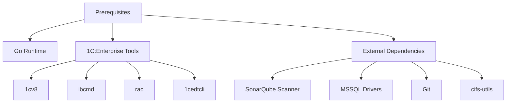
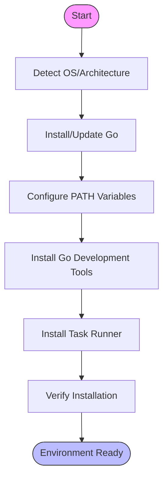

# Installation Guide

<cite>
**Referenced Files in This Document**   
- [README.md](file://README.md)
- [Makefile](file://Makefile)
- [scripts/install-dev-tools.sh](file://scripts/install-dev-tools.sh)
- [scripts/install-dev-tools-no-sudo.sh](file://scripts/install-dev-tools-no-sudo.sh)
- [scripts/9-start-container.sh](file://scripts/9-start-container.sh)
- [scripts/generate-version.sh](file://scripts/generate-version.sh)
- [mise.toml](file://mise.toml)
- [config/app.yaml](file://config/app.yaml)
- [internal/config/config.go](file://internal/config/config.go)
</cite>

## Table of Contents
1. [Introduction](#introduction)
2. [Prerequisites](#prerequisites)
3. [Installation Methods](#installation-methods)
4. [Development Environment Setup](#development-environment-setup)
5. [Containerized Deployment](#containerized-deployment)
6. [Version Management](#version-management)
7. [Verification Steps](#verification-steps)
8. [Troubleshooting Common Issues](#troubleshooting-common-issues)
9. [Conclusion](#conclusion)

## Introduction
The benadis-runner is a comprehensive tool designed for automating operations with the 1C:Enterprise platform, including data conversion, database restoration, service mode management, and integration with Enterprise Development Tools (EDT). This installation guide provides detailed instructions for setting up benadis-runner across different environments, covering multiple installation methods, prerequisites, verification procedures, and solutions to common issues.

**Section sources**
- [README.md](file://README.md#L1-L20)

## Prerequisites
Before installing benadis-runner, ensure that your system meets the following prerequisites:

### Go Runtime
The Go programming language runtime is required for building and running benadis-runner. The application is developed using Go, and various installation methods depend on Go tools.

### 1C:Enterprise Platform Tools
benadis-runner integrates with several 1C:Enterprise platform components:
- **1cv8**: The main 1C:Enterprise executable for running configuration commands
- **ibcmd**: Command-line utility for managing information bases
- **rac**: Remote Administration Console for cluster management
- **1cedtcli**: Command-line interface for Enterprise Development Tools

These tools must be installed and accessible in your system's PATH or properly configured in the application settings.

### External Dependencies
Additional external dependencies are required for full functionality:
- **SonarQube Scanner**: For code quality analysis and reporting
- **MSSQL Drivers**: Required for database restoration operations
- **Git**: For version control and repository operations
- **cifs-utils and samba-client**: For SMB operations when working with network shares

Configuration files specify default paths for these executables, which can be customized based on your environment setup.



**Diagram sources**
- [config/app.yaml](file://config/app.yaml#L1-L91)
- [internal/config/config.go](file://internal/config/config.go#L942-L988)

## Installation Methods
benadis-runner offers multiple installation methods to accommodate different deployment scenarios and user requirements.

### Makefile Targets
The project includes a comprehensive Makefile with various targets for building, testing, and deploying the application:

- **build**: Compiles the application and places the binary in the build directory
- **build-all**: Creates binaries for multiple platforms (Linux, Windows, macOS)
- **test**: Runs all unit tests
- **test-coverage**: Executes tests with coverage analysis
- **lint**: Runs code linters to ensure code quality
- **install**: Installs the application to GOPATH/bin
- **release**: Prepares a complete release with binaries for all platforms

The Makefile also includes specialized targets for dependency management, documentation generation, and environment setup.

### Shell Scripts
Several shell scripts facilitate different aspects of the installation process:

- **install-dev-tools.sh**: Installs Go, Task, and essential Go tools with sudo privileges
- **install-dev-tools-no-sudo.sh**: Same functionality as above but without requiring sudo, suitable for containerized environments
- **inst-golangci-lint.sh**: Specifically installs the golangci-lint tool with configuration format v2 support
- **generate-version.sh**: Automates version file generation based on git commit history

These scripts handle dependency resolution, path configuration, and tool installation in an automated manner.

### Direct Build from Source
For users who prefer manual control over the installation process, benadis-runner can be built directly from source:

```bash
git clone <repository-url>
cd benadis-runner
go build -o benadis-runner ./cmd/benadis-runner
```

This method gives users complete control over the build process and allows for custom compilation flags.

**Section sources**
- [Makefile](file://Makefile#L1-L254)
- [scripts/install-dev-tools.sh](file://scripts/install-dev-tools.sh#L1-L393)
- [scripts/install-dev-tools-no-sudo.sh](file://scripts/install-dev-tools-no-sudo.sh#L1-L374)
- [README.md](file://README.md#L25-L35)

## Development Environment Setup
Setting up a development environment for benadis-runner involves installing necessary tools and configuring the workspace properly.

### Using install-dev-tools.sh
The primary script for development environment setup is `install-dev-tools.sh`, which performs the following operations:

1. Detects the operating system and architecture
2. Installs or updates the Go runtime to the latest version
3. Configures Go environment variables (GOPATH, GOBIN) and adds them to PATH
4. Installs essential Go tools including:
   - gopls (Go language server)
   - dlv (debugger)
   - goimports (import formatter)
   - golangci-lint (advanced linter)
   - godoc (documentation tool)
   - Various other development utilities

The script also sets up Task, a task runner similar to Make, which simplifies common development workflows.

### Containerized Development Setup
For environments where sudo access is not available or when working within containers, use `install-dev-tools-no-sudo.sh`. This script:

1. Creates local directories in the user's home folder (~/.local/bin and ~/.local/go)
2. Installs Go and other tools locally without requiring elevated privileges
3. Configures PATH to include local binary directories
4. Sets up the Go workspace in the user's home directory

This approach is particularly useful for CI/CD pipelines and container-based development environments.

### Toolchain Configuration with mise.toml
The project includes a `mise.toml` configuration file that specifies the required tool versions:

```toml
[tools]
gemini = "latest"
golangci-lint = "latest"
jq = "latest"
node = "latest"
```

This file works with the mise tool to automatically manage and install the specified tool versions, ensuring consistency across different development environments.



**Diagram sources**
- [scripts/install-dev-tools.sh](file://scripts/install-dev-tools.sh#L1-L393)
- [scripts/install-dev-tools-no-sudo.sh](file://scripts/install-dev-tools-no-sudo.sh#L1-L374)
- [mise.toml](file://mise.toml#L1-L6)

## Containerized Deployment
benadis-runner supports containerized deployment through Docker, enabling consistent execution environments across different systems.

### Starting the Container
The `9-start-container.sh` script provides a simple way to launch a container with the necessary 1C:Enterprise tools:

```bash
#!/bin/bash
docker run -d \
  --name ar-edt \
  -p 2222:22 \
  git.apkholding.ru/xor/ar-edt:5.7.28.1
```

This script:
- Runs the container in detached mode (-d)
- Names the container "ar-edt"
- Maps port 2222 on the host to port 22 (SSH) in the container
- Uses a specific version of the ar-edt image from a private registry

### Container Image Details
The container image `git.apkholding.ru/xor/ar-edt:5.7.28.1` contains:
- Complete 1C:Enterprise Development Tools installation
- All necessary dependencies for running 1C applications
- SSH server for remote access and command execution

This containerized approach ensures that all team members and CI/CD systems use identical environments, eliminating "it works on my machine" issues.

### Alternative Container Usage
While the provided script uses a pre-built image, users can also create custom containers based on their specific requirements. The container should include:
- 1C:Enterprise platform components
- Git for version control operations
- Necessary database drivers
- Any additional tools required for specific workflows

**Section sources**
- [scripts/9-start-container.sh](file://scripts/9-start-container.sh#L1-L7)

## Version Management
Effective version management is crucial for tracking changes and maintaining stability in the benadis-runner application.

### Automatic Version Generation
The `generate-version.sh` script automates version file creation by:

1. Extracting date information (year, month, day) from the current date
2. Retrieving the short hash of the latest git commit
3. Reading the last commit message
4. Determining the build number based on whether it's a new day or continuation of the current day's builds

The script generates two files:
- `internal/constants/version.go`: Contains version constants used by the application
- `build/version.md`: Provides detailed build information including commit history

### Version Format
The generated version follows the format: `year.month.day.build:commit-hash`
For example: `3.5.15.4:a1b2c3d-debug`

Where:
- First digit: Last digit of the year
- Second digit: Month
- Third digit: Day
- Fourth digit: Build number for that day
- After colon: Short git commit hash
- Optional suffix: "-debug" for debug builds

### Version File Structure
The generated `version.go` file includes constants for:
- versionMinor: Daily build counter
- versionDay: Current day
- versionMonth: Current month
- versionYear: Last digit of the current year
- PreCommitHash: Short hash of the latest commit
- DebugSuffix: Suffix indicating debug build status
- Version: Complete version string combining all elements

This automated versioning system ensures traceability and helps identify the exact code state for any given build.

**Section sources**
- [scripts/generate-version.sh](file://scripts/generate-version.sh#L1-L227)

## Verification Steps
After installation, verify that benadis-runner is properly set up and functioning correctly.

### Checking Command Availability
Verify that the benadis-runner binary is accessible in your PATH:

```bash
which benadis-runner
```

Or if installed via Makefile:

```bash
which benadis-runner
```

### Testing Version Output
Check that the application can display its version information:

```bash
benadis-runner version
```

Or using the Makefile target:

```bash
make version
```

This should display the current version, build time, and git commit hash.

### Validating Dependencies
Use the Makefile to verify that all dependencies are properly installed:

```bash
make deps
```

This command will download and verify all required Go modules.

### Running Basic Tests
Execute the test suite to ensure the installation is functional:

```bash
make test
```

For more comprehensive testing, including race detection:

```bash
