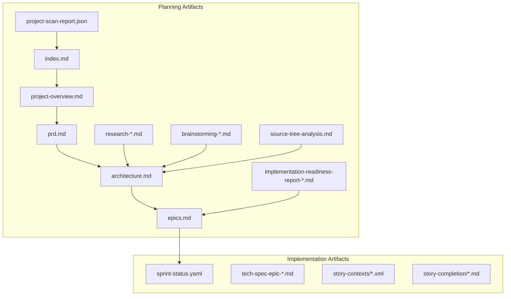
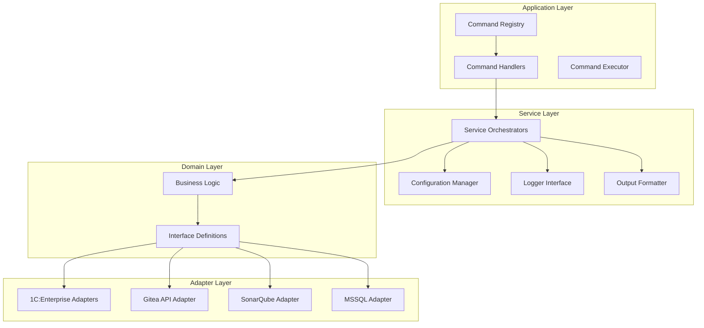
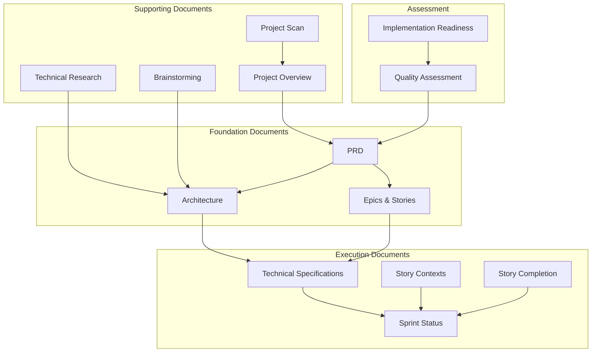

# Project Planning Artifacts

<cite>
**Referenced Files in This Document**
- [README.md](file://README.md)
- [index.md](file://_bmad-output/project-planning-artifacts/index.md)
- [project-overview.md](file://_bmad-output/project-planning-artifacts/project-overview.md)
- [prd.md](file://_bmad-output/project-planning-artifacts/prd.md)
- [architecture.md](file://_bmad-output/project-planning-artifacts/architecture.md)
- [epics.md](file://_bmad-output/project-planning-artifacts/epics.md)
- [epic-0-extension-publish.md](file://_bmad-output/project-planning-artifacts/epics/epic-0-extension-publish.md)
- [epic-1-foundation.md](file://_bmad-output/project-planning-artifacts/epics/epic-1-foundation.md)
- [implementation-readiness-report-2025-12-08.md](file://_bmad-output/project-planning-artifacts/implementation-readiness-report-2025-12-08.md)
- [source-tree-analysis.md](file://_bmad-output/project-planning-artifacts/source-tree-analysis.md)
- [research-technical-2025-11-25.md](file://_bmad-output/project-planning-artifacts/research-technical-2025-11-25.md)
- [brainstorming-session-results-2025-11-24.md](file://_bmad-output/project-planning-artifacts/brainstorming-session-results-2025-11-24.md)
- [project-scan-report.json](file://_bmad-output/project-planning-artifacts/project-scan-report.json)
- [sprint-status.yaml](file://_bmad-output/implementation-artifacts/sprint-artifacts/sprint-status.yaml)
- [tech-spec-epic-1.md](file://_bmad-output/implementation-artifacts/sprint-artifacts/tech-spec-epic-1.md)
- [1-1-command-registry-with-self-registration.context.xml](file://_bmad-output/implementation-artifacts/sprint-artifacts/1-1-command-registry-with-self-registration.context.xml)
- [0-1-gitea-api-releases.md](file://_bmad-output/implementation-artifacts/stories/0-1-gitea-api-releases.md)
</cite>

## Table of Contents
1. [Introduction](#introduction)
2. [Project Structure](#project-structure)
3. [Core Components](#core-components)
4. [Architecture Overview](#architecture-overview)
5. [Detailed Component Analysis](#detailed-component-analysis)
6. [Dependency Analysis](#dependency-analysis)
7. [Performance Considerations](#performance-considerations)
8. [Troubleshooting Guide](#troubleshooting-guide)
9. [Conclusion](#conclusion)
10. [Appendices](#appendices)

## Introduction
This document presents the comprehensive project planning artifacts for apk-ci, a CLI automation tool for 1C:Enterprise systems. The artifacts capture the strategic vision, technical architecture, implementation roadmap, and governance framework that guide the transformation from a monolithic collection of utilities into a modular, extensible platform with modern observability and CI/CD integration capabilities.

The planning artifacts encompass:
- Executive summaries and stakeholder alignment
- Product Requirements Document (PRD) with functional and non-functional requirements
- Technical architecture blueprint with design decisions
- Epic breakdown with user stories and acceptance criteria
- Implementation readiness assessment
- Technical research and brainstorming outcomes
- Sprint execution tracking and technical specifications

These artifacts collectively provide a single source of truth for understanding the project's scope, priorities, and execution approach across development, operations, and product management domains.

## Project Structure
The project follows a standard Go layout with clear separation between CLI entry points, internal business logic, and supporting infrastructure. The planning artifacts are organized into two primary areas:

**Planning Artifacts Directory (_bmad-output/project-planning-artifacts):**
- Executive documentation: index, project overview, PRD, architecture, epics
- Research and discovery: technical research reports, brainstorming sessions
- Implementation readiness: assessment reports, scan reports
- Supporting materials: source tree analysis, documentation requirements

**Implementation Artifacts Directory (_bmad-output/implementation-artifacts):**
- Sprint execution: sprint status tracking, technical specifications
- Story implementation: detailed story contexts and completion records

**Diagram sources**
- [index.md](file://_bmad-output/project-planning-artifacts/index.md#L1-L170)
- [sprint-status.yaml](file://_bmad-output/implementation-artifacts/sprint-artifacts/sprint-status.yaml#L1-L164)

**Section sources**
- [index.md](file://_bmad-output/project-planning-artifacts/index.md#L1-L170)
- [project-scan-report.json](file://_bmad-output/project-planning-artifacts/project-scan-report.json#L1-L76)

## Core Components
The planning system comprises several interconnected components that serve distinct roles in project governance and execution:

**Executive Documentation Suite**
- Index and overview documents establish project context and navigation
- PRD defines functional and non-functional requirements with traceability
- Architecture blueprint documents design decisions and system boundaries
- Epics and stories provide decomposition of work into manageable units

**Research and Discovery Framework**
- Technical research reports capture architectural decisions and alternatives
- Brainstorming sessions document creative problem-solving approaches
- Implementation readiness assessments validate project maturity

**Execution Tracking System**
- Sprint status files track progress across epics and stories
- Technical specifications provide detailed implementation guidance
- Story contexts define acceptance criteria and acceptance tests

**Section sources**
- [project-overview.md](file://_bmad-output/project-planning-artifacts/project-overview.md#L1-L111)
- [prd.md](file://_bmad-output/project-planning-artifacts/prd.md#L1-L484)
- [architecture.md](file://_bmad-output/project-planning-artifacts/architecture.md#L1-L577)
- [epics.md](file://_bmad-output/project-planning-artifacts/epics.md#L1-L46)

## Architecture Overview
The apk-ci architecture represents a deliberate evolution toward modern software engineering practices while maintaining backward compatibility with existing 1C:Enterprise integrations. The architecture emphasizes:

**Clean Architecture Principles**
- Separation of concerns through layered design
- Dependency inversion to isolate external dependencies
- Clear boundaries between application, service, and entity layers

**Modern Development Patterns**
- Command Pattern with registry-based command resolution
- Dependency Injection using Google Wire for compile-time safety
- Strategy pattern for interchangeable implementations (1cv8/ibcmd/native)
- Structured logging with OpenTelemetry integration

**Observability-First Design**
- Comprehensive logging with trace correlation
- Structured output formats for automation integration
- Metrics collection and alerting framework
- Performance monitoring and error tracking

**Diagram sources**
- [architecture.md](file://_bmad-output/project-planning-artifacts/architecture.md#L22-L93)
- [architecture.md](file://_bmad-output/project-planning-artifacts/architecture.md#L114-L130)

**Section sources**
- [architecture.md](file://_bmad-output/project-planning-artifacts/architecture.md#L1-L577)

## Detailed Component Analysis

### Product Requirements Document (PRD)
The PRD serves as the authoritative specification for apk-ci v2.0, establishing the transformation from mechanical utility aggregation to a modular platform. Key aspects include:

**Strategic Objectives**
- SOLID-compliant architecture with explicit dependency inversion
- Plug-in architecture enabling new functionality addition without code modification
- Complete observability stack with structured logging and distributed tracing
- Migration-ready design supporting parallel legacy and new command execution

**Functional Requirements Coverage**
The PRD documents 68 functional requirements across seven categories:
- Architecture and implementation strategies (FR1-FR5)
- Service mode management (FR6-FR9)
- Database operations (FR10-FR13)
- Configuration synchronization (FR14-FR18)
- Conversion operations (FR19-FR20)
- SonarQube integration (FR22-FR25)
- Gitea integration (FR26-FR28)
- Output formatting and logging (FR29-FR35)
- Alerting and observability (FR36-FR43)
- Debugging capabilities (FR44-FR46)
- Migration and compatibility (FR47-FR50)
- Testing and validation (FR51-FR54)
- Quality assurance (FR57-FR68)

**Non-Functional Requirements**
Performance targets include sub-500ms startup time and less than 5% observability overhead. Security requirements mandate secret masking and secure credential handling. Maintainability standards specify 80%+ test coverage and cyclomatic complexity constraints.

**Section sources**
- [prd.md](file://_bmad-output/project-planning-artifacts/prd.md#L1-L484)

### Epic and Story Decomposition
The epics provide strategic decomposition of the transformation effort:

**Epic 0: Extension Publish**
Focuses on automating extension distribution across subscribed repositories through subscription-based branching mechanisms. The epic includes eight stories covering Gitea API expansion, repository discovery, subscription management, and publication workflows.

**Epic 1: Architectural Foundation**
Establishes the SOLID-compliant foundation with Command Registry, Dependency Injection, structured output, logging, and observability. This critical epic enables all subsequent transformations.

**Epic 2-7: Implementation Epics**
Cover service mode management, database operations, configuration synchronization, quality integration, advanced observability, and finalization activities.

**Section sources**
- [epic-0-extension-publish.md](file://_bmad-output/project-planning-artifacts/epics/epic-0-extension-publish.md#L1-L248)
- [epic-1-foundation.md](file://_bmad-output/project-planning-artifacts/epics/epic-1-foundation.md#L1-L342)
- [epics.md](file://_bmad-output/project-planning-artifacts/epics.md#L1-L46)

### Implementation Execution Framework
The execution framework combines formal planning with practical implementation tracking:

**Sprint Status Tracking**
The sprint-status.yaml provides granular progress tracking across all epics and stories, including status definitions, workflow notes, and automated generation from planning workflows.

**Technical Specifications**
Each epic includes detailed technical specifications with system architecture alignment, data models, APIs, workflows, and acceptance criteria. These specifications serve as implementation blueprints.

**Story Context Documentation**
Story contexts provide comprehensive implementation guidance including acceptance criteria, artifacts, constraints, interfaces, and testing strategies. These documents enable consistent implementation across development teams.

**Section sources**
- [sprint-status.yaml](file://_bmad-output/implementation-artifacts/sprint-artifacts/sprint-status.yaml#L1-L164)
- [tech-spec-epic-1.md](file://_bmad-output/implementation-artifacts/sprint-artifacts/tech-spec-epic-1.md#L1-L800)
- [1-1-command-registry-with-self-registration.context.xml](file://_bmad-output/implementation-artifacts/sprint-artifacts/1-1-command-registry-with-self-registration.context.xml#L1-L587)

### Technical Research and Innovation
The research and brainstorming artifacts capture innovative approaches to CLI integration challenges:

**Command + Strategy Pattern Research**
Demonstrates optimal approach for unifying 1C:Enterprise CLI tool integration through command abstraction, strategy pattern implementation, and resilient execution frameworks.

**Pipeline Architecture Brainstorming**
Explores transformation from monolithic commands to compositional pipeline steps with persistent context management and declarative pipeline definitions.

**Section sources**
- [research-technical-2025-11-25.md](file://_bmad-output/project-planning-artifacts/research-technical-2025-11-25.md#L1-L771)
- [brainstorming-session-results-2025-11-24.md](file://_bmad-output/project-planning-artifacts/brainstorming-session-results-2025-11-24.md#L1-L237)

## Dependency Analysis
The planning artifacts demonstrate clear dependency relationships between documentation components and implementation deliverables:

**Diagram sources**
- [index.md](file://_bmad-output/project-planning-artifacts/index.md#L28-L66)
- [implementation-readiness-report-2025-12-08.md](file://_bmad-output/project-planning-artifacts/implementation-readiness-report-2025-12-08.md#L1-L323)

**Section sources**
- [index.md](file://_bmad-output/project-planning-artifacts/index.md#L28-L66)
- [implementation-readiness-report-2025-12-08.md](file://_bmad-output/project-planning-artifacts/implementation-readiness-report-2025-12-08.md#L1-L323)

## Performance Considerations
The planning artifacts establish clear performance expectations and optimization strategies:

**Startup Performance**
Target: Application startup under 500ms through compile-time dependency injection and lazy initialization patterns.

**Observability Overhead**
Constraint: Observability features (logging, tracing) contribute less than 5% to overall operation time through asynchronous export and sampling strategies.

**Execution Efficiency**
Guidelines emphasize idempotent operations, automatic dependency resolution, and state-aware execution to minimize redundant operations and improve reliability.

**Section sources**
- [architecture.md](file://_bmad-output/project-planning-artifacts/architecture.md#L471-L480)
- [prd.md](file://_bmad-output/project-planning-artifacts/prd.md#L439-L443)

## Troubleshooting Guide
The planning artifacts provide comprehensive troubleshooting guidance through multiple layers:

**Error Handling Framework**
Structured error codes with hierarchical categorization (CONFIG, COMMAND, OUTPUT, DB, ONEC, GITEA, SONARQUBE) enable systematic error diagnosis and resolution.

**Observability-Based Diagnostics**
Trace ID correlation across logs and outputs enables precise problem isolation and timeline reconstruction for operational incidents.

**Migration and Compatibility**
Deprecated command detection with automatic migration warnings ensures smooth transition from legacy to new command implementations without operational disruption.

**Section sources**
- [architecture.md](file://_bmad-output/project-planning-artifacts/architecture.md#L324-L354)
- [tech-spec-epic-1.md](file://_bmad-output/implementation-artifacts/sprint-artifacts/tech-spec-epic-1.md#L454-L481)

## Conclusion
The apk-ci project planning artifacts represent a comprehensive framework for transforming a monolithic CLI tool into a modern, extensible platform. The artifacts demonstrate:

**Strategic Clarity**: Clear alignment between business objectives, technical architecture, and implementation approach ensures focused execution toward measurable outcomes.

**Technical Excellence**: Modern software engineering practices including SOLID principles, dependency injection, and observability-first design establish a robust foundation for future growth.

**Operational Maturity**: Comprehensive planning, execution tracking, and quality assurance processes enable reliable delivery of complex automation solutions for 1C:Enterprise environments.

**Innovation Leadership**: Continuous research, brainstorming, and architectural exploration position the project at the forefront of CLI integration and DevOps automation practices.

The planning artifacts provide the essential documentation for stakeholders to understand, participate in, and support the apk-ci transformation journey.

## Appendices

### Implementation Readiness Summary
The implementation readiness assessment confirms project maturity with 100% functional requirement coverage, proper epic independence, and quality compliance across all evaluation criteria.

**Section sources**
- [implementation-readiness-report-2025-12-08.md](file://_bmad-output/project-planning-artifacts/implementation-readiness-report-2025-12-08.md#L259-L323)

### Technical Specification Examples
The technical specifications demonstrate detailed implementation guidance with system architecture alignment, data models, APIs, and comprehensive acceptance criteria for each epic.

**Section sources**
- [tech-spec-epic-1.md](file://_bmad-output/implementation-artifacts/sprint-artifacts/tech-spec-epic-1.md#L1-L800)

### Story Implementation Records
The story completion documents provide concrete evidence of implementation progress, including acceptance criteria fulfillment, testing coverage, and quality assurance validation.

**Section sources**
- [0-1-gitea-api-releases.md](file://_bmad-output/implementation-artifacts/stories/0-1-gitea-api-releases.md#L1-L266)