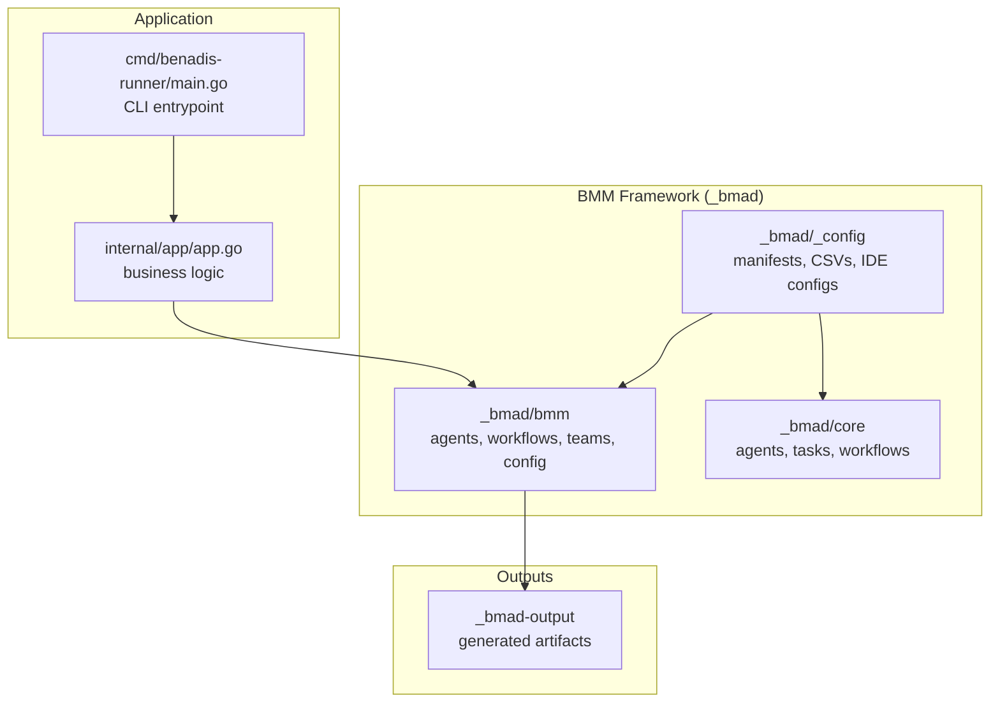
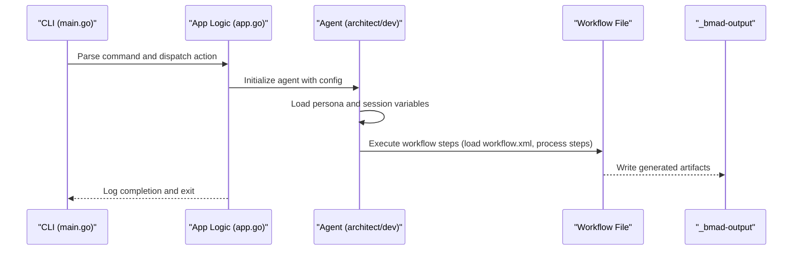
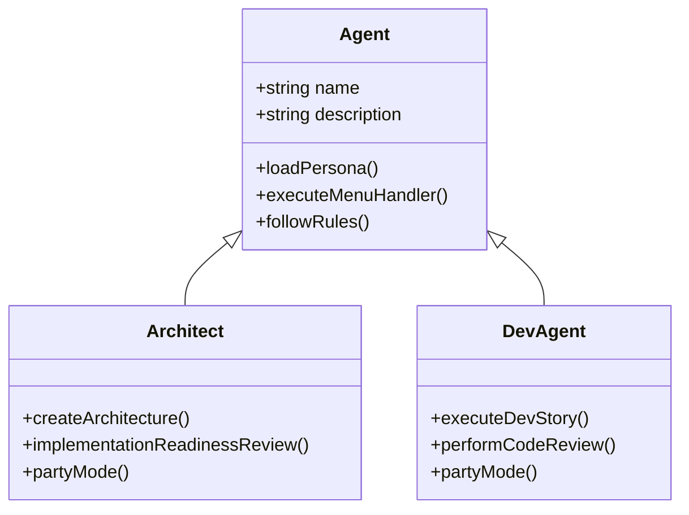
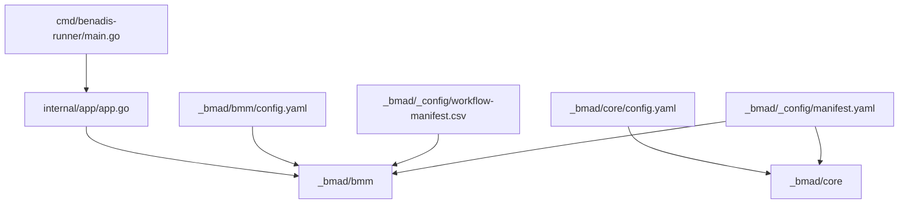

# BMM Framework Structure

<cite>
**Referenced Files in This Document**
- [README.md](file://README.md)
- [go.mod](file://go.mod)
- [cmd/benadis-runner/main.go](file://cmd/benadis-runner/main.go)
- [internal/app/app.go](file://internal/app/app.go)
- [_bmad/_config/manifest.yaml](file::_bmad/_config/manifest.yaml)
- [_bmad/_config/workflow-manifest.csv]::_bmad/_config/workflow-manifest.csv)
- [_bmad/bmm/config.yaml]::_bmad/bmm/config.yaml)
- [_bmad/core/config.yaml]::_bmad/core/config.yaml)
- [_bmad/bmm/agents/architect.md]::_bmad/bmm/agents/architect.md)
- [_bmad/bmm/agents/dev.md]::_bmad/bmm/agents/dev.md)
- [_bmad/bmm/teams/default-party.csv]::_bmad/bmm/teams/default-party.csv)
</cite>

## Table of Contents
1. [Introduction](#introduction)
2. [Project Structure](#project-structure)
3. [Core Components](#core-components)
4. [Architecture Overview](#architecture-overview)
5. [Detailed Component Analysis](#detailed-component-analysis)
6. [Dependency Analysis](#dependency-analysis)
7. [Performance Considerations](#performance-considerations)
8. [Troubleshooting Guide](#troubleshooting-guide)
9. [Conclusion](#conclusion)

## Introduction
This document describes the BMM (Business Model Management) Framework structure within the benadis-runner project. It explains how the BMM module integrates with the broader application architecture, how workflows are organized, and how agents and teams are configured. The BMM Framework provides a structured methodology for product discovery, planning, solutioning, and implementation, supported by reusable workflows, agents, and configuration.

## Project Structure
The BMM Framework is organized under the `_bmad` directory, which contains:
- Core and BMM modules with shared resources and workflows
- Agent definitions and personas
- Team compositions and orchestration
- Configuration files for modules and workflows
- Manifests that enumerate available modules, IDEs, and workflows

Key structural elements:
- `_bmad/_config`: Centralized manifests and configuration for modules, agents, tools, and workflows
- `_bmad/core`: Shared capabilities, tasks, and workflows used across modules
- `_bmad/bmm`: BMM-specific agents, workflows, teams, and configuration
- `_bmad-output`: Generated artifacts produced by BMM workflows

**Diagram sources**
- [cmd/benadis-runner/main.go](file://cmd/benadis-runner/main.go#L1-L262)
- [internal/app/app.go](file://internal/app/app.go#L1-L1307)
- [_bmad/_config/manifest.yaml]::_bmad/_config/manifest.yaml#L1-L11)
- [_bmad/bmm/config.yaml]::_bmad/bmm/config.yaml#L1-L19)

**Section sources**
- [README.md](file://README.md#L1-L220)
- [go.mod](file://go.mod#L1-L27)
- [cmd/benadis-runner/main.go](file://cmd/benadis-runner/main.go#L1-L262)
- [internal/app/app.go](file://internal/app/app.go#L1-L1307)
- [_bmad/_config/manifest.yaml]::_bmad/_config/manifest.yaml#L1-L11)
- [_bmad/bmm/config.yaml]::_bmad/bmm/config.yaml#L1-L19)

## Core Components
The BMM Framework comprises three primary layers:
- Agents: Persona-driven roles that execute workflows and tasks (e.g., Architect, Developer)
- Workflows: Step-by-step processes for analysis, planning, solutioning, and implementation
- Teams: Compositions of agents orchestrated for specific project phases

Configuration and manifests:
- Module installation and IDE selection are declared via manifests
- Workflow catalog enumerates available BMM workflows with module ownership and paths
- Per-module configuration defines project metadata, output locations, and language preferences

**Section sources**
- [_bmad/_config/manifest.yaml]::_bmad/_config/manifest.yaml#L1-L11)
- [_bmad/_config/workflow-manifest.csv]::_bmad/_config/workflow-manifest.csv#L1-L36)
- [_bmad/bmm/config.yaml]::_bmad/bmm/config.yaml#L1-L19)
- [_bmad/core/config.yaml]::_bmad/core/config.yaml#L1-L10)

## Architecture Overview
The BMM Framework operates as an extension of the benadis-runner application. The CLI entrypoint delegates to application logic, which coordinates BMM workflows and agents. Agents load configuration, resolve persona instructions, and execute menu-driven actions or workflow files. Teams orchestrate multiple agents for collaborative sessions.

**Diagram sources**
- [cmd/benadis-runner/main.go](file://cmd/benadis-runner/main.go#L16-L260)
- [internal/app/app.go](file://internal/app/app.go#L1-L1307)
- [_bmad/bmm/agents/architect.md]::_bmad/bmm/agents/architect.md#L1-L69)
- [_bmad/bmm/agents/dev.md]::_bmad/bmm/agents/dev.md#L1-L71)

## Detailed Component Analysis

### BMM Agents
Agents define roles and behaviors for executing BMM workflows. They:
- Load configuration at activation
- Store session variables from module config
- Follow strict menu handlers to execute workflows or executable files
- Adhere to persona principles and communication styles

Representative agents:
- Architect: Guides architecture creation and readiness reviews
- Developer Agent: Executes implementation workflows with strict adherence to acceptance criteria

**Diagram sources**
- [_bmad/bmm/agents/architect.md]::_bmad/bmm/agents/architect.md#L1-L69)
- [_bmad/bmm/agents/dev.md]::_bmad/bmm/agents/dev.md#L1-L71)

**Section sources**
- [_bmad/bmm/agents/architect.md]::_bmad/bmm/agents/architect.md#L1-L69)
- [_bmad/bmm/agents/dev.md]::_bmad/bmm/agents/dev.md#L1-L71)

### BMM Teams
Teams compose multiple agents for coordinated execution. The default party includes roles such as Analyst, Architect, Developer Agent, Product Manager, Scrum Master, Master Test Architect, Technical Writer, and UX Designer. Teams are defined with display metadata, roles, identities, communication styles, and principles aligned to the BMM methodology.

**Section sources**
- [_bmad/bmm/teams/default-party.csv]::_bmad/bmm/teams/default-party.csv#L1-L22)

### BMM Workflows Catalog
The workflow catalog enumerates BMM workflows with their module ownership and file paths. These workflows span:
- Analysis: Product brief creation, research
- Planning: UX design, PRD creation and validation
- Solutioning: Architecture creation, implementation readiness
- Implementation: Code review, course correction, story creation, dev story, retrospective, sprint planning/status
- Quick Flow: Tech specs and flexible development
- Documentation: Project documentation and Excalidraw diagrams
- Test Architecture: ATDD, automation, CI, framework initialization, NFR assessment, test design, test review, traceability

**Section sources**
- [_bmad/_config/workflow-manifest.csv]::_bmad/_config/workflow-manifest.csv#L1-L36)

### BMM Configuration
Module configuration defines:
- Project name and skill level
- Paths for planning and implementation artifacts
- Knowledge base location
- User preferences and languages
- Output folder resolution

**Section sources**
- [_bmad/bmm/config.yaml]::_bmad/bmm/config.yaml#L1-L19)
- [_bmad/core/config.yaml]::_bmad/core/config.yaml#L1-L10)

## Dependency Analysis
The BMM Framework depends on:
- Core module for shared tasks and orchestration
- Manifests for module installation and workflow discovery
- CLI entrypoint and application logic for runtime coordination
- Output directory for persisted artifacts

**Diagram sources**
- [_bmad/_config/manifest.yaml]::_bmad/_config/manifest.yaml#L1-L11)
- [_bmad/_config/workflow-manifest.csv]::_bmad/_config/workflow-manifest.csv#L1-L36)
- [_bmad/bmm/config.yaml]::_bmad/bmm/config.yaml#L1-L19)
- [_bmad/core/config.yaml]::_bmad/core/config.yaml#L1-L10)
- [cmd/benadis-runner/main.go](file://cmd/benadis-runner/main.go#L1-L262)
- [internal/app/app.go](file://internal/app/app.go#L1-L1307)

**Section sources**
- [_bmad/_config/manifest.yaml]::_bmad/_config/manifest.yaml#L1-L11)
- [_bmad/_config/workflow-manifest.csv]::_bmad/_config/workflow-manifest.csv#L1-L36)
- [_bmad/bmm/config.yaml]::_bmad/bmm/config.yaml#L1-L19)
- [_bmad/core/config.yaml]::_bmad/core/config.yaml#L1-L10)
- [cmd/benadis-runner/main.go](file://cmd/benadis-runner/main.go#L1-L262)
- [internal/app/app.go](file://internal/app/app.go#L1-L1307)

## Performance Considerations
- Workflow execution should leverage the shared orchestration from core tasks to minimize redundant logic
- Use the workflow catalog to avoid hardcoding paths and to ensure consistent updates
- Keep configuration centralized to reduce misalignment across agents and workflows

## Troubleshooting Guide
Common issues and resolutions:
- Missing configuration: Agents require module config to be loaded at activation; ensure paths are correct and accessible
- Workflow execution failures: Verify workflow file existence and permissions; confirm that workflow.xml is loaded before executing steps
- Output artifacts not appearing: Check output folder configuration and permissions; ensure the workflow writes to the configured output directory

**Section sources**
- [_bmad/bmm/agents/architect.md]::_bmad/bmm/agents/architect.md#L10-L25)
- [_bmad/bmm/agents/dev.md]::_bmad/bmm/agents/dev.md#L10-L25)
- [_bmad/bmm/config.yaml]::_bmad/bmm/config.yaml#L8-L19)

## Conclusion
The BMM Framework provides a structured, persona-driven methodology integrated into the benadis-runner application. Through curated agents, comprehensive workflows, and shared configurations, it enables disciplined product and engineering processes from discovery through implementation. The modular design, manifests, and centralized configuration support maintain consistency and scalability across projects.