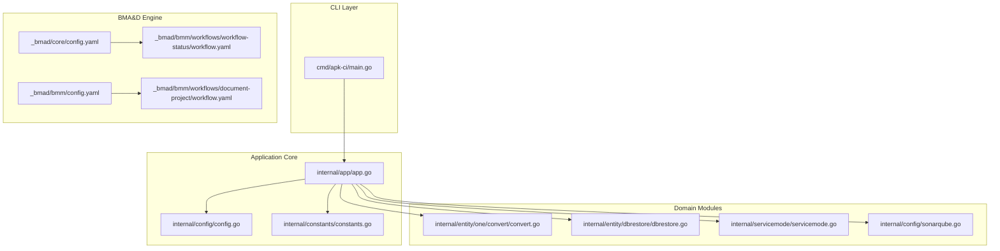
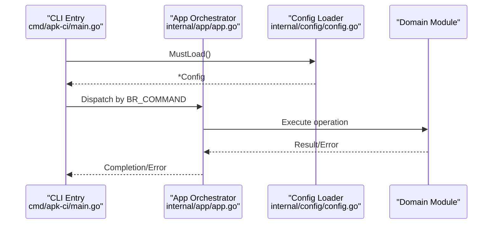
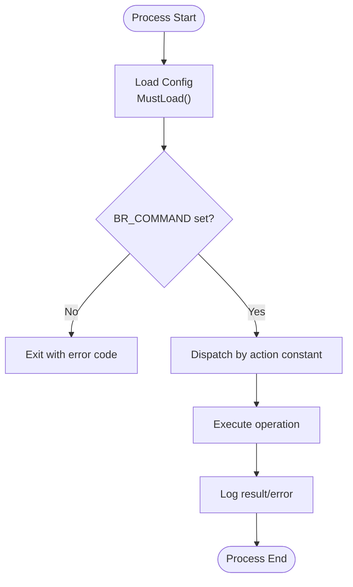
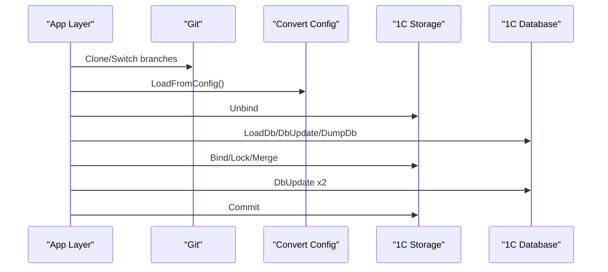
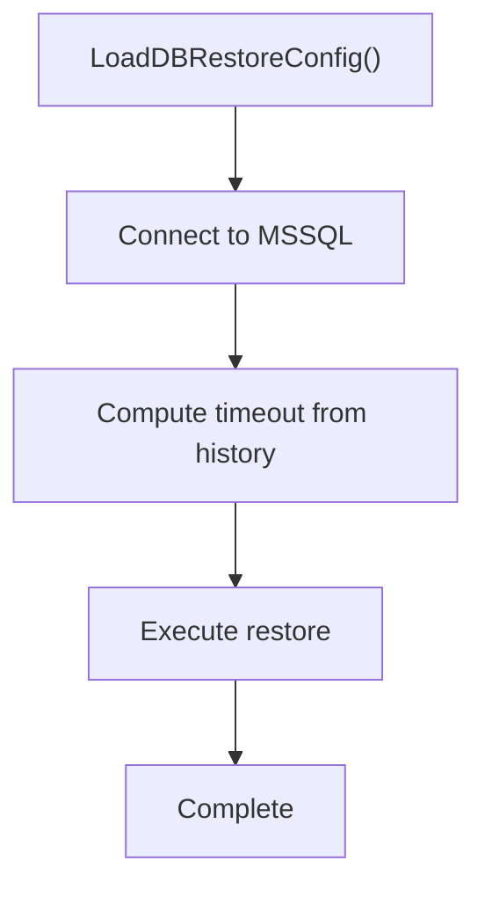
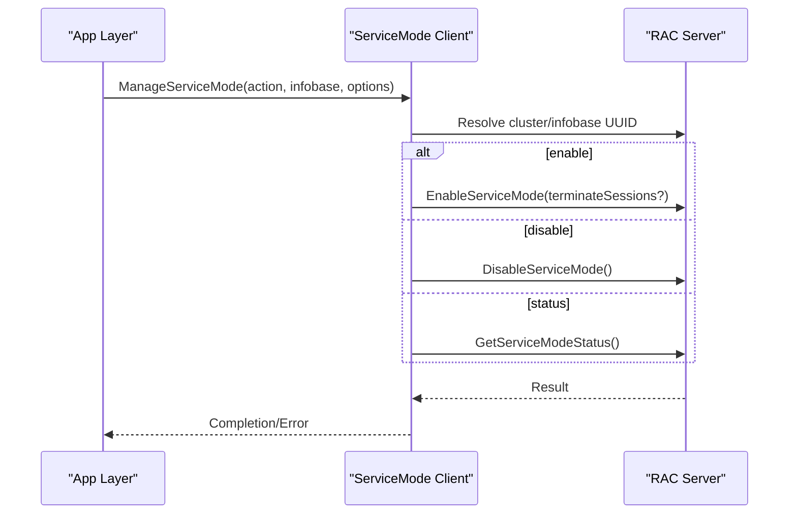
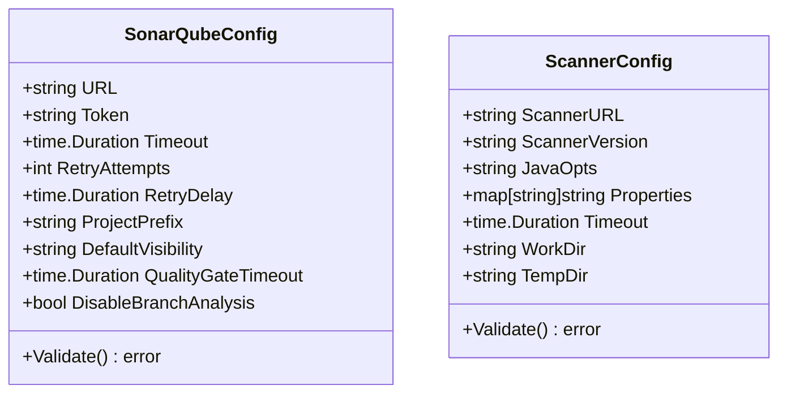
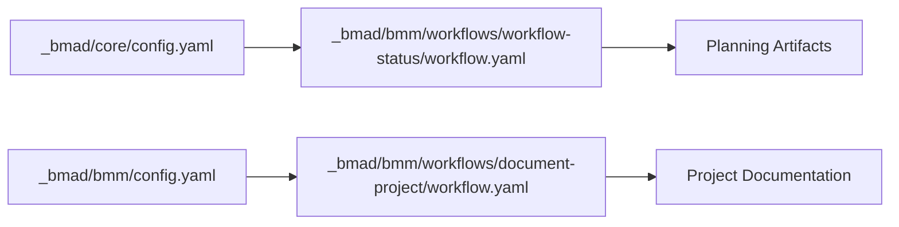
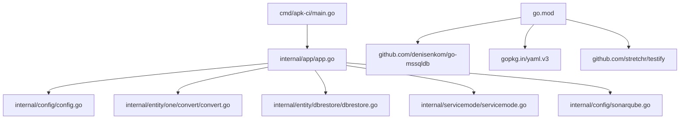

# Documentation Structure

<cite>
**Referenced Files in This Document**
- [README.md](file://README.md)
- [go.mod](file://go.mod)
- [Makefile](file://Makefile)
- [cmd/apk-ci/main.go](file://cmd/apk-ci/main.go)
- [internal/app/app.go](file://internal/app/app.go)
- [internal/config/config.go](file://internal/config/config.go)
- [internal/constants/constants.go](file://internal/constants/constants.go)
- [config/app.yaml](file://config/app.yaml)
- [_bmad/core/config.yaml](file://_bmad/core/config.yaml)
- [_bmad/bmm/config.yaml](file://_bmad/bmm/config.yaml)
- [_bmad/bmm/workflows/workflow-status/workflow.yaml](file://_bmad/bmm/workflows/workflow-status/workflow.yaml)
- [_bmad/bmm/workflows/document-project/workflow.yaml](file://_bmad/bmm/workflows/document-project/workflow.yaml)
- [internal/entity/dbrestore/dbrestore.go](file://internal/entity/dbrestore/dbrestore.go)
- [internal/entity/one/convert/convert.go](file://internal/entity/one/convert/convert.go)
- [internal/servicemode/servicemode.go](file://internal/servicemode/servicemode.go)
- [internal/config/sonarqube.go](file://internal/config/sonarqube.go)
</cite>

## Table of Contents
1. [Introduction](#introduction)
2. [Project Structure](#project-structure)
3. [Core Components](#core-components)
4. [Architecture Overview](#architecture-overview)
5. [Detailed Component Analysis](#detailed-component-analysis)
6. [Dependency Analysis](#dependency-analysis)
7. [Performance Considerations](#performance-considerations)
8. [Troubleshooting Guide](#troubleshooting-guide)
9. [Conclusion](#conclusion)

## Introduction
This document describes the documentation structure and architecture of the apk-ci project. It explains how the application is organized, how configuration is centralized, and how different modules (conversion, database restore, service mode management, SonarQube integration, and BMA&D workflow orchestration) interact. The goal is to provide both technical depth for developers and a clear understanding for stakeholders.

## Project Structure
The project follows a layered architecture with a central configuration system and modular components:

- Command entry point: a single binary that delegates to application logic based on environment-driven commands
- Centralized configuration: YAML-based system with environment variable overrides
- Domain modules: conversion, database restore, service mode, SonarQube integration
- BMA&D (Business Model and Architecture Design) workflow engine: orchestrates planning and documentation artifacts
- Build and test automation via Makefile

**Diagram sources**
- [cmd/apk-ci/main.go](file://cmd/apk-ci/main.go#L16-L262)
- [internal/app/app.go](file://internal/app/app.go#L1-L130)
- [internal/config/config.go](file://internal/config/config.go#L548-L702)
- [internal/constants/constants.go](file://internal/constants/constants.go#L48-L102)
- [internal/entity/one/convert/convert.go](file://internal/entity/one/convert/convert.go#L56-L146)
- [internal/entity/dbrestore/dbrestore.go](file://internal/entity/dbrestore/dbrestore.go#L79-L126)
- [internal/servicemode/servicemode.go](file://internal/servicemode/servicemode.go#L175-L200)
- [internal/config/sonarqube.go](file://internal/config/sonarqube.go#L14-L49)
- [_bmad/core/config.yaml](file://_bmad/core/config.yaml#L1-L10)
- [_bmad/bmm/config.yaml](file://_bmad/bmm/config.yaml#L1-L19)
- [_bmad/bmm/workflows/workflow-status/workflow.yaml](file://_bmad/bmm/workflows/workflow-status/workflow.yaml#L1-L31)
- [_bmad/bmm/workflows/document-project/workflow.yaml](file://_bmad/bmm/workflows/document-project/workflow.yaml#L1-L29)

**Section sources**
- [README.md](file://README.md#L1-L220)
- [go.mod](file://go.mod#L1-L27)
- [Makefile](file://Makefile#L1-L254)

## Core Components
This section outlines the primary building blocks and their responsibilities:

- Command dispatcher: parses environment variables and routes to appropriate actions
- Central configuration loader: merges YAML, environment variables, and defaults
- Domain modules:
  - Convert: project conversion between formats and storage synchronization
  - DBRestore: MSSQL database restoration with statistics-aware timeouts
  - ServiceMode: RAC-based service mode lifecycle management
  - SonarQube: configuration and integration for code quality analysis
- BMA&D workflow engine: manages planning, documentation, and status tracking

Key configuration sources:
- Application-wide settings: [config/app.yaml](file://config/app.yaml#L1-L138)
- Environment-driven command routing: [internal/constants/constants.go](file://internal/constants/constants.go#L48-L102)
- Centralized config loader: [internal/config/config.go](file://internal/config/config.go#L548-L702)

**Section sources**
- [cmd/apk-ci/main.go](file://cmd/apk-ci/main.go#L16-L262)
- [internal/app/app.go](file://internal/app/app.go#L58-L131)
- [internal/config/config.go](file://internal/config/config.go#L548-L702)
- [internal/constants/constants.go](file://internal/constants/constants.go#L48-L102)
- [config/app.yaml](file://config/app.yaml#L1-L138)

## Architecture Overview
The system uses a command-driven architecture with a central configuration layer:

- Entry point: [cmd/apk-ci/main.go](file://cmd/apk-ci/main.go#L16-L262) reads environment variables and invokes application functions
- Application logic: [internal/app/app.go](file://internal/app/app.go#L58-L131) orchestrates domain operations
- Configuration: [internal/config/config.go](file://internal/config/config.go#L548-L702) loads and merges settings from YAML, secrets, and environment variables
- Domain modules encapsulate business logic and integrate with external systems (1C tools, MSSQL, RAC, SonarQube)
- BMA&D engine coordinates planning and documentation workflows

**Diagram sources**
- [cmd/apk-ci/main.go](file://cmd/apk-ci/main.go#L16-L262)
- [internal/app/app.go](file://internal/app/app.go#L58-L131)
- [internal/config/config.go](file://internal/config/config.go#L548-L702)

## Detailed Component Analysis

### Command Dispatcher and Configuration
- The CLI reads environment variables and selects an action constant defined in [internal/constants/constants.go](file://internal/constants/constants.go#L48-L102)
- The central configuration loader in [internal/config/config.go](file://internal/config/config.go#L548-L702) merges:
  - Application settings from [config/app.yaml](file://config/app.yaml#L1-L138)
  - Secrets and environment overrides
  - Defaults for missing values
- The dispatcher logs structured messages and exits with explicit codes on failure

**Diagram sources**
- [cmd/apk-ci/main.go](file://cmd/apk-ci/main.go#L16-L262)
- [internal/config/config.go](file://internal/config/config.go#L548-L702)
- [internal/constants/constants.go](file://internal/constants/constants.go#L48-L102)

**Section sources**
- [cmd/apk-ci/main.go](file://cmd/apk-ci/main.go#L16-L262)
- [internal/config/config.go](file://internal/config/config.go#L548-L702)
- [internal/constants/constants.go](file://internal/constants/constants.go#L48-L102)

### Convert Module
- Purpose: synchronize and convert 1C configurations between Git and 1C storage
- Key operations:
  - Clone repository and switch branches
  - Load conversion configuration from project and database configs
  - Bind/unbind storage, update database, merge, and commit changes
- Configuration sources:
  - Store root and pairs derived from [internal/entity/one/convert/convert.go](file://internal/entity/one/convert/convert.go#L67-L146)
  - Application paths and timeouts from [config/app.yaml](file://config/app.yaml#L9-L13)

**Diagram sources**
- [internal/app/app.go](file://internal/app/app.go#L414-L538)
- [internal/entity/one/convert/convert.go](file://internal/entity/one/convert/convert.go#L67-L146)

**Section sources**
- [internal/app/app.go](file://internal/app/app.go#L58-L131)
- [internal/entity/one/convert/convert.go](file://internal/entity/one/convert/convert.go#L56-L146)
- [config/app.yaml](file://config/app.yaml#L9-L13)

### DBRestore Module
- Purpose: restore MSSQL databases from backups with configurable timeouts
- Key operations:
  - Load DB restore configuration from centralized config
  - Establish connection and calculate timeouts based on historical stats
  - Execute restore with automatic fallbacks
- Configuration sources:
  - [internal/entity/dbrestore/dbrestore.go](file://internal/entity/dbrestore/dbrestore.go#L79-L126)
  - [internal/config/config.go](file://internal/config/config.go#L756-L800)

**Diagram sources**
- [internal/entity/dbrestore/dbrestore.go](file://internal/entity/dbrestore/dbrestore.go#L79-L126)
- [internal/config/config.go](file://internal/config/config.go#L756-L800)

**Section sources**
- [internal/entity/dbrestore/dbrestore.go](file://internal/entity/dbrestore/dbrestore.go#L34-L126)
- [internal/config/config.go](file://internal/config/config.go#L756-L800)

### Service Mode Management
- Purpose: manage 1C service mode via RAC
- Key operations:
  - Enable/disable service mode with optional session termination
  - Retrieve service mode status
  - Integrate with RAC client and structured logging
- Configuration sources:
  - [internal/servicemode/servicemode.go](file://internal/servicemode/servicemode.go#L175-L200)
  - [internal/config/config.go](file://internal/config/config.go#L460-L499)

**Diagram sources**
- [internal/servicemode/servicemode.go](file://internal/servicemode/servicemode.go#L175-L200)
- [internal/config/config.go](file://internal/config/config.go#L460-L499)

**Section sources**
- [internal/servicemode/servicemode.go](file://internal/servicemode/servicemode.go#L14-L100)
- [internal/config/config.go](file://internal/config/config.go#L241-L254)

### SonarQube Integration
- Purpose: configure and validate SonarQube and scanner settings
- Key operations:
  - Load configuration from app.yaml, secrets, and environment variables
  - Validate required fields and defaults
  - Provide getters for downstream services
- Configuration sources:
  - [internal/config/sonarqube.go](file://internal/config/sonarqube.go#L14-L49)
  - [config/app.yaml](file://config/app.yaml#L35-L93)

**Diagram sources**
- [internal/config/sonarqube.go](file://internal/config/sonarqube.go#L14-L75)

**Section sources**
- [internal/config/sonarqube.go](file://internal/config/sonarqube.go#L14-L194)
- [config/app.yaml](file://config/app.yaml#L35-L93)

### BMA&D Workflow Engine
- Purpose: coordinate planning and documentation workflows
- Components:
  - Core configuration: [_bmad/core/config.yaml](file://_bmad/core/config.yaml#L1-L10)
  - BMM configuration: [_bmad/bmm/config.yaml](file://_bmad/bmm/config.yaml#L1-L19)
  - Workflow status router: [_bmad/bmm/workflows/workflow-status/workflow.yaml](file://_bmad/bmm/workflows/workflow-status/workflow.yaml#L1-L31)
  - Project documentation workflow: [_bmad/bmm/workflows/document-project/workflow.yaml](file://_bmad/bmm/workflows/document-project/workflow.yaml#L1-L29)

**Diagram sources**
- [_bmad/core/config.yaml](file://_bmad/core/config.yaml#L1-L10)
- [_bmad/bmm/config.yaml](file://_bmad/bmm/config.yaml#L1-L19)
- [_bmad/bmm/workflows/workflow-status/workflow.yaml](file://_bmad/bmm/workflows/workflow-status/workflow.yaml#L1-L31)
- [_bmad/bmm/workflows/document-project/workflow.yaml](file://_bmad/bmm/workflows/document-project/workflow.yaml#L1-L29)

**Section sources**
- [_bmad/core/config.yaml](file://_bmad/core/config.yaml#L1-L10)
- [_bmad/bmm/config.yaml](file://_bmad/bmm/config.yaml#L1-L19)
- [_bmad/bmm/workflows/workflow-status/workflow.yaml](file://_bmad/bmm/workflows/workflow-status/workflow.yaml#L1-L31)
- [_bmad/bmm/workflows/document-project/workflow.yaml](file://_bmad/bmm/workflows/document-project/workflow.yaml#L1-L29)

## Dependency Analysis
External dependencies and their roles:
- Configuration and environment parsing: [go.mod](file://go.mod#L5-L26)
- MSSQL driver for database operations: [go.mod](file://go.mod#L7-L7)
- Testing and assertion utilities: [go.mod](file://go.mod#L8-L8)
- YAML processing: [go.mod](file://go.mod#L11-L11)

**Diagram sources**
- [go.mod](file://go.mod#L5-L26)
- [cmd/apk-ci/main.go](file://cmd/apk-ci/main.go#L1-L20)
- [internal/app/app.go](file://internal/app/app.go#L1-L30)

**Section sources**
- [go.mod](file://go.mod#L5-L26)

## Performance Considerations
- Centralized configuration reduces repeated I/O and parsing overhead
- Structured logging enables efficient filtering and observability
- Timeouts and retry policies are configurable to adapt to environments
- Modular design allows selective execution and caching where applicable

## Troubleshooting Guide
Common issues and resolution paths:
- Configuration loading failures: verify environment variables and YAML paths; check [internal/config/config.go](file://internal/config/config.go#L548-L702)
- Command dispatch errors: confirm BR_COMMAND value matches constants in [internal/constants/constants.go](file://internal/constants/constants.go#L48-L102)
- Service mode errors: validate RAC connectivity and credentials; see [internal/servicemode/servicemode.go](file://internal/servicemode/servicemode.go#L175-L200)
- DB restore timeouts: adjust autotimeout or manual timeout in [config/app.yaml](file://config/app.yaml#L29-L34) and [internal/entity/dbrestore/dbrestore.go](file://internal/entity/dbrestore/dbrestore.go#L79-L126)
- SonarQube integration errors: validate URL, token, and timeouts in [internal/config/sonarqube.go](file://internal/config/sonarqube.go#L144-L194)

**Section sources**
- [internal/config/config.go](file://internal/config/config.go#L548-L702)
- [internal/constants/constants.go](file://internal/constants/constants.go#L48-L102)
- [internal/servicemode/servicemode.go](file://internal/servicemode/servicemode.go#L175-L200)
- [config/app.yaml](file://config/app.yaml#L29-L34)
- [internal/entity/dbrestore/dbrestore.go](file://internal/entity/dbrestore/dbrestore.go#L79-L126)
- [internal/config/sonarqube.go](file://internal/config/sonarqube.go#L144-L194)

## Conclusion
The apk-ci project employs a centralized configuration architecture with modular domain components and a robust CLI dispatcher. The BMA&D engine complements development workflows by generating planning and documentation artifacts. The design emphasizes configurability, structured logging, and clear separation of concerns, enabling reliable automation across 1C-related operations and code quality workflows.