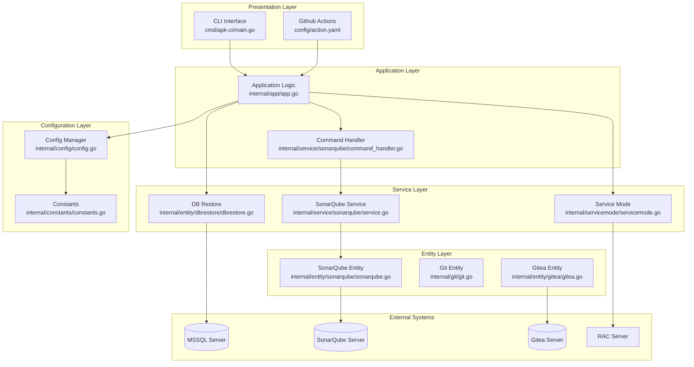
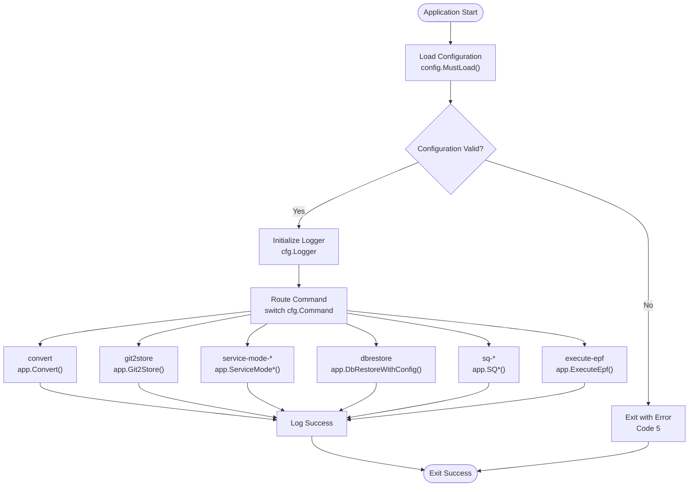
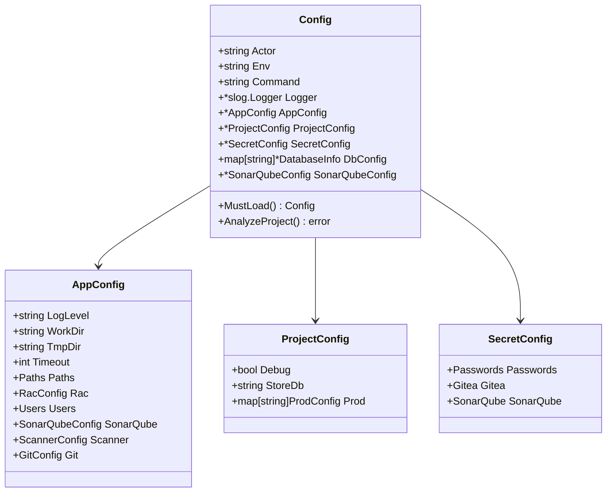
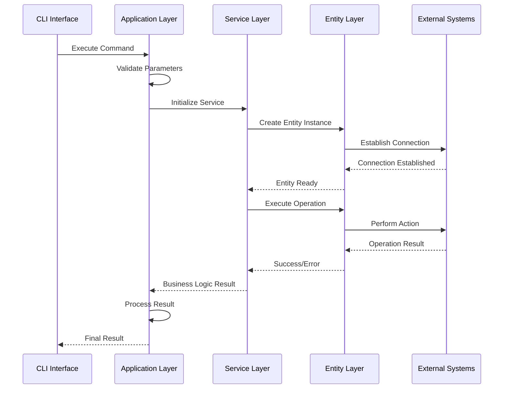
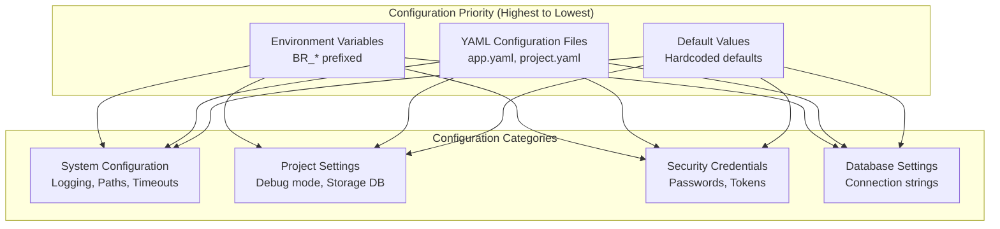
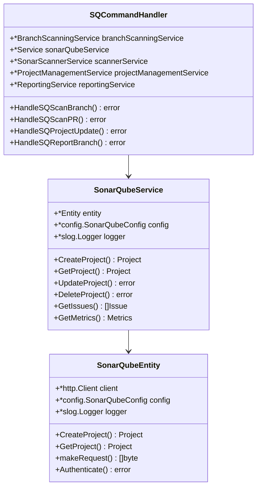
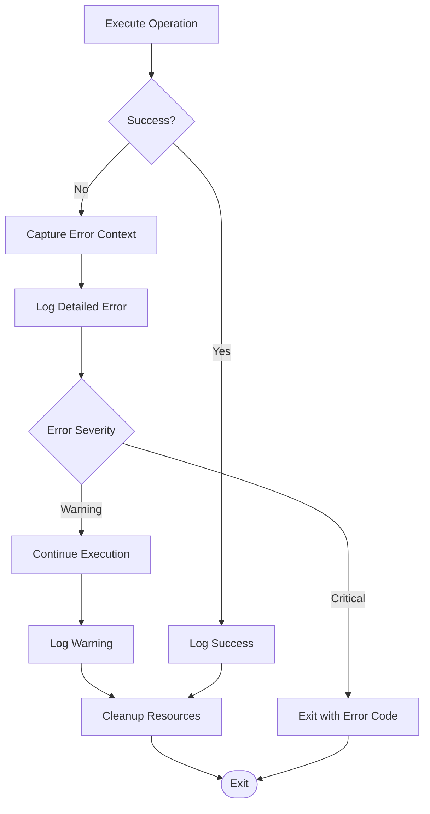

# Tool Overview & Core Value

<cite>
**Referenced Files in This Document**
- [cmd/apk-ci/main.go](file://cmd/apk-ci/main.go)
- [internal/app/app.go](file://internal/app/app.go)
- [internal/config/config.go](file://internal/config/config.go)
- [internal/constants/constants.go](file://internal/constants/constants.go)
- [internal/entity/sonarqube/sonarqube.go](file://internal/entity/sonarqube/sonarqube.go)
- [internal/service/sonarqube/command_handler.go](file://internal/service/sonarqube/command_handler.go)
- [internal/service/sonarqube/service.go](file://internal/service/sonarqube/service.go)
- [internal/servicemode/servicemode.go](file://internal/servicemode/servicemode.go)
- [internal/entity/dbrestore/dbrestore.go](file://internal/entity/dbrestore/dbrestore.go)
- [config/app.yaml](file://config/app.yaml)
- [config/action.yaml](file://config/action.yaml)
</cite>

## Table of Contents
1. [Introduction](#introduction)
2. [Architecture Overview](#architecture-overview)
3. [Core Components](#core-components)
4. [Command Processing Pipeline](#command-processing-pipeline)
5. [Configuration Management](#configuration-management)
6. [External System Integration](#external-system-integration)
7. [Practical Usage Examples](#practical-usage-examples)
8. [Technical Implementation Details](#technical-implementation-details)
9. [Best Practices](#best-practices)
10. [Conclusion](#conclusion)

## Introduction

The apk-ci is a sophisticated CLI tool designed to automate 1C:Enterprise development workflows. It serves as a comprehensive automation utility that streamlines database management, configuration conversion, service mode control, and SonarQube integration within the 1C ecosystem. The tool is built with modularity and separation of concerns, making it suitable for both simple automation tasks and complex CI/CD pipeline integrations.

The tool operates as a modular monolith architecture, where each major functionality is encapsulated within dedicated packages while maintaining clear boundaries and interfaces. This design enables efficient maintenance, testing, and scaling of individual components without affecting the overall system stability.

## Architecture Overview

The apk-ci follows a layered architecture pattern with clear separation between presentation, business logic, and data access layers. The architecture is designed around the principle of dependency injection and factory patterns, enabling loose coupling and high testability.



**Diagram sources**
- [cmd/apk-ci/main.go](file://cmd/apk-ci/main.go#L1-L252)
- [internal/app/app.go](file://internal/app/app.go#L1-L1301)
- [internal/service/sonarqube/command_handler.go](file://internal/service/sonarqube/command_handler.go#L1-L344)

The architecture emphasizes:
- **Modular Design**: Each functional area is isolated in separate packages
- **Dependency Injection**: Services receive their dependencies through constructors
- **Factory Patterns**: Creation of complex objects through specialized factories
- **Singleton Logger**: Centralized logging across all components
- **Configuration Abstraction**: Unified configuration management from multiple sources

## Core Components

### Application Entry Point

The main entry point in `cmd/apk-ci/main.go` serves as the orchestrator for all operations. It loads configuration, initializes logging, and routes commands to appropriate handlers based on the specified action.



**Diagram sources**
- [cmd/apk-ci/main.go](file://cmd/apk-ci/main.go#L20-L252)

### Application Logic Layer

The `internal/app/app.go` package contains the core business logic for all supported operations. It acts as a facade that coordinates between different subsystems and manages the overall workflow for each command.

Key responsibilities include:
- **Command Routing**: Directing operations to appropriate handlers
- **Workflow Coordination**: Managing multi-step processes like database restoration
- **Error Handling**: Centralized error processing and logging
- **Resource Management**: Proper initialization and cleanup of resources

### Configuration Management

The configuration system in `internal/config/config.go` provides a unified approach to loading settings from multiple sources including YAML files, environment variables, and command-line arguments.



**Diagram sources**
- [internal/config/config.go](file://internal/config/config.go#L1-L1445)

**Section sources**
- [cmd/apk-ci/main.go](file://cmd/apk-ci/main.go#L1-L252)
- [internal/app/app.go](file://internal/app/app.go#L1-L1301)
- [internal/config/config.go](file://internal/config/config.go#L1-L1445)

## Command Processing Pipeline

The command processing pipeline demonstrates the tool's ability to handle diverse automation scenarios through a consistent interface. Each command follows a standardized flow while allowing for specialized processing logic.



**Diagram sources**
- [internal/app/app.go](file://internal/app/app.go#L1-L1301)
- [internal/service/sonarqube/service.go](file://internal/service/sonarqube/service.go#L1-L770)

### Supported Commands

The tool supports a comprehensive set of commands for various automation needs:

1. **Database Operations**
   - `dbrestore`: Restore databases from historical backups
   - `service-mode-enable/disable/status`: Control service mode for 1C bases
   - `store2db`: Export configuration from 1C storage to database

2. **Integration Commands**
   - `sq-scan-branch`: Scan Git branches with SonarQube
   - `sq-scan-pr`: Scan pull requests with SonarQube
   - `sq-project-update`: Update SonarQube project metadata
   - `sq-report-branch`: Generate branch reports

3. **Development Workflow**
   - `git2store`: Sync Git repositories to 1C storage
   - `convert`: Convert 1C projects from Git to local format
   - `execute-epf`: Run external 1C processing files

4. **Utility Commands**
   - `create-temp-db`: Create temporary databases
   - `create-stores`: Create configuration stores
   - `action-menu-build`: Build action menus

**Section sources**
- [internal/constants/constants.go](file://internal/constants/constants.go#L1-L219)
- [internal/app/app.go](file://internal/app/app.go#L1-L1301)

## Configuration Management

The configuration system provides flexibility and security through multiple layers of configuration sources. The tool prioritizes environment variables for sensitive data while using YAML files for application settings.

### Configuration Hierarchy



**Diagram sources**
- [internal/config/config.go](file://internal/config/config.go#L1-L1445)
- [config/app.yaml](file://config/app.yaml#L1-L138)

### Environment Variable Integration

The tool seamlessly integrates with GitHub Actions through environment variable mapping. This enables easy CI/CD pipeline integration without requiring manual configuration file management.

Key environment variables include:
- `BR_COMMAND`: Specifies the operation to perform
- `BR_INFOBASE_NAME`: Database name for service mode operations
- `BR_TERMINATE_SESSIONS`: Controls session termination policy
- `BR_ACCESS_TOKEN`: Authentication token for external systems
- `BR_CONFIG_*`: References to configuration file locations

**Section sources**
- [internal/config/config.go](file://internal/config/config.go#L1-L1445)
- [config/action.yaml](file://config/action.yaml#L1-L121)

## External System Integration

The apk-ci excels at integrating with external systems commonly used in 1C:Enterprise environments. These integrations are implemented through well-defined interfaces that promote loose coupling and testability.

### SonarQube Integration

The SonarQube integration provides comprehensive code quality analysis capabilities for 1C:Enterprise projects. The integration supports both branch-level and pull request scanning with automatic project management.



**Diagram sources**
- [internal/service/sonarqube/command_handler.go](file://internal/service/sonarqube/command_handler.go#L1-L344)
- [internal/service/sonarqube/service.go](file://internal/service/sonarqube/service.go#L1-L770)
- [internal/entity/sonarqube/sonarqube.go](file://internal/entity/sonarqube/sonarqube.go#L1-L832)

### Service Mode Management

The service mode management system provides robust control over 1C:Enterprise database access. It integrates with the Remote Administration Console (RAC) to enable maintenance operations while preventing user interference.

Key features include:
- **Session Termination**: Automatic termination of active user sessions
- **Status Monitoring**: Real-time monitoring of service mode status
- **UUID Resolution**: Automatic resolution of cluster and database UUIDs
- **Retry Logic**: Built-in retry mechanisms for network failures

### Database Restoration

The database restoration system automates the process of restoring 1C:Enterprise databases from historical backups. It includes intelligent timeout calculation based on historical performance data.

Features:
- **Historical Statistics**: Automatic calculation of optimal timeout values
- **Multi-Server Support**: Seamless restoration between different server configurations
- **Transaction Safety**: Ensures data consistency during restoration
- **Error Recovery**: Comprehensive error handling and recovery mechanisms

**Section sources**
- [internal/service/sonarqube/command_handler.go](file://internal/service/sonarqube/command_handler.go#L1-L344)
- [internal/servicemode/servicemode.go](file://internal/servicemode/servicemode.go#L1-L441)
- [internal/entity/dbrestore/dbrestore.go](file://internal/entity/dbrestore/dbrestore.go#L1-L594)

## Practical Usage Examples

### Database Restoration Workflow

Here's a practical example of using the database restoration functionality:

```bash
# Basic database restoration
apk-ci --command=dbrestore --dbname=test_base

# With custom timeout and session termination
apk-ci --command=dbrestore \
  --dbname=test_base \
  --terminate-sessions=true \
  --timeout=1800s
```

The tool automatically:
1. Loads configuration from YAML files and environment variables
2. Determines source and destination servers based on database configuration
3. Calculates optimal timeout based on historical restoration statistics
4. Executes the restoration process with proper error handling
5. Logs detailed information about the restoration process

### SonarQube Integration Example

```bash
# Scan a branch with SonarQube
apk-ci --command=sq-scan-branch \
  --branch-for-scan=feature/new-feature \
  --commit-hash=abc123def456

# Update project metadata
apk-ci --command=sq-project-update

# Generate branch report
apk-ci --command=sq-report-branch
```

### Service Mode Operations

```bash
# Enable service mode with session termination
apk-ci --command=service-mode-enable \
  --dbname=production_base \
  --terminate-sessions=true

# Check service mode status
apk-ci --command=service-mode-status \
  --dbname=production_base

# Disable service mode
apk-ci --command=service-mode-disable \
  --dbname=production_base
```

## Technical Implementation Details

### Dependency Injection Pattern

The tool employs dependency injection extensively to promote testability and maintainability. Services receive their dependencies through constructor functions rather than global state or static methods.

```go
// Example from servicemode.go
func NewClient(racConfig RacConfig, logger Logger) *Client {
    racClient := rac.NewClient(
        racConfig.RacPath,
        racConfig.RacServer,
        racConfig.RacPort,
        racConfig.RacUser,
        racConfig.RacPassword,
        racConfig.DbUser,
        racConfig.DbPassword,
        racConfig.RacTimeout,
        racConfig.RacRetries,
        slogLogger,
    )
    
    return &Client{
        config:    &racConfig,
        racClient: racClient,
        logger:    logger,
    }
}
```

### Factory Pattern Implementation

The factory pattern is used for creating complex objects with multiple dependencies. This pattern ensures consistent object creation and encapsulates creation logic.

```go
// Example from dbrestore.go
func NewFromConfig(logger *slog.Logger, cfg *config.Config, dbName string) (*DBRestore, error) {
    dbR := &DBRestore{
        Port:            DefaultPort,
        Server:          DefaultServer,
        TimeToRestore:   nowInMoscow.Format("2006-01-02T15:04:05"),
        TimeToStatistic: nowInMoscow.AddDate(0, 0, -120).Format("2006-01-02T15:04:05"),
        Description:     "gitops db restore task",
    }
    
    // Populate data from AppConfig
    if cfg.AppConfig != nil {
        // Set configuration values...
    }
    
    return dbR, nil
}
```

### Singleton Logger Usage

The tool uses a singleton logger pattern with structured logging capabilities. The logger is configured once during application startup and shared across all components.

```go
// Logger initialization from config.go
func getSlog(actor string, logLevel string) *slog.Logger {
    var programLevel = new(slog.LevelVar)
    
    switch boLogLevel {
    default:
        programLevel.Set(slog.LevelInfo)
    case constants.LogLevelDebug:
        programLevel.Set(slog.LevelDebug)
    case constants.LogLevelInfo:
        programLevel.Set(slog.LevelInfo)
    case constants.LogLevelWarn:
        programLevel.Set(slog.LevelWarn)
    case constants.LogLevelError:
        programLevel.Set(slog.LevelError)
    }
    
    return slog.New(slog.NewJSONHandler(os.Stdout, &slog.HandlerOptions{
        AddSource: true,
        Level:     programLevel,
    }))
}
```

### Error Handling Strategy

The tool implements a comprehensive error handling strategy with detailed error context and graceful degradation capabilities.



**Section sources**
- [internal/servicemode/servicemode.go](file://internal/servicemode/servicemode.go#L1-L441)
- [internal/entity/dbrestore/dbrestore.go](file://internal/entity/dbrestore/dbrestore.go#L1-L594)
- [internal/config/config.go](file://internal/config/config.go#L1-L1445)

## Best Practices

### Configuration Management

1. **Environment Variables for Secrets**: Always use environment variables for sensitive data like passwords and tokens
2. **YAML Configuration for Settings**: Use YAML files for application-wide settings and paths
3. **Hierarchical Configuration**: Leverage the configuration hierarchy to override defaults when needed
4. **Validation**: Implement comprehensive configuration validation to catch errors early

### Error Handling

1. **Structured Logging**: Use structured logging with contextual information for better debugging
2. **Graceful Degradation**: Implement fallback mechanisms for non-critical operations
3. **Error Propagation**: Propagate errors with meaningful context rather than generic messages
4. **Resource Cleanup**: Ensure proper resource cleanup in error scenarios

### Testing Strategy

1. **Interface-Based Testing**: Design interfaces to enable easy mocking and unit testing
2. **Dependency Injection**: Use DI to facilitate test isolation and dependency management
3. **Integration Tests**: Implement integration tests for external system interactions
4. **Mock Objects**: Create comprehensive mock objects for external dependencies

### Performance Optimization

1. **Concurrent Operations**: Use goroutines for independent operations that can run in parallel
2. **Connection Pooling**: Implement connection pooling for database and external system connections
3. **Caching**: Cache frequently accessed data to reduce redundant operations
4. **Timeout Management**: Implement appropriate timeouts for all external operations

## Conclusion

The apk-ci CLI tool represents a mature, well-architected solution for automating 1C:Enterprise development workflows. Its modular design, comprehensive configuration management, and robust integration capabilities make it an essential tool for organizations adopting DevOps practices with 1C:Enterprise systems.

The tool's strength lies in its ability to abstract complex operations into simple, composable commands while maintaining flexibility through extensive configuration options. The separation of concerns between application logic, services, and entities ensures maintainability and testability, while the comprehensive error handling and logging provide operational visibility.

Key benefits of the apk-ci include:
- **Unified Interface**: Single tool for diverse automation needs
- **CI/CD Integration**: Seamless GitHub Actions integration
- **External System Support**: Robust integration with SonarQube, Gitea, and 1C:Enterprise systems
- **Operational Excellence**: Comprehensive logging, error handling, and monitoring
- **Extensibility**: Modular architecture allows for easy addition of new functionality

The tool continues to evolve with new features and improvements, making it a reliable foundation for 1C:Enterprise automation initiatives. Its design principles and implementation patterns serve as excellent examples for building scalable, maintainable automation tools in enterprise environments.