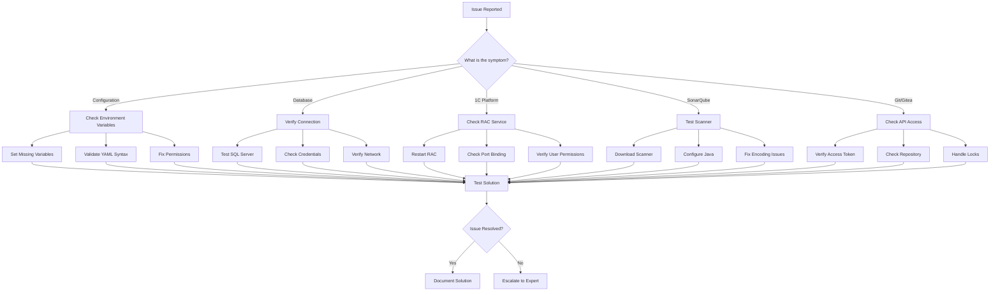

# Troubleshooting Guide

<cite>
**Referenced Files in This Document**
- [README.md](file://README.md)
- [cmd/apk-ci/main.go](file://cmd/apk-ci/main.go)
- [internal/config/config.go](file://internal/config/config.go)
- [internal/app/sonarqube_init.go](file://internal/app/sonarqube_init.go)
- [internal/servicemode/servicemode.go](file://internal/servicemode/servicemode.go)
- [internal/entity/dbrestore/dbrestore.go](file://internal/entity/dbrestore/dbrestore.go)
- [internal/entity/gitea/gitea.go](file://internal/entity/gitea/gitea.go)
- [internal/service/sonarqube/scanner.go](file://internal/service/sonarqube/scanner.go)
- [internal/logging/utils.go](file://internal/logging/utils.go)
- [internal/constants/constants.go](file://internal/constants/constants.go)
- [git_index_lock_fix_report.md](file://git_index_lock_fix_report.md)
- [analysis_report.md](file://analysis_report.md)
- [config/app.yaml](file://config/app.yaml)
</cite>

## Table of Contents
1. [Introduction](#introduction)
2. [Common Issues Categories](#common-issues-categories)
3. [Configuration Errors](#configuration-errors)
4. [Database Connectivity Issues](#database-connectivity-issues)
5. [1C Platform Integration Problems](#1c-platform-integration-problems)
6. [SonarQube Scanning Failures](#sonarqube-scanning-failures)
7. [Git Operations and Gitea Integration](#git-operations-and-gitea-integration)
8. [Environment and Resource Limitations](#environment-and-resource-limitations)
9. [Diagnostic Tools and Techniques](#diagnostic-tools-and-techniques)
10. [Systematic Problem Isolation](#systematic-problem-isolation)
11. [Escalation Paths](#escalation-paths)
12. [Known Limitations and Workarounds](#known-limitations-and-workarounds)

## Introduction

This troubleshooting guide provides comprehensive solutions for common issues encountered when using apk-ci. The guide organizes problems by functional categories and provides systematic approaches to problem isolation, diagnosis, and resolution. Each section includes specific fixes documented in reports like `git_index_lock_fix_report.md` and `analysis_report.md`.

apk-ci is a complex system with multiple integrated modules including service mode management, database restoration, 1C platform integration, and SonarQube scanning. Understanding the architecture helps in identifying root causes and implementing effective solutions.

## Common Issues Categories

The system can encounter issues across several functional domains:

```mermaid
flowchart TD
A["Benadis Runner Issues"] --> B["Configuration Errors"]
A --> C["Database Connectivity"]
A --> D["1C Platform Integration"]
A --> E["SonarQube Scanning"]
A --> F["Git/Gitea Operations"]
A --> G["Environment Resources"]
B --> B1["Missing Environment Variables"]
B --> B2["Invalid YAML Config"]
B --> B3["Permission Issues"]
C --> C1["SQL Server Connection"]
C --> C2["Authentication Failures"]
C --> C3["Network Timeouts"]
D --> D1["RAC Connection"]
D --> D2["1C Binary Path"]
D --> D3["License Issues"]
E --> E1["Scanner Download"]
E --> E2["Analysis Failures"]
E --> E3["Quality Gate Violations"]
F --> F1["Git Lock Issues"]
F --> F2["Branch Creation"]
F --> F3["API Authentication"]
G --> G1["Disk Space"]
G --> G2["Memory Constraints"]
G --> G3["File Permissions"]
```



## Configuration Errors

### Missing Environment Variables

**Symptoms:**
- Application exits with code 5
- "Не удалось загрузить конфигурацию приложения" error message
- Missing required parameters in logs

**Diagnosis Steps:**
1. Check required environment variables:
   ```bash
   echo $BR_ACTOR
   echo $BR_GITEA_URL
   echo $BR_REPOSITORY
   echo $BR_ACCESS_TOKEN
   echo $BR_COMMAND
   ```

2. Verify input parameters:
   ```bash
   # Check GitHub Actions input parameters
   echo $INPUT_ACTOR
   echo $INPUT_GITEAURL
   echo $INPUT_REPOSITORY
   echo $INPUT_ACCESSTOKEN
   echo $INPUT_COMMAND
   ```

**Solution:**
1. Set all required environment variables
2. Use configuration templates from examples/
3. Validate YAML syntax using online validators

**Prevention:**
- Create comprehensive deployment scripts
- Implement configuration validation
- Use CI/CD pipeline checks

### Invalid YAML Configuration

**Symptoms:**
- Parsing errors in configuration files
- Unexpected behavior in module operations
- Validation failures

**Diagnosis Steps:**
1. Validate YAML syntax:
   ```bash
   yamllint config/app.yaml
   ```

2. Check specific configuration sections:
   ```bash
   # Test specific configurations
   cat config/app.yaml | grep -A 10 "sonarqube:"
   cat config/app.yaml | grep -A 10 "git:"
   ```

**Solution:**
1. Fix YAML syntax errors
2. Validate indentation and structure
3. Use configuration templates as reference

### Permission Issues

**Symptoms:**
- Access denied errors
- Unable to create directories
- File write permission failures

**Diagnosis Steps:**
1. Check file permissions:
   ```bash
   ls -la config/
   ls -la /tmp/4del/
   ```

2. Verify user permissions:
   ```bash
   whoami
   groups
   ```

**Solution:**
1. Set appropriate file permissions:
   ```bash
   chmod 644 config/*.yaml
   chmod 755 /tmp/4del/
   ```

2. Run with proper user privileges

## Database Connectivity Issues

### SQL Server Connection Failures

**Symptoms:**
- Connection timeout errors
- Authentication failures
- "Cannot connect to RAC server" messages

**Diagnosis Steps:**
1. Test direct SQL Server connection:
   ```bash
   telnet MSSQL_SERVER 1433
   ```

2. Verify connection parameters:
   ```bash
   # Check database configuration
   cat config/app.yaml | grep -A 5 "dbrestore:"
   ```

3. Test with SQL Server client:
   ```bash
   sqlcmd -S MSSQL_SERVER -U gitops -P PASSWORD -d master
   ```

**Solution:**
1. Verify server address and port
2. Check firewall settings
3. Validate credentials
4. Test with SQL Server Management Studio

**Section sources**
- [internal/entity/dbrestore/dbrestore.go](file://internal/entity/dbrestore/dbrestore.go#L317-L356)

### RAC Connection Issues

**Symptoms:**
- RAC server unreachable
- Port binding failures
- Authentication timeouts

**Diagnosis Steps:**
1. Check RAC server status:
   ```bash
   netstat -tlnp | grep 1545
   ```

2. Test RAC connectivity:
   ```bash
   rac -S localhost -P 1545 -U admin -P password version
   ```

3. Verify configuration:
   ```bash
   # Check RAC configuration
   cat config/app.yaml | grep -A 10 "rac:"
   ```

**Solution:**
1. Restart RAC service
2. Verify port availability
3. Check user permissions
4. Update configuration parameters

**Section sources**
- [internal/servicemode/servicemode.go](file://internal/servicemode/servicemode.go#L249-L279)

## 1C Platform Integration Problems

### Service Mode Management Issues

**Symptoms:**
- Service mode enable/disable failures
- Session termination problems
- Information base locking

**Diagnosis Steps:**
1. Check service mode status:
   ```bash
   ./apk-ci service-mode-status --infobase MyInfobase
   ```

2. Monitor session activity:
   ```bash
   # Check active sessions via RAC
   rac -S localhost -P 1545 -U admin -P password sessions
   ```

3. Verify information base existence:
   ```bash
   rac -S localhost -P 1545 -U admin -P password list
   ```

**Solution:**
1. Ensure information base exists
2. Terminate conflicting sessions
3. Use proper session termination flag
4. Check RAC service health

**Section sources**
- [internal/servicemode/servicemode.go](file://internal/servicemode/servicemode.go#L310-L328)

### 1C Binary Path Issues

**Symptoms:**
- Binary not found errors
- Version compatibility problems
- Execution permission failures

**Diagnosis Steps:**
1. Verify binary paths:
   ```bash
   ls -la /opt/1cv8/x86_64/8.3.27.1606/
   ```

2. Check binary versions:
   ```bash
   /opt/1cv8/x86_64/8.3.27.1606/1cv8 version
   ```

3. Test execution permissions:
   ```bash
   sudo -u gitops /opt/1cv8/x86_64/8.3.27.1606/1cv8 version
   ```

**Solution:**
1. Install required 1C binaries
2. Set proper execution permissions
3. Verify version compatibility
4. Update configuration paths

## SonarQube Scanning Failures

### Scanner Download and Setup Issues

**Symptoms:**
- Scanner download failures
- Java heap space errors
- Scanner initialization problems

**Diagnosis Steps:**
1. Check scanner download:
   ```bash
   # Test git clone
   git clone https://regdv.apkholding.ru/gitops-tools/sonar-scanner-cli.git
   ```

2. Verify Java configuration:
   ```bash
   java -version
   echo $JAVA_OPTS
   ```

3. Check disk space:
   ```bash
   df -h /tmp/4del/scanner/
   ```

**Solution:**
1. Increase Java heap size:
   ```bash
   export JAVA_OPTS="-Xmx8192m"
   ```

2. Clear temporary directories:
   ```bash
   rm -rf /tmp/4del/scanner/*
   ```

3. Verify network connectivity

**Section sources**
- [internal/service/sonarqube/scanner.go](file://internal/service/sonarqube/scanner.go#L44-L60)

### Analysis Failures and BSL Errors

**Symptoms:**
- Tokenization errors in BSL files
- Encoding issues
- File not found errors

**Diagnosis Steps:**
1. Review analysis logs:
   ```bash
   tail -f /var/log/apk-ci.log | grep -i error
   ```

2. Check problematic files:
   ```bash
   # From analysis_report.md
   ls -la ../sonar-scan-3789141417/TOIR3/src/CommonModules/
   ```

3. Test file encoding:
   ```bash
   file -bi Module.bsl
   iconv -f WINDOWS-1252 -t UTF-8 Module.bsl
   ```

**Solution:**
1. Fix encoding issues:
   ```bash
   iconv -f WINDOWS-1252 -t UTF-8 -o Module_utf8.bsl Module.bsl
   mv Module_utf8.bsl Module.bsl
   ```

2. Add exclusions to sonar.exclusions
3. Update scanner properties

**Section sources**
- [analysis_report.md](file://analysis_report.md#L1-L105)

### Quality Gate Violations

**Symptoms:**
- Quality gate failures
- Exceeded thresholds
- Metric violations

**Diagnosis Steps:**
1. Check quality gate status:
   ```bash
   curl -u TOKEN: http://sq.apkholding.ru:9000/api/qualitygates/project_status?projectKey=YOUR_PROJECT
   ```

2. Review metrics:
   ```bash
   curl -u TOKEN: http://sq.apkholding.ru:9000/api/measures/component?component=YOUR_PROJECT&metricKeys=coverage,duplicated_lines_density
   ```

**Solution:**
1. Adjust quality gate thresholds
2. Improve code quality
3. Add appropriate exclusions

## Git Operations and Gitea Integration

### Git Index Lock Issues

**Symptoms:**
- "fatal: Unable to create '/tmp/4del/s2032845846/.git/index.lock': File exists"
- Concurrent Git operations failures
- Repository corruption

**Diagnosis Steps:**
1. Check for existing locks:
   ```bash
   ls -la /tmp/4del/*/index.lock
   ```

2. Identify process holding lock:
   ```bash
   lsof | grep index.lock
   ps aux | grep git
   ```

3. Review recent Git operations:
   ```bash
   tail -f /var/log/apk-ci.log | grep -i git
   ```

**Solution:**
1. Remove stale locks:
   ```bash
   rm -f /tmp/4del/*/index.lock
   ```

2. Implement automatic lock removal:
   ```bash
   # From git_index_lock_fix_report.md
   removeGitIndexLock()
   executeGitCommandWithRetry()
   ```

3. Add retry logic to Git operations

**Section sources**
- [git_index_lock_fix_report.md](file://git_index_lock_fix_report.md#L1-L50)

### Branch Creation and Management

**Symptoms:**
- Branch creation failures
- Merge conflicts
- API authentication errors

**Diagnosis Steps:**
1. Check Gitea API connectivity:
   ```bash
   curl -I https://gitea.example.com/api/v1/version
   ```

2. Verify branch permissions:
   ```bash
   curl -u TOKEN: https://gitea.example.com/api/v1/repos/owner/repo/branches/test-branch
   ```

3. Review branch creation logs:
   ```bash
   # Check Gitea API responses
   grep -i "CreateTestBranch" /var/log/apk-ci.log
   ```

**Solution:**
1. Verify Gitea access token
2. Check repository permissions
3. Ensure branch naming conventions
4. Handle merge conflicts automatically

**Section sources**
- [internal/entity/gitea/gitea.go](file://internal/entity/gitea/gitea.go#L216-L235)

## Environment and Resource Limitations

### Disk Space and Storage Issues

**Symptoms:**
- Out of disk space errors
- Temporary directory full
- Scanner download failures

**Diagnosis Steps:**
1. Check disk usage:
   ```bash
   df -h /tmp/4del/
   du -sh /tmp/4del/
   ```

2. Monitor temporary directories:
   ```bash
   find /tmp/4del/ -type f -mtime +1 -delete
   ```

3. Check inode usage:
   ```bash
   df -i /tmp/4del/
   ```

**Solution:**
1. Clean up temporary files:
   ```bash
   rm -rf /tmp/4del/*
   ```

2. Increase disk quota
3. Optimize temporary directory usage

### Memory and CPU Constraints

**Symptoms:**
- Out of memory errors
- Process killed by OOM killer
- Slow performance

**Diagnosis Steps:**
1. Monitor system resources:
   ```bash
   top -p $(pgrep apk-ci)
   free -h
   ```

2. Check Java heap usage:
   ```bash
   jstat -gc $(pgrep java)
   ```

3. Review process limits:
   ```bash
   ulimit -a
   cat /proc/$(pgrep apk-ci)/limits
   ```

**Solution:**
1. Increase memory allocation:
   ```bash
   export JAVA_OPTS="-Xmx4096m"
   ```

2. Optimize concurrent operations
3. Implement resource monitoring

### Network Connectivity Issues

**Symptoms:**
- Connection timeouts
- DNS resolution failures
- Proxy configuration problems

**Diagnosis Steps:**
1. Test network connectivity:
   ```bash
   ping sq.apkholding.ru
   nslookup sq.apkholding.ru
   ```

2. Check proxy settings:
   ```bash
   env | grep -i proxy
   curl -I http://sq.apkholding.ru:9000
   ```

3. Verify firewall rules:
   ```bash
   iptables -L | grep -E "(80|443|9000)"
   ```

**Solution:**
1. Configure proxy settings
2. Update firewall rules
3. Use alternative DNS servers

## Diagnostic Tools and Techniques

### Logging and Monitoring

**Log Analysis Techniques:**

1. **Structured Logging:**
   ```bash
   # Filter by log level
   grep '"level":"ERROR"' /var/log/apk-ci.log
   
   # Search by operation
   grep '"operation":"service-mode-enable"' /var/log/apk-ci.log
   ```

2. **Correlation ID Tracking:**
   ```bash
   # Find all logs for specific operation
   grep '"correlation_id":"OPERATION_ID"' /var/log/apk-ci.log
   ```

3. **Error Pattern Recognition:**
   ```bash
   # Common error patterns
   grep -E "(timeout|connection|authentication)" /var/log/apk-ci.log
   ```

**Section sources**
- [internal/logging/utils.go](file://internal/logging/utils.go#L1-L189)

### Health Checks and Status Verification

**System Health Checks:**

1. **Application Status:**
   ```bash
   # Check if application is running
   pgrep apk-ci
   
   # Verify configuration loading
   ./apk-ci --help
   ```

2. **External Service Status:**
   ```bash
   # Check SonarQube service
   curl -f http://sq.apkholding.ru:9000/api/system/status
   
   # Verify database connectivity
   rac -S localhost -P 1545 -U admin -P password version
   ```

3. **Resource Utilization:**
   ```bash
   # Monitor system resources
   iostat -x 1
   vmstat 1
   ```

### Debug Mode and Verbose Logging

**Enable Debug Mode:**
```bash
export BR_LOG_LEVEL=Debug
export LOG_LEVEL=Debug

# Run with debug output
./apk-ci service-mode-enable --infobase MyInfobase --debug
```

**Verbose Configuration Display:**
```bash
# Enable configuration display
./apk-ci --show-config
```

## Systematic Problem Isolation

### Decision Tree for Issue Resolution



### Step-by-Step Troubleshooting Process

**Phase 1: Initial Assessment**
1. Collect error messages and stack traces
2. Identify affected components
3. Determine when the issue started
4. Check recent configuration changes

**Phase 2: Environment Verification**
1. Verify system requirements
2. Check resource availability
3. Validate external dependencies
4. Confirm network connectivity

**Phase 3: Component-Specific Diagnostics**
1. Test individual components
2. Verify configuration parameters
3. Check authentication credentials
4. Validate file permissions

**Phase 4: Solution Implementation**
1. Apply fixes incrementally
2. Test each change
3. Verify system stability
4. Document successful solutions

**Phase 5: Prevention and Monitoring**
1. Implement monitoring alerts
2. Create automated health checks
3. Establish preventive measures
4. Update documentation

## Escalation Paths

### Self-Help Resources

**Documentation and References:**
1. [Official Documentation](docs/wiki/README.md)
2. [Configuration Guide](docs/wiki/04-Конфигурация.md)
3. [Command Reference](docs/wiki/01-Справочник-команд.md)

**Community Support:**
1. GitHub Issues for bug reports
2. Discussion forums for general questions
3. Stack Overflow for technical problems

### Expert Assistance

**Internal Support Channels:**
1. Team lead escalation
2. Technical architect review
3. System administrator assistance

**External Resources:**
1. 1C Platform support
2. SonarQube professional services
3. Database vendor support

### Escalation Criteria

**Critical Issues (Immediate Action):**
- System downtime affecting multiple users
- Security vulnerabilities
- Data loss or corruption
- Complete service unavailability

**High Priority (Within 24 hours):**
- Performance degradation
- Frequent recurring errors
- Configuration corruption
- Integration failures

**Standard Priority (Within 5 business days):**
- Minor functionality issues
- Configuration problems
- Documentation updates
- Feature enhancement requests

## Known Limitations and Workarounds

### File System Limitations

**Limitation:** Large file handling in Git operations
**Workaround:** Use sparse checkout for large repositories
```bash
git config core.sparsecheckout true
echo "important/path/" >> .git/info/sparse-checkout
git read-tree -mu HEAD
```

**Limitation:** Concurrent Git operations
**Workaround:** Implement advisory locks or queue systems

### Memory Management

**Limitation:** Java heap space for large projects
**Workaround:** Increase heap size and optimize scanner configuration
```bash
export JAVA_OPTS="-Xmx8192m -XX:+UseG1GC"
```

### Network Dependencies

**Limitation:** External service availability
**Workaround:** Implement local caching and offline modes where possible

### Configuration Complexity

**Limitation:** Multi-layered configuration system
**Workaround:** Use configuration templates and validation scripts

**Section sources**
- [config/app.yaml](file://config/app.yaml#L1-L137)
- [internal/config/config.go](file://internal/config/config.go#L1-L799)

### Performance Optimizations

**Limitation:** Slow scanner execution
**Workaround:** Parallelize scanning operations and optimize exclusion patterns

**Limitation:** Long-running database operations
**Workaround:** Implement progress monitoring and cancellation support

### Error Recovery Mechanisms

**Limitation:** Graceful error handling
**Workaround:** Implement retry logic with exponential backoff and circuit breakers

**Section sources**
- [cmd/apk-ci/main.go](file://cmd/apk-ci/main.go#L1-L251)
- [internal/constants/constants.go](file://internal/constants/constants.go#L1-L218)

This comprehensive troubleshooting guide provides systematic approaches to resolving common issues with apk-ci. By following the categorized solutions and diagnostic techniques outlined here, teams can quickly identify and resolve problems while maintaining system reliability and performance.