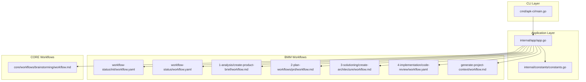
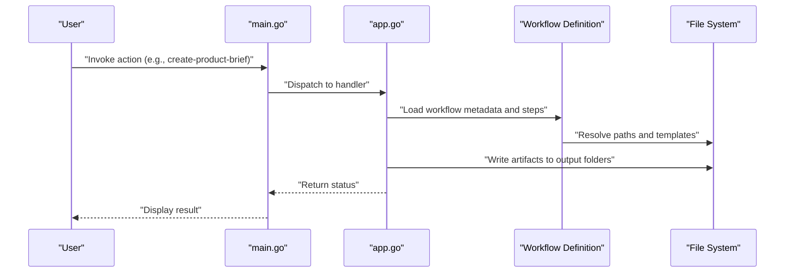
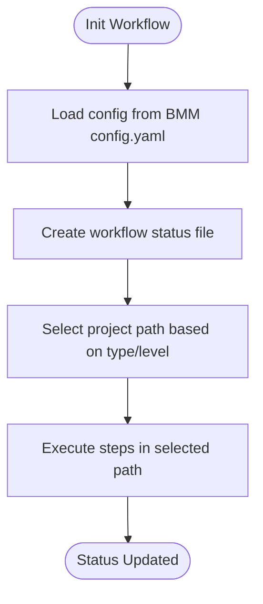
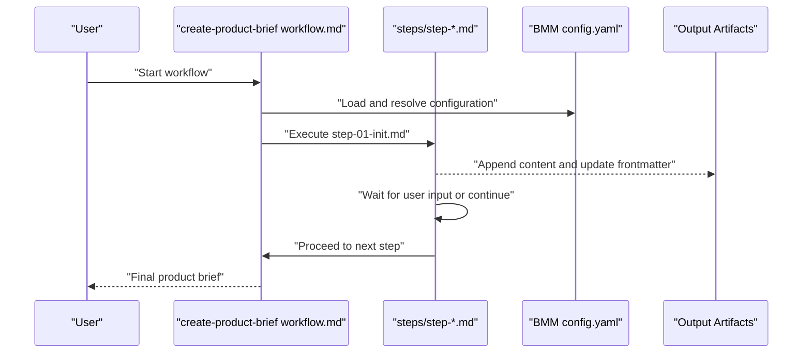
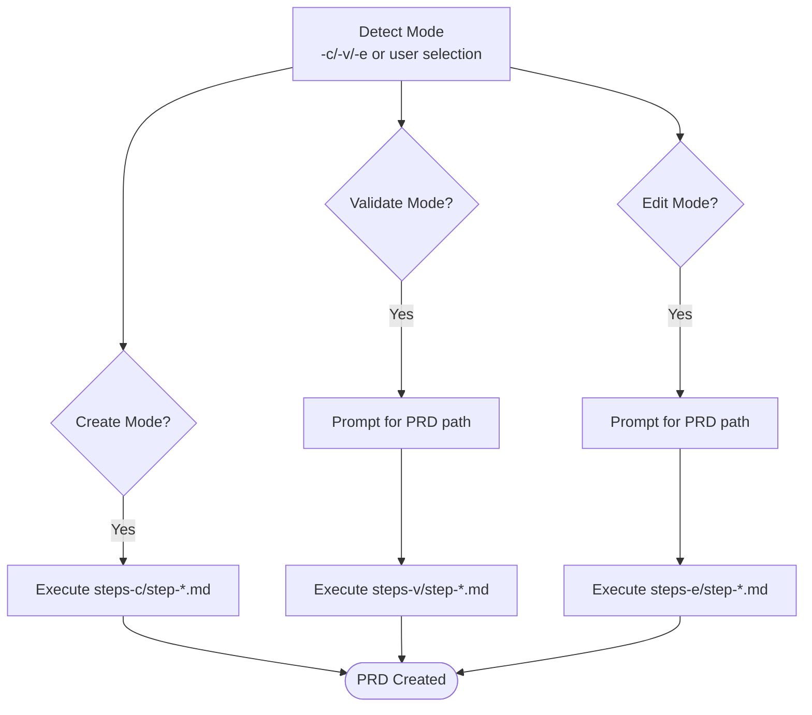
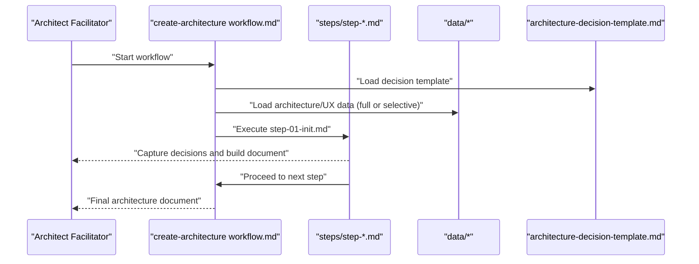
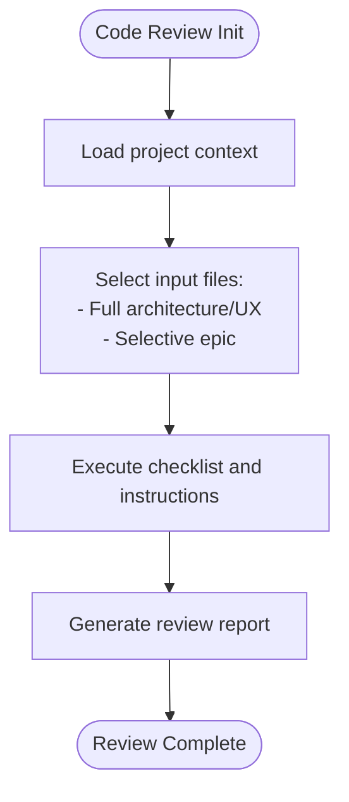
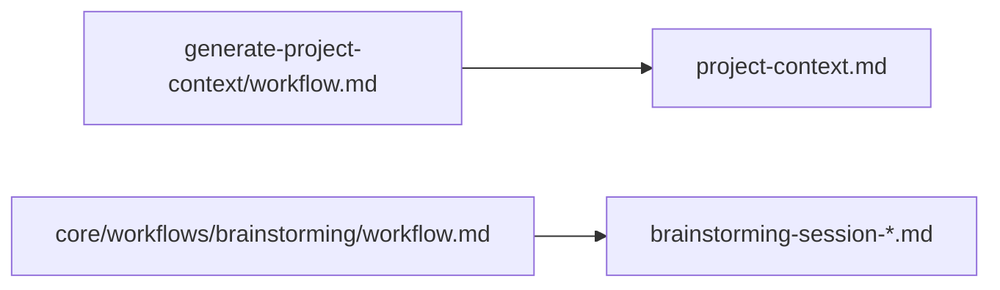
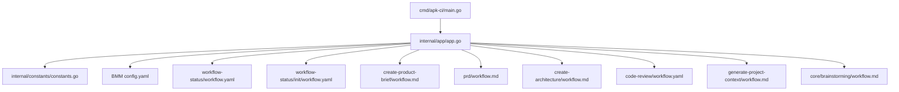

# Workflow Management

<cite>
**Referenced Files in This Document**
- [main.go](file://cmd/apk-ci/main.go)
- [app.go](file://internal/app/app.go)
- [constants.go](file://internal/constants/constants.go)
- [config.yaml](file://_bmad/bmm/config.yaml)
- [workflow.yaml](file://_bmad/bmm/workflows/workflow-status/workflow.yaml)
- [workflow.yaml](file://_bmad/bmm/workflows/workflow-status/init/workflow.yaml)
- [workflow.md](file://_bmad/bmm/workflows/1-analysis/create-product-brief/workflow.md)
- [workflow.md](file://_bmad/bmm/workflows/2-plan-workflows/prd/workflow.md)
- [workflow.md](file://_bmad/bmm/workflows/3-solutioning/create-architecture/workflow.md)
- [workflow.yaml](file://_bmad/bmm/workflows/4-implementation/code-review/workflow.yaml)
- [workflow.md](file://_bmad/bmm/workflows/generate-project-context/workflow.md)
- [workflow.md](file://_bmad/core/workflows/brainstorming/workflow.md)
</cite>

## Table of Contents
1. [Introduction](#introduction)
2. [Project Structure](#project-structure)
3. [Core Components](#core-components)
4. [Architecture Overview](#architecture-overview)
5. [Detailed Component Analysis](#detailed-component-analysis)
6. [Dependency Analysis](#dependency-analysis)
7. [Performance Considerations](#performance-considerations)
8. [Troubleshooting Guide](#troubleshooting-guide)
9. [Conclusion](#conclusion)

## Introduction
This document describes the Workflow Management system used by the apk-ci project. It explains how workflows are organized, configured, and executed across analysis, planning, solutioning, and implementation phases. The system leverages modular workflow definitions with step-file architectures, centralized configuration, and a command-driven entry point to orchestrate automated processes.

## Project Structure
The Workflow Management system is composed of:
- Command entry point that routes actions to workflow handlers
- Centralized configuration for project metadata and output locations
- Modular workflow definitions with step-file execution models
- Phase-specific workflow families covering analysis, planning, solutioning, and implementation

**Diagram sources**
- [main.go](file://cmd/apk-ci/main.go#L16-L261)
- [app.go](file://internal/app/app.go#L1-L1307)
- [constants.go](file://internal/constants/constants.go#L49-L102)
- [workflow.yaml](file://_bmad/bmm/workflows/workflow-status/init/workflow.yaml#L1-L29)
- [workflow.yaml](file://_bmad/bmm/workflows/workflow-status/workflow.yaml#L1-L31)
- [workflow.md](file://_bmad/bmm/workflows/1-analysis/create-product-brief/workflow.md#L1-L59)
- [workflow.md](file://_bmad/bmm/workflows/2-plan-workflows/prd/workflow.md#L1-L151)
- [workflow.md](file://_bmad/bmm/workflows/3-solutioning/create-architecture/workflow.md#L1-L51)
- [workflow.yaml](file://_bmad/bmm/workflows/4-implementation/code-review/workflow.yaml#L1-L50)
- [workflow.md](file://_bmad/bmm/workflows/generate-project-context/workflow.md#L1-L50)
- [workflow.md](file://_bmad/core/workflows/brainstorming/workflow.md#L1-L59)

**Section sources**
- [main.go](file://cmd/apk-ci/main.go#L16-L261)
- [app.go](file://internal/app/app.go#L1-L1307)
- [constants.go](file://internal/constants/constants.go#L49-L102)

## Core Components
- Command routing: The CLI entry point parses the requested action and delegates to the appropriate handler in the application layer.
- Application handlers: Centralized functions implement the business logic for each action, including workflow orchestration and integration with external systems.
- Configuration: Shared configuration defines project metadata, output folders, and language preferences used by workflows.
- Workflow definitions: YAML and Markdown files define workflow metadata, step-file paths, templates, and execution rules.

Key responsibilities:
- CLI dispatch to workflow handlers
- Workflow status tracking and project initialization
- Step-file driven execution with state persistence
- Output artifact management and templating

**Section sources**
- [main.go](file://cmd/apk-ci/main.go#L16-L261)
- [app.go](file://internal/app/app.go#L1-L1307)
- [config.yaml](file://_bmad/bmm/config.yaml#L6-L19)

## Architecture Overview
The Workflow Management architecture follows a layered approach:
- CLI layer validates commands and invokes application handlers
- Application layer coordinates workflow execution and integrates with external systems
- Workflow layer defines modular, step-file driven processes
- Configuration layer centralizes project settings and output paths

**Diagram sources**
- [main.go](file://cmd/apk-ci/main.go#L30-L260)
- [app.go](file://internal/app/app.go#L68-L131)
- [workflow.md](file://_bmad/bmm/workflows/1-analysis/create-product-brief/workflow.md#L50-L59)

## Detailed Component Analysis

### Workflow Status System
The workflow status system provides:
- Initialization workflow to set up project-level status tracking
- Master workflow orchestrating status checks and routing to appropriate paths

**Diagram sources**
- [workflow.yaml](file://_bmad/bmm/workflows/workflow-status/init/workflow.yaml#L1-L29)
- [workflow.yaml](file://_bmad/bmm/workflows/workflow-status/workflow.yaml#L1-L31)

**Section sources**
- [workflow.yaml](file://_bmad/bmm/workflows/workflow-status/init/workflow.yaml#L1-L29)
- [workflow.yaml](file://_bmad/bmm/workflows/workflow-status/workflow.yaml#L1-L31)

### Analysis Phase: Create Product Brief
The create-product-brief workflow uses a step-file architecture with strict sequencing and state tracking via frontmatter arrays. It loads configuration from BMM config.yaml and executes steps in order.

**Diagram sources**
- [workflow.md](file://_bmad/bmm/workflows/1-analysis/create-product-brief/workflow.md#L50-L59)
- [config.yaml](file://_bmad/bmm/config.yaml#L6-L19)

**Section sources**
- [workflow.md](file://_bmad/bmm/workflows/1-analysis/create-product-brief/workflow.md#L1-L59)
- [config.yaml](file://_bmad/bmm/config.yaml#L6-L19)

### Planning Phase: PRD Tri-Modal Workflow
The PRD workflow supports three modes (create, validate, edit) with mode detection via invocation or user selection. It enforces step-file discipline and state tracking.

**Diagram sources**
- [workflow.md](file://_bmad/bmm/workflows/2-plan-workflows/prd/workflow.md#L26-L68)

**Section sources**
- [workflow.md](file://_bmad/bmm/workflows/2-plan-workflows/prd/workflow.md#L1-L151)

### Solutioning Phase: Create Architecture
The create-architecture workflow facilitates collaborative architectural decision-making with micro-file architecture and selective input loading strategies.

**Diagram sources**
- [workflow.md](file://_bmad/bmm/workflows/3-solutioning/create-architecture/workflow.md#L29-L51)

**Section sources**
- [workflow.md](file://_bmad/bmm/workflows/3-solutioning/create-architecture/workflow.md#L1-L51)

### Implementation Phase: Code Review
The code-review workflow performs adversarial reviews with smart input file selection strategies for architecture, UX, and epics.

**Diagram sources**
- [workflow.yaml](file://_bmad/bmm/workflows/4-implementation/code-review/workflow.yaml#L24-L50)

**Section sources**
- [workflow.yaml](file://_bmad/bmm/workflows/4-implementation/code-review/workflow.yaml#L1-L50)

### Supporting Workflows
- Generate Project Context: Creates a concise project-context.md optimized for LLM context efficiency.
- Brainstorming: Facilitates interactive sessions with diverse ideation methods and technique loading.

**Diagram sources**
- [workflow.md](file://_bmad/bmm/workflows/generate-project-context/workflow.md#L28-L50)
- [workflow.md](file://_bmad/core/workflows/brainstorming/workflow.md#L33-L59)

**Section sources**
- [workflow.md](file://_bmad/bmm/workflows/generate-project-context/workflow.md#L1-L50)
- [workflow.md](file://_bmad/core/workflows/brainstorming/workflow.md#L1-L59)

## Dependency Analysis
The workflow system exhibits clear separation of concerns:
- CLI depends on application handlers for action execution
- Application handlers depend on workflow definitions for orchestration
- Workflow definitions depend on configuration for paths and templates
- Workflows depend on file system for step execution and artifact generation

**Diagram sources**
- [main.go](file://cmd/apk-ci/main.go#L16-L261)
- [app.go](file://internal/app/app.go#L1-L1307)
- [constants.go](file://internal/constants/constants.go#L49-L102)
- [config.yaml](file://_bmad/bmm/config.yaml#L6-L19)

**Section sources**
- [main.go](file://cmd/apk-ci/main.go#L16-L261)
- [app.go](file://internal/app/app.go#L1-L1307)
- [constants.go](file://internal/constants/constants.go#L49-L102)

## Performance Considerations
- Step-file architecture minimizes memory overhead by loading only the current step
- Selective input loading reduces I/O by targeting specific epics during code review
- Centralized configuration avoids repeated path resolution across workflows
- Logging and structured error handling improve operational visibility

## Troubleshooting Guide
Common issues and resolutions:
- Unknown command: Verify BR_ACTION value matches supported constants
- Configuration load failures: Ensure BMM config.yaml exists and paths are resolvable
- Workflow status file not found: Run workflow-init to create status template
- Step execution errors: Confirm step files exist and frontmatter updates are persisted
- Input file selection failures: Validate pattern matches and selective load strategies

**Section sources**
- [main.go](file://cmd/apk-ci/main.go#L254-L260)
- [app.go](file://internal/app/app.go#L1-L1307)
- [constants.go](file://internal/constants/constants.go#L49-L102)

## Conclusion
The Workflow Management system provides a robust, modular framework for guiding complex development processes through structured, step-file driven workflows. Its configuration-centric design, clear separation of concerns, and phase-specific families enable scalable automation across analysis, planning, solutioning, and implementation stages.