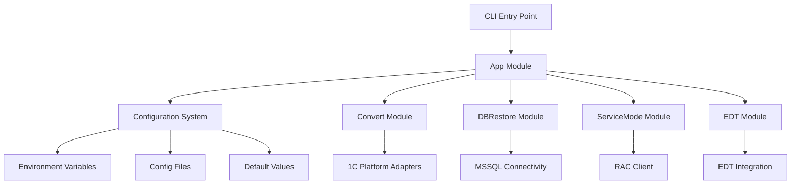
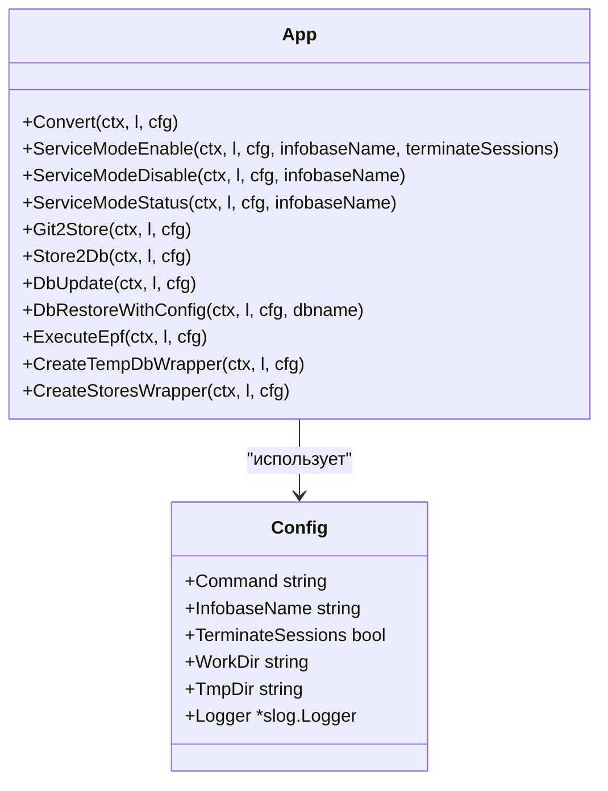

# Введение

## Обзор проекта

**apk-ci** - это инструмент автоматизации для работы с системой 1C:Enterprise, предоставляющий модули для конвертации данных, восстановления баз данных, управления сервисным режимом и интеграции с EDT.

### Решаемые проблемы пользователей

- Автоматизация конвертации данных между форматами
- Упрощение восстановления и управления базами данных MSSQL
- Управление сервисным режимом информационных баз 1C
- Интеграция с 1C:Enterprise Development Tools

### Возможности системы

- **Модуль Convert**: Конвертация форматов данных
- **Модуль DBRestore**: Управление базами данных MSSQL
- **Модуль ServiceMode**: Управление сервисным режимом информационных баз 1C
- **Модуль EDT**: Интеграция с 1C EDT
- Централизованная система конфигурации с поддержкой переменных окружения, файлов конфигурации и значений по умолчанию

## Архитектура системы

### Архитектурный паттерн

**Модульный монолит** с централизованной конфигурацией

### Ключевые технические решения

- Язык Go для производительности и кроссплатформенной совместимости
- Централизованная система конфигурации с приоритетным разрешением
- CLI интерфейс с подкомандами для различных модулей
- Поддержка множественных форматов конфигурации (JSON/YAML)

### Используемые паттерны проектирования

- **Dependency Injection**: Для компонентов конфигурации и сервисов
- **Adapter Pattern**: Для интеграции различных версий платформы 1C
- **Strategy Pattern**: Для обработки различных источников конфигурации
- **Factory Pattern**: Для создания клиентов, специфичных для модулей

### Взаимодействие компонентов



- Главная точка входа CLI направляет команды соответствующему модулю
- Система конфигурации предоставляет унифицированный доступ к настройкам
- Каждый модуль реализует свою специфическую функциональность, используя общие утилиты
- Модули взаимодействуют с системами 1C через специфичные для платформы адаптеры

## Структура проекта

### Основные модули

```
cmd/apk-ci     # CLI точка входа
internal/config        # Централизованная система конфигурации  
internal/entity        # Основные модели данных и сущности
internal/servicemode   # Функциональность управления сервисным режимом
internal/app          # Логика приложения и выполнение
internal/util         # Утилитарные функции и раннеры
```

### Поддерживающие компоненты

```
internal/git      # Интеграция с Git
internal/rac      # RAC (1C командная строка) утилиты
internal/service  # Сервисные компоненты
internal/constants # Общие константы
```

### Документация

```
docs/       # Техническая архитектура и руководство по использованию
examples/   # Примеры конфигураций и кода
README.md   # Обзор проекта и руководство по использованию
```

### Скрипты и инструменты

```
scripts/    # Shell скрипты для настройки окружения и операций
Makefile    # Автоматизация сборки
Taskfile.yml # Автоматизация задач
```

## Детальный анализ компонентов

### Анализ модуля App

Модуль App служит центральным координатором для всех операций в приложении apk-ci. Он получает команды от главной функции и делегирует задачи соответствующим пакетам сущностей в зависимости от запрошенной операции.



## Технические требования

### Требования к производительности

- Разработан для эффективной обработки данных и операций с базой данных
- Поддержка параллельного выполнения через Go рутины

### Требования к безопасности

- Безопасная обработка данных конфигурации
- Правильное управление учетными данными для подключений к базе данных

### Известные ограничения

- Модуль SMB требует специфичных системных зависимостей (smbclient, mount.cifs, kinit, klist)
- Некоторые функции требуют правильной конфигурации платформы 1C

## Команды сборки и тестирования

### Команды сборки

```bash
make build         # Базовая сборка
make build-all     # Кроссплатформенная сборка
make build-linux   # Только Linux
make build-windows # Только Windows
make build-darwin  # Только macOS
```

### Команды тестирования

```bash
make test              # Юнит тесты
make test-integration  # Интеграционные тесты
make test-coverage     # Покрытие тестами
```

### Установка

```bash
# Из исходного кода
go build -o apk-ci ./cmd/apk-ci

# Как библиотека
go get github.com/your-org/apk-ci
```