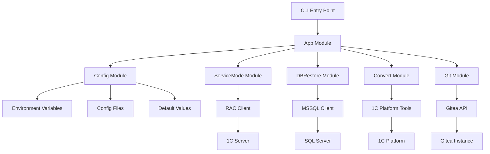

# Основные модули

apk-ci построен по модульной архитектуре, где каждый модуль отвечает за определенную область функциональности системы 1C:Enterprise.

## Обзор модулей

### [Управление конфигурацией](Управление-конфигурацией.md)
Централизованная система конфигурации, поддерживающая множественные источники конфигурации с определенным порядком приоритетов.

### [Операции с базой данных](Операции-с-базой-данных.md)
Модуль для восстановления баз данных MS SQL Server с автоматическим расчетом таймаутов и механизмами восстановления после ошибок.

### [Управление сервисным режимом](Управление-сервисным-режимом.md)
Управление сервисным режимом информационных баз 1C через RAC (Remote Administration Client).

### [Выполнение внешних обработок](Выполнение-внешних-обработок.md)
Выполнение внешних обработок (.epf файлов) в контексте информационных баз 1C.

### [Интеграция с Git](Интеграция-с-Git.md)
Интеграция с системами контроля версий Git и Gitea для автоматизации рабочих процессов разработки.

## Архитектура модулей



## Принципы проектирования

### Dependency Injection
Для компонентов конфигурации и сервисов используется паттерн внедрения зависимостей, что позволяет легко тестировать и расширять функциональность.

### Adapter Pattern
Для интеграции различных версий платформы 1C используется паттерн адаптера, обеспечивающий совместимость с разными версиями системы.

### Strategy Pattern
Для обработки различных источников конфигурации используется паттерн стратегии, позволяющий гибко управлять приоритетами настроек.

### Factory Pattern
Для создания клиентов, специфичных для модулей, используется паттерн фабрики, упрощающий инициализацию компонентов.

## Взаимодействие модулей

### Централизованная конфигурация
Все модули используют единую систему конфигурации, что обеспечивает:
- Консистентность настроек
- Простоту управления
- Безопасное хранение секретных данных

### Общие утилиты
Модули разделяют общие утилитарные функции:
- Выполнение команд системы
- Логирование
- Обработка ошибок
- Работа с файловой системой

### Интерфейсы взаимодействия
Модули взаимодействуют через четко определенные интерфейсы:
- Logger interface для логирования
- Config interface для конфигурации
- Client interfaces для внешних систем

## Расширяемость

### Добавление новых модулей
Для добавления нового модуля необходимо:

1. Создать пакет в `internal/entity/`
2. Реализовать интерфейсы конфигурации
3. Добавить команды в CLI
4. Обновить документацию

### Пример структуры нового модуля

```
internal/entity/newmodule/
├── newmodule.go          # Основная логика
├── newmodule_test.go     # Тесты
├── client.go             # Клиент для внешней системы
├── config.go             # Конфигурация модуля
└── interfaces.go         # Интерфейсы
```

## Тестирование модулей

### Юнит тестирование
Каждый модуль включает комплексные юнит тесты:
- Тестирование бизнес логики
- Мокирование внешних зависимостей
- Проверка обработки ошибок

### Интеграционное тестирование
Интеграционные тесты проверяют взаимодействие модулей:
- Тестирование полных сценариев
- Проверка конфигурации
- Валидация внешних интеграций

### Пример запуска тестов

```bash
# Юнит тесты
make test

# Интеграционные тесты
make test-integration

# Покрытие тестами
make test-coverage

# Тесты конкретного модуля
go test ./internal/servicemode/...
```

## Производительность

### Оптимизации
- Параллельное выполнение независимых операций через Go рутины
- Пулы соединений для базы данных
- Кэширование конфигурации
- Потоковая обработка больших файлов

### Мониторинг
- Структурированное логирование с метриками производительности
- Трассировка времени выполнения операций
- Мониторинг использования ресурсов

## Безопасность

### Управление секретами
- Отдельное хранение секретных данных
- Шифрование конфиденциальной информации
- Ограниченные права доступа к файлам конфигурации

### Аудит и логирование
- Логирование всех критических операций
- Отслеживание доступа к конфиденциальным данным
- Аудит изменений конфигурации

## Обработка ошибок

### Стратегии восстановления
- Автоматические повторные попытки с экспоненциальной задержкой
- Graceful degradation при сбоях внешних систем
- Откат изменений при критических ошибках

### Логирование ошибок
- Структурированные сообщения об ошибках
- Контекстная информация для диагностики
- Интеграция с системами мониторинга