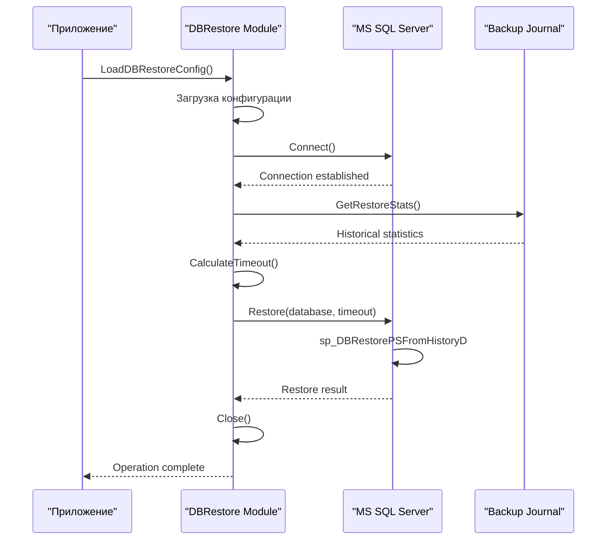

# Операции с базой данных

Модуль операций с базой данных обрабатывает рабочие процессы восстановления базы данных с комплексной обработкой таймаутов и механизмами восстановления после ошибок. Реализованный в `internal/entity/dbrestore/dbrestore.go`, этот модуль предоставляет функциональность для восстановления баз данных MS SQL Server из исторических резервных копий с автоматическим расчетом таймаута на основе исторической статистики.

## Архитектура модуля



## Ключевые компоненты

### 1. Загрузка конфигурации
Функция `LoadDBRestoreConfig` загружает конфигурацию из централизованной системы конфигурации, объединяя настройки из:
- `app.yaml` - основные настройки приложения
- `secret.yaml` - пароли и секретные данные
- `dbconfig.yaml` - параметры подключения к базе данных

```go
type DBRestoreConfig struct {
    Server       string
    Database     string
    Username     string
    Password     string
    Timeout      time.Duration
    AutoTimeout  bool
    RetryCount   int
}
```

### 2. Установление соединения
Метод `Connect` устанавливает соединение с MS SQL Server используя параметры конфигурации:

```go
func (d *DBRestore) Connect() error {
    connString := fmt.Sprintf(
        "server=%s;database=%s;user id=%s;password=%s;timeout=%d",
        d.config.Server,
        d.config.Database, 
        d.config.Username,
        d.config.Password,
        int(d.config.Timeout.Seconds()),
    )
    
    db, err := sql.Open("mssql", connString)
    if err != nil {
        return fmt.Errorf("ошибка подключения к базе данных: %w", err)
    }
    
    d.db = db
    return nil
}
```

### 3. Сбор статистики
Метод `GetRestoreStats` запрашивает журнал запросов резервного копирования для расчета среднего и максимального времени восстановления для автоматического расчета таймаута:

```sql
SELECT 
    AVG(DATEDIFF(second, StartTime, EndTime)) as AvgDuration,
    MAX(DATEDIFF(second, StartTime, EndTime)) as MaxDuration,
    COUNT(*) as TotalOperations
FROM BackupRequestJournal 
WHERE OperationType = 'RESTORE' 
    AND DatabaseName = @dbname
    AND StartTime >= DATEADD(day, -30, GETDATE())
    AND Status = 'SUCCESS'
```

### 4. Восстановление базы данных
Метод `Restore` выполняет хранимую процедуру `sp_DBRestorePSFromHistoryD` для выполнения фактического восстановления базы данных:

```go
func (d *DBRestore) Restore(dbname string) error {
    ctx, cancel := context.WithTimeout(context.Background(), d.config.Timeout)
    defer cancel()
    
    query := `EXEC sp_DBRestorePSFromHistoryD 
              @DatabaseName = ?, 
              @RestorePoint = ?, 
              @OverwriteExisting = 1`
    
    _, err := d.db.ExecContext(ctx, query, dbname, time.Now())
    if err != nil {
        return fmt.Errorf("ошибка восстановления базы данных %s: %w", dbname, err)
    }
    
    return nil
}
```

### 5. Управление ресурсами
Метод `Close` обеспечивает правильную очистку соединений с базой данных:

```go
func (d *DBRestore) Close() error {
    if d.db != nil {
        return d.db.Close()
    }
    return nil
}
```

## Автоматический расчет таймаута

Модуль реализует автоматический расчет таймаута при включенном `AutoTimeOut`. Он запрашивает таблицу `BackupRequestJournal` для получения исторических времен восстановления и устанавливает таймаут в 170% от максимального исторического времени восстановления для обеспечения достаточного буфера.

```go
func (d *DBRestore) CalculateTimeout(dbname string) (time.Duration, error) {
    stats, err := d.GetRestoreStats(dbname)
    if err != nil {
        return 0, fmt.Errorf("ошибка получения статистики: %w", err)
    }
    
    // Используем 170% от максимального времени как безопасный таймаут
    safetyFactor := 1.7
    calculatedTimeout := time.Duration(float64(stats.MaxDuration) * safetyFactor)
    
    // Минимальный таймаут 30 минут
    minTimeout := 30 * time.Minute
    if calculatedTimeout < minTimeout {
        calculatedTimeout = minTimeout
    }
    
    // Максимальный таймаут 4 часа
    maxTimeout := 4 * time.Hour
    if calculatedTimeout > maxTimeout {
        calculatedTimeout = maxTimeout
    }
    
    return calculatedTimeout, nil
}
```

## Конфигурация модуля

### Конфигурация в app.yaml
```yaml
dbrestore:
  database: "DefaultDatabase"
  timeout: "3600s"              # Фиксированный таймаут
  autotimeout: true            # Включить автоматический расчет
  retryCount: 3                # Количество повторных попыток
  retryDelay: "30s"            # Задержка между попытками
```

### Конфигурация в secret.yaml
```yaml
passwords:
  mssql: "secure_mssql_password"
  db: "secure_db_password"
```

### Конфигурация в dbconfig.yaml
```yaml
MyDatabase:
  one-server: "1C-SERVER-001"
  prod: false
  dbserver: "SQL-SERVER-001"
  
ProductionDB:
  one-server: "1C-PROD-001" 
  prod: true
  dbserver: "SQL-PROD-001"
```

### Переменные окружения
```bash
# Основные настройки
DBRESTORE_DATABASE="MyDatabase"
DBRESTORE_TIMEOUT="3600"
DBRESTORE_AUTOTIMEOUT="true"

# Настройки соединения
DBRESTORE_SERVER="sql-server:1433"
DBRESTORE_USERNAME="dbuser"
DBRESTORE_PASSWORD="secure_password"
```

## Обработка ошибок и восстановление

### Стратегии повторных попыток
```go
func (d *DBRestore) RestoreWithRetry(dbname string) error {
    var lastErr error
    
    for attempt := 1; attempt <= d.config.RetryCount; attempt++ {
        err := d.Restore(dbname)
        if err == nil {
            return nil // Успешно
        }
        
        lastErr = err
        d.logger.Warn("Попытка восстановления неудачна", 
            "attempt", attempt,
            "maxAttempts", d.config.RetryCount,
            "error", err)
        
        if attempt < d.config.RetryCount {
            time.Sleep(d.config.RetryDelay)
        }
    }
    
    return fmt.Errorf("восстановление не удалось после %d попыток: %w", 
        d.config.RetryCount, lastErr)
}
```

### Обработка таймаутов
```go
func (d *DBRestore) RestoreWithContext(ctx context.Context, dbname string) error {
    // Создаем контекст с таймаутом
    restoreCtx, cancel := context.WithTimeout(ctx, d.config.Timeout)
    defer cancel()
    
    // Канал для результата операции
    resultChan := make(chan error, 1)
    
    go func() {
        resultChan <- d.performRestore(dbname)
    }()
    
    select {
    case err := <-resultChan:
        return err
    case <-restoreCtx.Done():
        return fmt.Errorf("операция восстановления превысила таймаут %v", d.config.Timeout)
    }
}
```

## Мониторинг и логирование

### Структурированное логирование
```go
func (d *DBRestore) Restore(dbname string) error {
    start := time.Now()
    
    d.logger.Info("Начало восстановления базы данных",
        "database", dbname,
        "timeout", d.config.Timeout,
        "autoTimeout", d.config.AutoTimeout)
    
    err := d.performRestore(dbname)
    
    duration := time.Since(start)
    if err != nil {
        d.logger.Error("Ошибка восстановления базы данных",
            "database", dbname,
            "duration", duration,
            "error", err)
    } else {
        d.logger.Info("Восстановление базы данных завершено успешно",
            "database", dbname, 
            "duration", duration)
    }
    
    return err
}
```

### Метрики производительности
```go
type RestoreMetrics struct {
    DatabaseName    string
    StartTime      time.Time
    EndTime        time.Time
    Duration       time.Duration
    Success        bool
    Error          string
    TimeoutUsed    time.Duration
    RetryCount     int
}

func (d *DBRestore) RecordMetrics(metrics RestoreMetrics) {
    d.logger.Info("Метрики восстановления",
        "database", metrics.DatabaseName,
        "duration", metrics.Duration,
        "success", metrics.Success,
        "retries", metrics.RetryCount,
        "timeoutUsed", metrics.TimeoutUsed)
}
```

## Примеры использования

### Базовое восстановление
```go
// Создание клиента восстановления
restoreClient, err := dbrestore.NewClient(config)
if err != nil {
    log.Fatal("Ошибка создания клиента:", err)
}
defer restoreClient.Close()

// Восстановление базы данных
err = restoreClient.Restore("MyDatabase")
if err != nil {
    log.Fatal("Ошибка восстановления:", err)
}
```

### Восстановление с автоматическим таймаутом
```go
// Включение автоматического расчета таймаута
config.AutoTimeout = true

restoreClient, err := dbrestore.NewClient(config)
if err != nil {
    log.Fatal("Ошибка создания клиента:", err)
}

// Автоматический расчет и применение таймаута
err = restoreClient.RestoreWithAutoTimeout("ProductionDB")
if err != nil {
    log.Fatal("Ошибка восстановления:", err)
}
```

### Пакетное восстановление
```go
databases := []string{"DB1", "DB2", "DB3"}

for _, dbname := range databases {
    err := restoreClient.Restore(dbname)
    if err != nil {
        log.Printf("Ошибка восстановления %s: %v", dbname, err)
        continue
    }
    log.Printf("База данных %s восстановлена успешно", dbname)
}
```

## Безопасность и соответствие требованиям

### Аудит операций
```go
type AuditLog struct {
    Timestamp    time.Time
    User         string
    Operation    string
    Database     string
    Success      bool
    Duration     time.Duration
    IPAddress    string
}

func (d *DBRestore) AuditRestore(dbname string, user string, success bool, duration time.Duration) {
    audit := AuditLog{
        Timestamp: time.Now(),
        User:      user,
        Operation: "DATABASE_RESTORE",
        Database:  dbname,
        Success:   success,
        Duration:  duration,
        IPAddress: d.getClientIP(),
    }
    
    d.auditLogger.Info("Операция восстановления",
        "audit", audit)
}
```

### Проверка разрешений
```go
func (d *DBRestore) CheckPermissions(user string, dbname string) error {
    // Проверка прав пользователя на восстановление конкретной базы данных
    permitted, err := d.authService.CheckRestorePermission(user, dbname)
    if err != nil {
        return fmt.Errorf("ошибка проверки разрешений: %w", err)
    }
    
    if !permitted {
        return fmt.Errorf("пользователь %s не имеет прав на восстановление базы данных %s", user, dbname)
    }
    
    return nil
}
```

## Производительность и оптимизация

### Параллельное восстановление
```go
func (d *DBRestore) RestoreMultiple(databases []string) error {
    const maxConcurrent = 3
    semaphore := make(chan struct{}, maxConcurrent)
    
    var wg sync.WaitGroup
    errChan := make(chan error, len(databases))
    
    for _, dbname := range databases {
        wg.Add(1)
        go func(db string) {
            defer wg.Done()
            
            semaphore <- struct{}{}        // Захват семафора
            defer func() { <-semaphore }() // Освобождение семафора
            
            if err := d.Restore(db); err != nil {
                errChan <- fmt.Errorf("ошибка восстановления %s: %w", db, err)
            }
        }(dbname)
    }
    
    wg.Wait()
    close(errChan)
    
    // Сбор ошибок
    var errors []error
    for err := range errChan {
        errors = append(errors, err)
    }
    
    if len(errors) > 0 {
        return fmt.Errorf("ошибки при восстановлении: %v", errors)
    }
    
    return nil
}
```