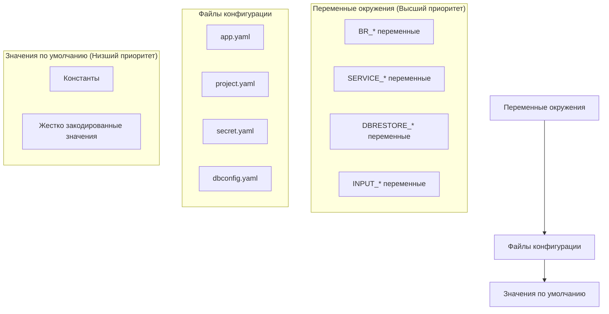
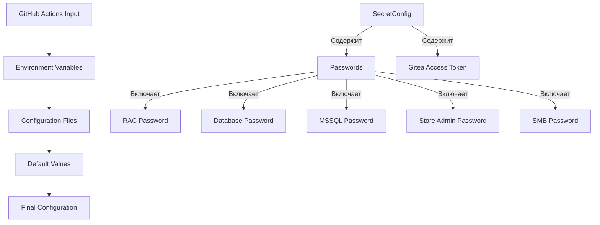

# Управление конфигурацией

Модуль управления конфигурацией обеспечивает централизованную систему конфигурации, которая поддерживает множественные источники конфигурации с определенным порядком приоритетов: переменные окружения (высший приоритет), файлы конфигурации и значения по умолчанию (низший приоритет).

## Архитектура модуля

Система реализована в файле `internal/config/config.go` и следует иерархической структуре с логической группировкой настроек конфигурации.

```mermaid
classDiagram
class Config {
+string Actor
+string Env
+string Command
+*slog.Logger Logger
+string ConfigSystem
+string ConfigProject
+string ConfigSecret
+*AppConfig AppConfig
+*ProjectConfig ProjectConfig
+*SecretConfig SecretConfig
+map[string]*DatabaseInfo DbConfig
}
class AppConfig {
+string LogLevel
+string WorkDir
+string TmpDir
+int Timeout
+Paths Paths
+Rac Rac
+Users Users
+Dbrestore Dbrestore
}
class ProjectConfig {
+bool Debug
+string StoreDb
+map[string]struct{} Prod
}
class SecretConfig {
+Passwords Passwords
+Gitea Gitea
}
class DatabaseInfo {
+string OneServer
+bool Prod
+string DbServer
}
Config --> AppConfig : "содержит"
Config --> ProjectConfig : "содержит"
Config --> SecretConfig : "содержит"
Config --> DatabaseInfo : "содержит множественные"
```

## Основная структура конфигурации

Главная структура конфигурации `Config` содержит:
- Системные настройки
- Пути к файлам
- Конфигурацию приложения
- Конфигурацию проекта
- Секретную конфигурацию
- Конфигурацию базы данных

## Процесс загрузки конфигурации

Процесс загрузки конфигурации начинается с функции `MustLoad()`, которая координирует загрузку различных компонентов конфигурации:

1. **Системные настройки**: Загружаются из переменных окружения с префиксом `BR_`
2. **Конфигурация приложения**: Загружается из `app.yaml` содержащего:
   - Уровень логирования
   - Рабочие директории
   - Таймауты
   - Пути к исполняемым файлам
3. **Конфигурация проекта**: Загружается из `project.yaml` содержащего:
   - Режим отладки
   - База данных хранилища
   - Настройки производственной базы данных
4. **Секретная конфигурация**: Загружается из `secret.yaml` содержащего:
   - Пароли
   - Токены доступа
5. **Конфигурация базы данных**: Загружается из `dbconfig.yaml` содержащего:
   - Настройки подключения для серверов 1C
   - Настройки серверов баз данных

## Источники конфигурации

### 1. Переменные окружения

#### BR_* переменные (Основная конфигурация)
```bash
BR_ACTOR="developer"                    # Пользователь, инициировавший процесс
BR_ENV="dev"                           # Тип окружения (по умолчанию: "dev")
BR_COMMAND="service-mode-enable"       # Команда для выполнения
BR_CONFIG_SYSTEM="config/app.yaml"     # Путь к системной конфигурации
BR_CONFIG_PROJECT="config/project.yaml" # Путь к конфигурации проекта
BR_CONFIG_SECRET="config/secret.yaml"  # Путь к секретной конфигурации
BR_INFOBASE_NAME="MyInfobase"          # Имя целевой информационной базы
BR_TERMINATE_SESSIONS="true"           # Флаг завершения сессий
```

#### SERVICE_* переменные
Переменные для управления сервисным режимом:
```bash
SERVICE_RAC_PATH="/opt/1C/v8.3/x86_64/rac"
SERVICE_RAC_SERVER="localhost:1545"
SERVICE_RAC_TIMEOUT="30"
SERVICE_RAC_RETRIES="3"
```

#### DBRESTORE_* переменные
Переменные для восстановления базы данных:
```bash
DBRESTORE_DATABASE="MyDatabase"
DBRESTORE_TIMEOUT="3600"
DBRESTORE_AUTOTIMEOUT="true"
```

### 2. Файлы конфигурации

#### app.yaml - Конфигурация приложения
```yaml
logLevel: "info"
workDir: "/tmp/apk-ci"
tmpDir: "/tmp"
timeout: 300

paths:
  bin1cv8: "/opt/1C/v8.3/x86_64/1cv8"
  binIbcmd: "/opt/1C/v8.3/x86_64/ibcmd"
  edtCli: "/opt/1C/v8.3/x86_64/ring"
  rac: "/opt/1C/v8.3/x86_64/rac"

rac:
  port: 1545
  timeout: 30
  retries: 3

users:
  rac: "admin"
  db: "dbuser"
  mssql: "sa"
  storeAdmin: "storeAdmin"

dbrestore:
  database: "DefaultDB"
  timeout: "3600s"
  autotimeout: true
```

#### project.yaml - Конфигурация проекта
```yaml
debug: false
store-db: "V8_DEV_STORE"

prod:
  V8_PROD_ERP:
    dbName: "V8_PROD_ERP"
    add-disable: ["feature1", "feature2"]
    related:
      backup: "V8_PROD_ERP_BACKUP"
```

#### secret.yaml - Секретная конфигурация
```yaml
passwords:
  rac: "secure_rac_password"
  db: "secure_db_password"
  mssql: "secure_mssql_password"
  storeAdminPassword: "secure_store_admin_password"
  smb: "secure_smb_password"

gitea:
  accessToken: "gitea_access_token_value"
```

#### dbconfig.yaml - Конфигурация баз данных
```yaml
V8_DEV_DSBEKETOV_STORE_ERP:
  one-server: DEV-16-AS-003
  prod: false
  dbserver: MSK-DV-SQL-01

V8_OPER_APK_TOIR3:
  one-server: MSK-TS-AS-001
  prod: true
  dbserver: MSK-TS-SQL-01
```

## Иерархия приоритетов



## Валидация конфигурации

### Обязательные поля
Система проверяет наличие обязательных полей конфигурации:

```go
func (c *Config) Validate() error {
    if c.Command == "" {
        return errors.New("поле Command обязательно")
    }
    
    if c.ConfigSystem == "" {
        return errors.New("поле ConfigSystem обязательно")
    }
    
    return nil
}
```

### Применение значений по умолчанию
```go
func (c *Config) ApplyDefaults() {
    if c.Env == "" {
        c.Env = "dev"
    }
    
    if c.AppConfig.LogLevel == "" {
        c.AppConfig.LogLevel = "info"
    }
    
    if c.AppConfig.Timeout == 0 {
        c.AppConfig.Timeout = 300
    }
}
```

## Безопасность конфигурации

### Архитектура безопасности


### Рекомендации по безопасности

1. **Защита файлов секретов**:
   ```bash
   chmod 600 config/secret.yaml
   chown root:root config/secret.yaml
   ```

2. **Использование переменных окружения для секретов**:
   ```bash
   export BR_RAC_PASSWORD="secure_password"
   export BR_GITEA_TOKEN="secure_token"
   ```

3. **Исключение из системы контроля версий**:
   ```gitignore
   config/secret.yaml
   config/local.yaml
   .env
   ```

## Обратная совместимость

Система конфигурации поддерживает обратную совместимость с устаревшими методами конфигурации, одновременно внедряя новую функциональность параллельно. Каждый модуль использует свой специфический подход к загрузке конфигурации.

## Примеры использования

### Загрузка конфигурации в коде
```go
package main

import (
    "log"
    "github.com/your-org/apk-ci/internal/config"
)

func main() {
    // Загрузка конфигурации
    cfg, err := config.MustLoad()
    if err != nil {
        log.Fatal("Ошибка загрузки конфигурации:", err)
    }
    
    // Использование конфигурации
    logger := cfg.Logger
    workDir := cfg.AppConfig.WorkDir
    dbInfo := cfg.DbConfig[cfg.InfobaseName]
    
    logger.Info("Конфигурация загружена", 
        "workDir", workDir,
        "infobase", cfg.InfobaseName)
}
```

### Переопределение конфигурации
```bash
# Конфигурация в файле
# app.yaml: logLevel: "info"

# Переопределение через переменную окружения
export BR_LOG_LEVEL="debug"

# Результат: используется "debug"
```

## Расширение конфигурации

### Добавление новых полей
Для добавления новых полей конфигурации:

1. Добавьте поле в соответствующую структуру
2. Добавьте тег для переменной окружения или YAML
3. Обновите валидацию
4. Добавьте значение по умолчанию

```go
// Пример расширения AppConfig
type AppConfig struct {
    // ... существующие поля ...
    
    NewModule struct {
        Enabled bool   `yaml:"enabled" env:"BR_NEW_MODULE_ENABLED"`
        ApiUrl  string `yaml:"apiUrl" env:"BR_NEW_MODULE_API_URL"`
        Timeout int    `yaml:"timeout" env:"BR_NEW_MODULE_TIMEOUT"`
    } `yaml:"newModule"`
}
```

## Отладка конфигурации

### Просмотр загруженной конфигурации
```bash
# Включение отладочного режима
export BR_DEBUG="true"

# Вывод конфигурации (без секретов)
./apk-ci --dump-config
```

### Проверка источников
```bash
# Проверка переменных окружения
env | grep "^BR_\|^SERVICE_\|^DBRESTORE_"

# Проверка файлов конфигурации
ls -la config/
cat config/app.yaml
```