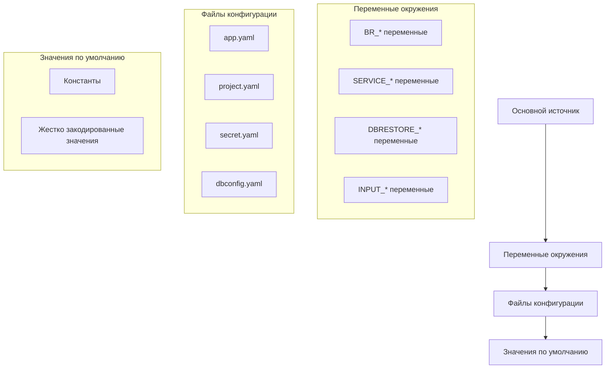

# Руководство по конфигурации

Система конфигурации benadis-runner обеспечивает централизованное управление настройками с поддержкой множественных источников конфигурации и определенным порядком приоритетов.

## Обзор системы конфигурации

Система конфигурации поддерживает множественные источники конфигурации с определенным порядком приоритетов:

1. **Переменные окружения** (высший приоритет)
2. **Файлы конфигурации**
3. **Значения по умолчанию** (низший приоритет)

## Структура конфигурации

```mermaid
classDiagram
class Config {
+string Actor
+string Env
+string Command
+*slog.Logger Logger
+string ConfigSystem
+string ConfigProject
+string ConfigSecret
+*AppConfig AppConfig
+*ProjectConfig ProjectConfig
+*SecretConfig SecretConfig
+map[string]*DatabaseInfo DbConfig
}
class AppConfig {
+string LogLevel
+string WorkDir
+string TmpDir
+int Timeout
+Paths Paths
+Rac Rac
+Users Users
+Dbrestore Dbrestore
}
class ProjectConfig {
+bool Debug
+string StoreDb
+map[string]struct{} Prod
}
class SecretConfig {
+Passwords Passwords
+Gitea Gitea
}
class DatabaseInfo {
+string OneServer
+bool Prod
+string DbServer
}
Config --> AppConfig : "содержит"
Config --> ProjectConfig : "содержит"
Config --> SecretConfig : "содержит"
Config --> DatabaseInfo : "содержит множественные"
```

## Процесс загрузки конфигурации

Процесс загрузки конфигурации начинается с функции `MustLoad()`, которая координирует загрузку различных компонентов конфигурации:

1. **Системные настройки**: Загружаются из переменных окружения с префиксом `BR_`
2. **Конфигурация приложения**: Загружается из `app.yaml` с уровнем логирования, рабочими директориями, таймаутами и путями к исполняемым файлам
3. **Конфигурация проекта**: Загружается из `project.yaml` с режимом отладки, базой данных хранилища и настройками производственной базы данных
4. **Секретная конфигурация**: Загружается из `secret.yaml` с паролями и токенами доступа
5. **Конфигурация базы данных**: Загружается из `dbconfig.yaml` с настройками подключения для серверов 1C и серверов баз данных

## Компоненты конфигурации

### [Источники конфигурации](Источники-конфигурации.md)
Детальное описание всех поддерживаемых источников конфигурации и их приоритетов.

### [Структура конфигурации](Структура-конфигурации.md)
Полное описание структур конфигурации и их полей.

### [Безопасное управление конфигурацией](Безопасное-управление-конфигурацией.md)
Рекомендации по безопасному хранению и использованию конфиденциальных данных.

### [Валидация конфигурации](Валидация-конфигурации.md)
Правила валидации конфигурации и обработка ошибок.

## Иерархия источников конфигурации



## Обратная совместимость

Система конфигурации поддерживает обратную совместимость с устаревшими методами конфигурации, одновременно внедряя новую функциональность параллельно. Каждый модуль использует свой специфический подход к конфигурации, сохраняя совместимость с существующими настройками.

## Быстрый старт

### Минимальная конфигурация

Для базового запуска необходимо установить следующие переменные окружения:

```bash
export BR_COMMAND="your-command"
export BR_CONFIG_SYSTEM="path/to/app.yaml"
export BR_CONFIG_PROJECT="path/to/project.yaml"
```

### Пример использования

```bash
# Установка переменных окружения
export BR_ACTOR="developer"
export BR_ENV="dev"
export BR_COMMAND="service-mode-enable"
export BR_INFOBASE_NAME="MyInfobase"

# Запуск приложения
./benadis-runner
```