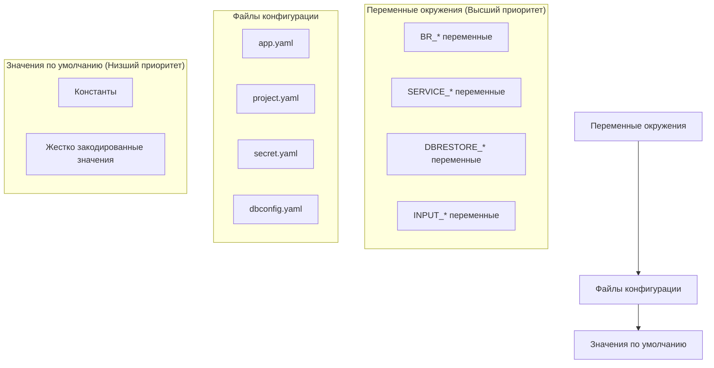
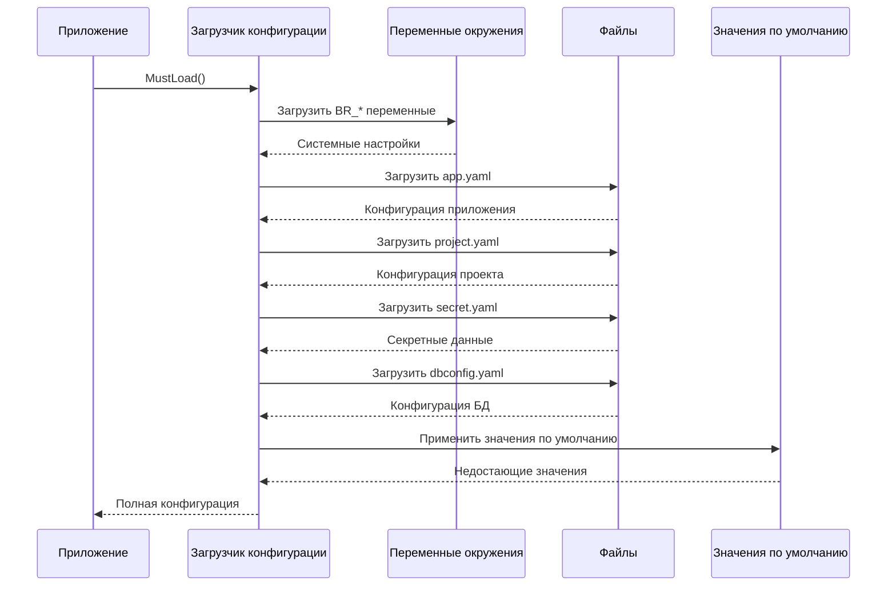

# Источники конфигурации

Система конфигурации apk-ci поддерживает множественные источники конфигурации с четко определенной иерархией приоритетов.

## Иерархия приоритетов

Система конфигурации следует специфическому порядку приоритетов:



## 1. Переменные окружения

### BR_* переменные (Основные настройки)

Основные переменные конфигурации приложения:

```bash
# Системные настройки
BR_ACTOR="developer"                    # Пользователь, инициировавший процесс
BR_ENV="dev"                           # Тип окружения (dev/prod)
BR_COMMAND="service-mode-enable"       # Команда для выполнения

# Пути к файлам конфигурации
BR_CONFIG_SYSTEM="config/app.yaml"     # Путь к системной конфигурации
BR_CONFIG_PROJECT="config/project.yaml" # Путь к конфигурации проекта
BR_CONFIG_SECRET="config/secret.yaml"  # Путь к секретной конфигурации
BR_CONFIG_DBDATA="config/dbconfig.yaml" # Путь к конфигурации БД

# Параметры операций
BR_INFOBASE_NAME="MyInfobase"          # Имя целевой информационной базы
BR_TERMINATE_SESSIONS="true"           # Флаг завершения сессий
BR_FORCE_UPDATE="false"               # Флаг принудительного обновления
BR_ISSUE_NUMBER="123"                 # Номер задачи
```

### SERVICE_* переменные

Переменные для модуля управления сервисным режимом:

```bash
SERVICE_RAC_PATH="/opt/1C/v8.3/x86_64/rac"  # Путь к RAC
SERVICE_RAC_SERVER="localhost:1545"          # Адрес сервера RAC
SERVICE_RAC_TIMEOUT="30"                     # Таймаут RAC операций
SERVICE_RAC_RETRIES="3"                      # Количество повторов
```

### DBRESTORE_* переменные

Переменные для модуля восстановления базы данных:

```bash
DBRESTORE_DATABASE="MyDatabase"       # Имя базы данных
DBRESTORE_TIMEOUT="3600"             # Таймаут операции (секунды)
DBRESTORE_AUTOTIMEOUT="true"         # Автоматический расчет таймаута
DBRESTORE_SERVER="sql-server:1433"   # Сервер базы данных
```

### INPUT_* переменные

Переменные от GitHub Actions (автоматически конвертируются):

```bash
INPUT_ACTOR="github-actor"
INPUT_GITEAURL="https://gitea.example.com"
INPUT_REPOSITORY="org/repo"
INPUT_ACCESSTOKEN="ghp_xxxxx"
INPUT_COMMAND="dbrestore"
```

## 2. Файлы конфигурации

### app.yaml - Конфигурация приложения

Содержит настройки приложения:

```yaml
logLevel: "info"
workDir: "/tmp/apk-ci"
tmpDir: "/tmp"
timeout: 300

paths:
  bin1cv8: "/opt/1C/v8.3/x86_64/1cv8"
  binIbcmd: "/opt/1C/v8.3/x86_64/ibcmd"
  edtCli: "/opt/1C/v8.3/x86_64/ring"
  rac: "/opt/1C/v8.3/x86_64/rac"

rac:
  port: 1545
  timeout: 30
  retries: 3

users:
  rac: "admin"
  db: "dbuser"
  mssql: "sa"
  storeAdmin: "storeAdmin"

dbrestore:
  database: "DefaultDB"
  timeout: "3600s"
  autotimeout: true
```

### project.yaml - Конфигурация проекта

Содержит настройки конкретного проекта:

```yaml
debug: false
store-db: "V8_DEV_STORE"

prod:
  V8_PROD_ERP:
    dbName: "V8_PROD_ERP"
    add-disable: ["feature1", "feature2"]
    related:
      backup: "V8_PROD_ERP_BACKUP"
  V8_PROD_CRM:
    dbName: "V8_PROD_CRM"
    add-disable: []
    related: {}
```

### secret.yaml - Секретная конфигурация

Содержит пароли и токены:

```yaml
passwords:
  rac: "secure_rac_password"
  db: "secure_db_password"
  mssql: "secure_mssql_password"
  storeAdminPassword: "secure_store_admin_password"
  smb: "secure_smb_password"

gitea:
  accessToken: "gitea_access_token_value"
```

### dbconfig.yaml - Конфигурация баз данных

Содержит настройки подключения к базам данных:

```yaml
V8_DEV_DSBEKETOV_STORE_ERP:
  one-server: DEV-16-AS-003
  prod: false
  dbserver: MSK-DV-SQL-01

V8_OPER_APK_TOIR3:
  one-server: MSK-TS-AS-001
  prod: true
  dbserver: MSK-TS-SQL-01
```

## 3. Значения по умолчанию

Если настройка не найдена в переменных окружения или файлах конфигурации, используются значения по умолчанию:

```go
// Значения по умолчанию
const (
    DefaultLogLevel = "info"
    DefaultTimeout = 300
    DefaultRacPort = 1545
    DefaultRacTimeout = 30
    DefaultRacRetries = 3
    DefaultWorkDir = "/tmp/apk-ci"
    DefaultTmpDir = "/tmp"
)
```

## Загрузка конфигурации

### Процесс загрузки



### Пример кода загрузки

```go
// Загрузка конфигурации с приоритетами
cfg := &Config{}

// 1. Загрузить переменные окружения
err := cleanenv.ReadEnv(cfg)
if err != nil {
    log.Fatal("Ошибка загрузки переменных окружения:", err)
}

// 2. Загрузить файлы конфигурации (если переменные не установлены)
if cfg.ConfigSystem != "" {
    err = cleanenv.ReadConfig(cfg.ConfigSystem, &cfg.AppConfig)
}

// 3. Применить значения по умолчанию
cfg.ApplyDefaults()
```

## Переопределение конфигурации

### Примеры переопределения

Переменные окружения всегда имеют приоритет:

```bash
# В app.yaml: logLevel: "info"
# В переменной окружения:
export BR_LOG_LEVEL="debug"
# Результат: будет использован "debug"
```

### Частичное переопределение структур

Для сложных структур переопределение происходит на уровне полей:

```bash
# В app.yaml:
# rac:
#   port: 1545
#   timeout: 30

# Переопределение только порта:
export BR_RAC_PORT="1546"
# Результат: port=1546, timeout=30 (из файла)
```

## Валидация источников

### Проверка доступности файлов

```bash
# Проверка существования файлов конфигурации
test -f "$BR_CONFIG_SYSTEM" || echo "Файл app.yaml не найден"
test -f "$BR_CONFIG_PROJECT" || echo "Файл project.yaml не найден"
test -f "$BR_CONFIG_SECRET" || echo "Файл secret.yaml не найден"
```

### Проверка переменных окружения

```bash
# Проверка обязательных переменных
: ${BR_COMMAND:?"Переменная BR_COMMAND обязательна"}
: ${BR_CONFIG_SYSTEM:?"Переменная BR_CONFIG_SYSTEM обязательна"}
```

## Отладка конфигурации

### Просмотр загруженной конфигурации

```bash
# Включение отладочного режима
export BR_DEBUG="true"

# Запуск с выводом конфигурации
./apk-ci --dump-config
```

### Проверка приоритетов

```bash
# Проверка какие переменные окружения установлены
env | grep "^BR_\|^SERVICE_\|^DBRESTORE_\|^INPUT_"

# Проверка файлов конфигурации
ls -la config/
```