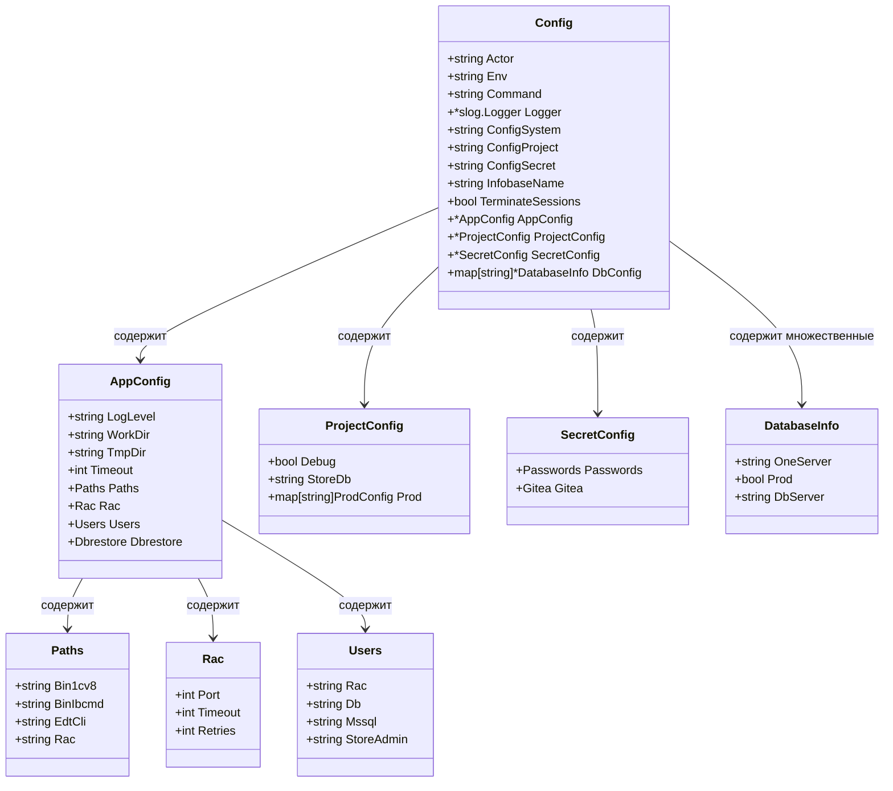

# Структура конфигурации

Система конфигурации benadis-runner состоит из нескольких взаимосвязанных структур, каждая из которых отвечает за определенную область настроек.

## Основная структура Config

Главная структура конфигурации содержит системные настройки, пути к файлам, конфигурацию приложения, проекта, секретные данные и конфигурацию базы данных.

```go
type Config struct {
    // Системные настройки
    Actor              string                     `env:"BR_ACTOR"`
    Env                string                     `env:"BR_ENV" env-default:"dev"`
    Command            string                     `env:"BR_COMMAND"`
    Logger             *slog.Logger
    
    // Пути к файлам конфигурации
    ConfigSystem       string                     `env:"BR_CONFIG_SYSTEM"`
    ConfigProject      string                     `env:"BR_CONFIG_PROJECT"`
    ConfigSecret       string                     `env:"BR_CONFIG_SECRET"`
    ConfigDbData       string                     `env:"BR_CONFIG_DBDATA"`
    
    // Параметры операций
    InfobaseName       string                     `env:"BR_INFOBASE_NAME"`
    TerminateSessions  bool                       `env:"BR_TERMINATE_SESSIONS"`
    ForceUpdate        bool                       `env:"BR_FORCE_UPDATE"`
    IssueNumber        int                        `env:"BR_ISSUE_NUMBER" env-default:"1"`
    
    // Конфигурационные структуры
    AppConfig          *AppConfig
    ProjectConfig      *ProjectConfig
    SecretConfig       *SecretConfig
    DbConfig           map[string]*DatabaseInfo
}
```

## AppConfig - Конфигурация приложения

Структура `AppConfig` содержит настройки уровня приложения из файла `app.yaml`:

```go
type AppConfig struct {
    LogLevel string `yaml:"logLevel"`
    WorkDir  string `yaml:"workDir"`
    TmpDir   string `yaml:"tmpDir"`
    Timeout  int    `yaml:"timeout"`
    
    Paths struct {
        Bin1cv8  string `yaml:"bin1cv8"`
        BinIbcmd string `yaml:"binIbcmd"`
        EdtCli   string `yaml:"edtCli"`
        Rac      string `yaml:"rac"`
    } `yaml:"paths"`
    
    Rac struct {
        Port    int `yaml:"port"`
        Timeout int `yaml:"timeout"`
        Retries int `yaml:"retries"`
    } `yaml:"rac"`
    
    Users struct {
        Rac        string `yaml:"rac"`
        Db         string `yaml:"db"`
        Mssql      string `yaml:"mssql"`
        StoreAdmin string `yaml:"storeAdmin"`
    } `yaml:"users"`
    
    Dbrestore struct {
        Database    string `yaml:"database"`
        Timeout     string `yaml:"timeout"`
        Autotimeout bool   `yaml:"autotimeout"`
    } `yaml:"dbrestore"`
}
```

### Детальное описание полей AppConfig

#### Основные настройки

| Поле | Тип | Описание | Значение по умолчанию |
|------|-----|----------|----------------------|
| `LogLevel` | string | Уровень логирования (debug, info, warn, error) | "info" |
| `WorkDir` | string | Рабочая директория приложения | "/tmp/benadis-runner" |
| `TmpDir` | string | Временная директория | "/tmp" |
| `Timeout` | int | Общий таймаут операций (секунды) | 300 |

#### Пути к исполняемым файлам (Paths)

| Поле | Описание | Пример значения |
|------|----------|-----------------|
| `Bin1cv8` | Путь к 1cv8 | "/opt/1C/v8.3/x86_64/1cv8" |
| `BinIbcmd` | Путь к ibcmd | "/opt/1C/v8.3/x86_64/ibcmd" |
| `EdtCli` | Путь к EDT CLI | "/opt/1C/v8.3/x86_64/ring" |
| `Rac` | Путь к RAC | "/opt/1C/v8.3/x86_64/rac" |

#### Настройки RAC (Remote Administration Client)

| Поле | Тип | Описание | Значение по умолчанию |
|------|-----|----------|----------------------|
| `Port` | int | Порт RAC сервера | 1545 |
| `Timeout` | int | Таймаут RAC операций (секунды) | 30 |
| `Retries` | int | Количество повторных попыток | 3 |

#### Пользователи системы (Users)

| Поле | Описание |
|------|----------|
| `Rac` | Пользователь для RAC подключений |
| `Db` | Пользователь базы данных |
| `Mssql` | Пользователь MS SQL Server |
| `StoreAdmin` | Администратор хранилища |

#### Настройки восстановления БД (Dbrestore)

| Поле | Тип | Описание |
|------|-----|----------|
| `Database` | string | Имя базы данных по умолчанию |
| `Timeout` | string | Таймаут операции восстановления |
| `Autotimeout` | bool | Автоматический расчет таймаута |

## ProjectConfig - Конфигурация проекта

Структура `ProjectConfig` содержит настройки конкретного проекта из файла `project.yaml`:

```go
type ProjectConfig struct {
    Debug   bool   `yaml:"debug"`
    StoreDb string `yaml:"store-db"`
    Prod    map[string]struct {
        DbName     string                 `yaml:"dbName"`
        AddDisable []string               `yaml:"add-disable"`
        Related    map[string]interface{} `yaml:"related"`
    } `yaml:"prod"`
}
```

### Описание полей ProjectConfig

| Поле | Тип | Описание |
|------|-----|----------|
| `Debug` | bool | Включение режима отладки |
| `StoreDb` | string | Имя базы данных хранилища конфигураций |
| `Prod` | map | Конфигурации производственных баз данных |

#### Структура производственных конфигураций (Prod)

Каждая запись в `Prod` содержит:

| Поле | Тип | Описание |
|------|-----|----------|
| `DbName` | string | Имя производственной базы данных |
| `AddDisable` | []string | Список отключаемых дополнений |
| `Related` | map | Связанные ресурсы (резервные копии, зависимости) |

### Пример конфигурации проекта

```yaml
debug: false
store-db: "V8_DEV_STORE"

prod:
  V8_PROD_ERP:
    dbName: "V8_PROD_ERP"
    add-disable: 
      - "ДополнениеТестирование"
      - "ОтладочныеОтчеты"
    related:
      backup: "V8_PROD_ERP_BACKUP"
      monitoring: "V8_PROD_ERP_MONITOR"
      
  V8_PROD_CRM:
    dbName: "V8_PROD_CRM"
    add-disable: []
    related:
      backup: "V8_PROD_CRM_BACKUP"
```

## SecretConfig - Секретная конфигурация

Структура `SecretConfig` содержит конфиденциальные данные из файла `secret.yaml`:

```go
type SecretConfig struct {
    Passwords struct {
        Rac                string `yaml:"rac"`
        Db                 string `yaml:"db"`
        Mssql              string `yaml:"mssql"`
        StoreAdminPassword string `yaml:"storeAdminPassword"`
        Smb                string `yaml:"smb"`
    } `yaml:"passwords"`
    
    Gitea struct {
        AccessToken string `yaml:"accessToken"`
    } `yaml:"gitea"`
}
```

### Безопасность секретных данных

```yaml
passwords:
  rac: "secure_rac_password"
  db: "secure_db_password"
  mssql: "secure_mssql_password"
  storeAdminPassword: "secure_store_admin_password"
  smb: "secure_smb_password"

gitea:
  accessToken: "gitea_access_token_value"
```

> **Важно**: Файл `secret.yaml` должен иметь ограниченные права доступа (600) и не должен попадать в систему контроля версий.

## DatabaseInfo - Информация о базе данных

Структура `DatabaseInfo` содержит настройки подключения к конкретной базе данных:

```go
type DatabaseInfo struct {
    OneServer string `yaml:"one-server"`
    Prod      bool   `yaml:"prod"`
    DbServer  string `yaml:"dbserver"`
}
```

### Описание полей DatabaseInfo

| Поле | Тип | Описание |
|------|-----|----------|
| `OneServer` | string | Адрес сервера 1C:Enterprise |
| `Prod` | bool | Флаг производственной среды |
| `DbServer` | string | Адрес сервера базы данных |

### Пример конфигурации баз данных

```yaml
V8_DEV_DSBEKETOV_STORE_ERP:
  one-server: DEV-16-AS-003
  prod: false
  dbserver: MSK-DV-SQL-01

V8_OPER_APK_TOIR3:
  one-server: MSK-TS-AS-001
  prod: true
  dbserver: MSK-TS-SQL-01

V8_TEST_INTEGRATION:
  one-server: TEST-AS-001
  prod: false
  dbserver: TEST-SQL-01
```

## Диаграмма взаимосвязей структур



## Валидация структур

### Обязательные поля

Некоторые поля являются обязательными для правильной работы:

```go
// Валидация основной конфигурации
func (c *Config) Validate() error {
    if c.Command == "" {
        return errors.New("поле Command обязательно")
    }
    
    if c.ConfigSystem == "" {
        return errors.New("поле ConfigSystem обязательно")
    }
    
    return nil
}

// Валидация конфигурации приложения
func (a *AppConfig) Validate() error {
    if a.Paths.Rac == "" {
        return errors.New("путь к RAC обязателен")
    }
    
    if a.Rac.Port <= 0 || a.Rac.Port > 65535 {
        return errors.New("некорректный порт RAC")
    }
    
    return nil
}
```

### Применение значений по умолчанию

```go
func (c *Config) ApplyDefaults() {
    if c.Env == "" {
        c.Env = "dev"
    }
    
    if c.AppConfig.LogLevel == "" {
        c.AppConfig.LogLevel = "info"
    }
    
    if c.AppConfig.Timeout == 0 {
        c.AppConfig.Timeout = 300
    }
    
    if c.AppConfig.Rac.Port == 0 {
        c.AppConfig.Rac.Port = 1545
    }
}
```

## Примеры использования структур

### Доступ к конфигурации в коде

```go
// Загрузка и использование конфигурации
cfg, err := config.MustLoad()
if err != nil {
    log.Fatal(err)
}

// Использование настроек приложения
logger := slog.New(slog.NewTextHandler(os.Stdout, &slog.HandlerOptions{
    Level: parseLogLevel(cfg.AppConfig.LogLevel),
}))

// Использование путей к исполняемым файлам
racPath := cfg.AppConfig.Paths.Rac
timeout := time.Duration(cfg.AppConfig.Rac.Timeout) * time.Second

// Использование информации о базе данных
dbInfo, exists := cfg.DbConfig[cfg.InfobaseName]
if !exists {
    log.Fatalf("Конфигурация для базы %s не найдена", cfg.InfobaseName)
}

server := dbInfo.OneServer
isProd := dbInfo.Prod
```

### Расширение конфигурации

Для добавления новых полей конфигурации:

1. Добавьте поле в соответствующую структуру
2. Добавьте тег для переменной окружения или YAML
3. Обновите валидацию
4. Добавьте значение по умолчанию при необходимости

```go
// Расширение AppConfig новым модулем
type AppConfig struct {
    // ... существующие поля ...
    
    // Новый модуль
    NewModule struct {
        Enabled bool   `yaml:"enabled" env:"BR_NEW_MODULE_ENABLED"`
        ApiUrl  string `yaml:"apiUrl" env:"BR_NEW_MODULE_API_URL"`
        Timeout int    `yaml:"timeout" env:"BR_NEW_MODULE_TIMEOUT"`
    } `yaml:"newModule"`
}
```