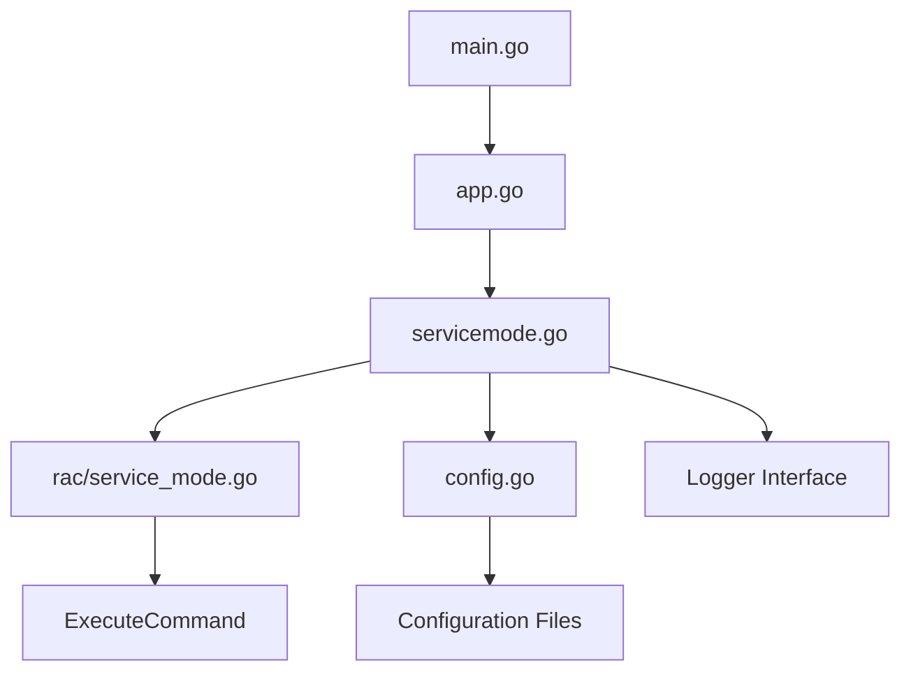
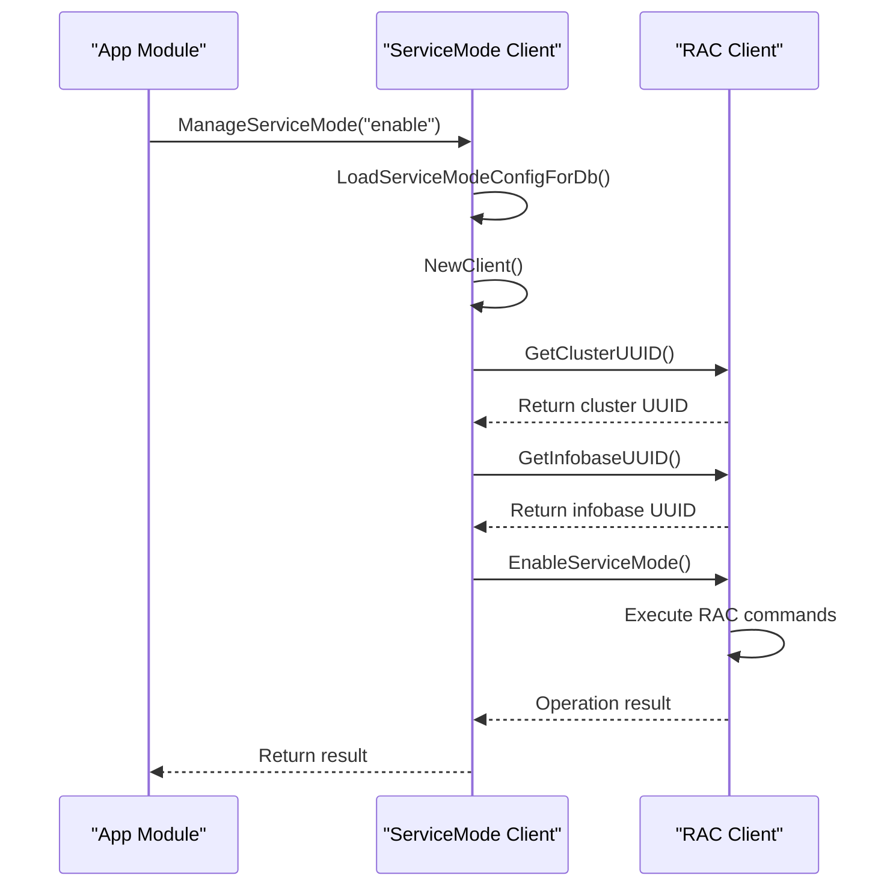

# Команда service-mode-enable

Команда `service-mode-enable` активирует сервисный режим для информационной базы 1C:Enterprise, ограничивая доступ пользователей и позволяя выполнять административные операции.

## Назначение

Активирует сервисный режим для информационной базы, предотвращая подключения пользователей и позволяя выполнять административные операции. Опционально завершает существующие пользовательские сессии.

## Синтаксис

```bash
benadis-runner service-mode-enable --infobase <имя-информационной-базы> [--terminate-sessions]
```

## Параметры

### Обязательные параметры

| Параметр | Переменная окружения | Описание |
|----------|---------------------|----------|
| `--infobase` | `BR_INFOBASE_NAME` | Имя информационной базы |

### Опциональные параметры

| Параметр | Переменная окружения | Описание | По умолчанию |
|----------|---------------------|----------|--------------|
| `--terminate-sessions` | `BR_TERMINATE_SESSIONS` | Завершить активные сессии | false |

## Требования к конфигурации

### Конфигурация RAC (Remote Administration Client)

```yaml
# app.yaml
paths:
  rac: "/opt/1C/v8.3/x86_64/rac"

rac:
  port: 1545
  timeout: 30
  retries: 3

users:
  rac: "admin"
```

### Секретная конфигурация

```yaml
# secret.yaml
passwords:
  rac: "secure_rac_password"
```

### Конфигурация базы данных

```yaml
# dbconfig.yaml
MyInfobase:
  one-server: SERVER-001
  prod: false
  dbserver: SQL-SERVER-001
```

## Архитектура и интеграция

Архитектура следует принципу инверсии зависимостей, где компоненты высокого уровня зависят от абстракций, а не от конкретных реализаций.



### Поток выполнения команды

Реализация начинается в main.go, где константа `constants.ActServiceModeEnable` запускает функцию ServiceModeEnable в app.go. Эта функция создает экземпляр SlogLogger и вызывает ManageServiceMode из пакета servicemode с параметром действия "enable".



### Детальный анализ команды

Метод EnableServiceMode выполняет следующие шаги:

1. **Получение UUID кластера** используя GetClusterUUID
2. **Получение UUID информационной базы** используя GetInfobaseUUID  
3. **Вызов EnableServiceMode** на RAC клиенте с UUID кластера и информационной базы

RAC реализация в `internal/rac/service_mode.go` выполняет фактические RAC команды для активации сервисного режима.

## Примеры использования

### Базовое использование

```bash
# Включение сервисного режима без завершения сессий
benadis-runner service-mode-enable --infobase MyInfobase

# Включение сервисного режима с завершением активных сессий  
benadis-runner service-mode-enable --infobase MyInfobase --terminate-sessions
```

### Использование с переменными окружения

```bash
# Установка переменных
export BR_INFOBASE_NAME="MyInfobase"
export BR_TERMINATE_SESSIONS="true"
export BR_COMMAND="service-mode-enable"

# Запуск команды
benadis-runner
```

### Интеграция с скриптами

```bash
#!/bin/bash
set -e

INFOBASE="ProductionDB"

echo "Включение сервисного режима для $INFOBASE..."
benadis-runner service-mode-enable \
    --infobase "$INFOBASE" \
    --terminate-sessions

echo "Сервисный режим активирован"

# Выполнение административных операций
# ...

echo "Отключение сервисного режима..."
benadis-runner service-mode-disable --infobase "$INFOBASE"
```

## Ожидаемый результат

### Успешное выполнение

```
Сервисный режим успешно включен для информационной базы: MyInfobase
```

### Коды ошибок

| Код | Описание |
|-----|----------|
| 0 | Успешное выполнение |
| 8 | Ошибка выполнения операции сервисного режима |
| 5 | Ошибка загрузки конфигурации |

## Логирование

Реализация обеспечивает подробное логирование для устранения неполадок:

- **Debug уровень**: Подробный поток операций и логирование параметров
- **Info уровень**: Успешное завершение операции  
- **Error уровень**: Сбои операции с контекстом
- **Warning уровень**: Некритичные проблемы и повторные попытки

Записи логов включают структурированные поля для фильтрации и анализа:

```json
{
    "level": "info", 
    "msg": "Сервисный режим включен успешно",
    "dbName": "MyInfobase",
    "terminateSessions": true,
    "duration": "2.5s"
}
```

## Сценарии восстановления

Для восстановления после ошибок реализуйте следующие паттерны:

1. **Повторы с экспоненциальной задержкой**: Реализуйте логику повторов на стороне клиента
2. **Проверка статуса**: Всегда проверяйте финальное состояние после операций
3. **Процедуры отката**: Имейте документированные процедуры ручного восстановления

## Лучшие практики

### Балансировка команд

Всегда балансируйте `service-mode-enable` с `service-mode-disable` в автоматизированных скриптах:

- Убедитесь, что каждая операция включения имеет соответствующее отключение
- Используйте defer блоки или finally секции для гарантии очистки
- Реализуйте механизмы таймаута для предотвращения бесконечного сервисного режима

### Соображения безопасности

- Храните учетные данные RAC безопасно (используйте переменные окружения или зашифрованные файлы)
- Ограничьте доступ к команде только авторизованному персоналу
- Аудируйте использование сервисного режима для соблюдения требований

### Мониторинг и оповещения

- Настройте мониторинг для длительно активного сервисного режима
- Реализуйте оповещения при сбоях операций сервисного режима
- Логируйте все активации сервисного режима для аудита

### Интеграция с CI/CD

```yaml
# GitHub Actions пример
- name: Enable Service Mode
  run: |
    benadis-runner service-mode-enable \
      --infobase ${{ env.INFOBASE_NAME }} \
      --terminate-sessions
  env:
    BR_CONFIG_SYSTEM: config/app.yaml
    BR_CONFIG_SECRET: config/secret.yaml
    INFOBASE_NAME: MyInfobase
```

## Устранение неполадок

### Общие проблемы

#### Ошибка подключения к RAC

```bash
# Проверка доступности RAC сервера
telnet rac-server 1545

# Проверка конфигурации RAC
echo $BR_CONFIG_SYSTEM
cat config/app.yaml | grep -A5 rac
```

#### Неправильные учетные данные

```bash
# Проверка учетных данных
echo $BR_CONFIG_SECRET
# НЕ выводите пароли в логи!

# Тест подключения RAC (если доступно)
rac cluster list --ras=server:1545
```

#### Информационная база не найдена

```bash
# Проверка конфигурации базы данных
cat config/dbconfig.yaml | grep MyInfobase

# Список доступных информационных баз
rac infobase summary list --cluster=<cluster-uuid>
```

### Отладка

Включите подробное логирование для диагностики:

```bash
export BR_LOG_LEVEL="debug"
benadis-runner service-mode-enable --infobase MyInfobase
```

### Производительность

Команда оптимизирована для минимального воздействия:

- Использует конфигурируемые таймауты для предотвращения бесконечного блокирования
- Реализует логику повторов для обработки временных сетевых проблем  
- Минимизирует количество выполняемых RAC команд