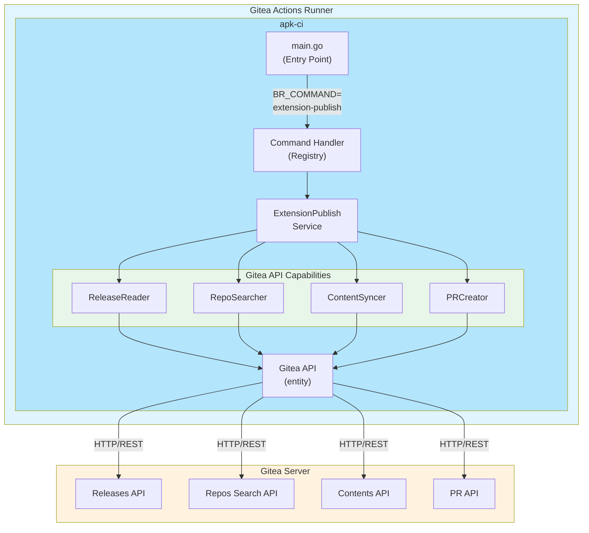
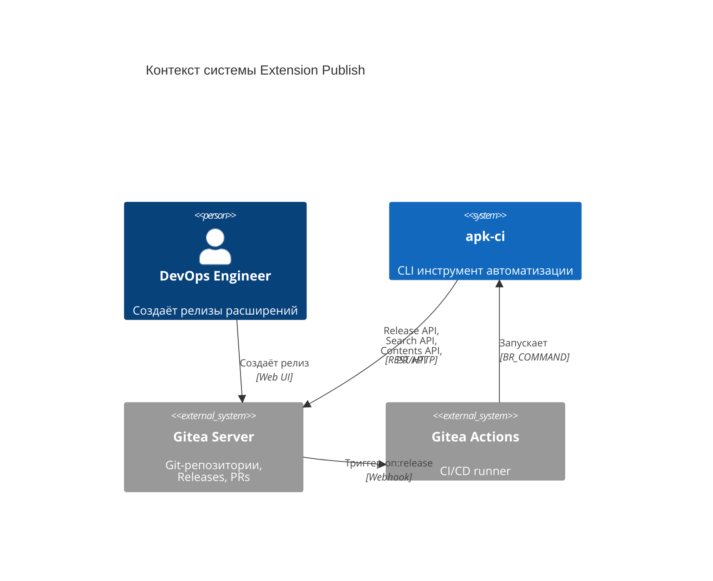
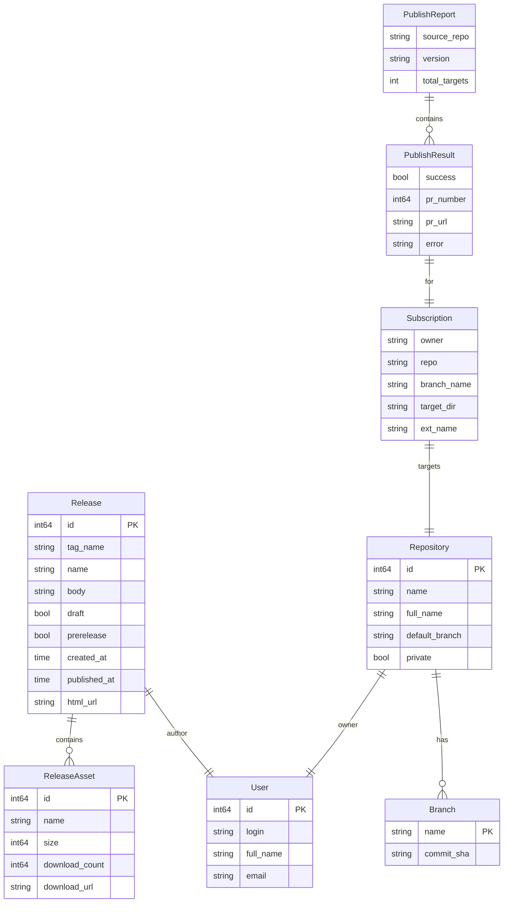
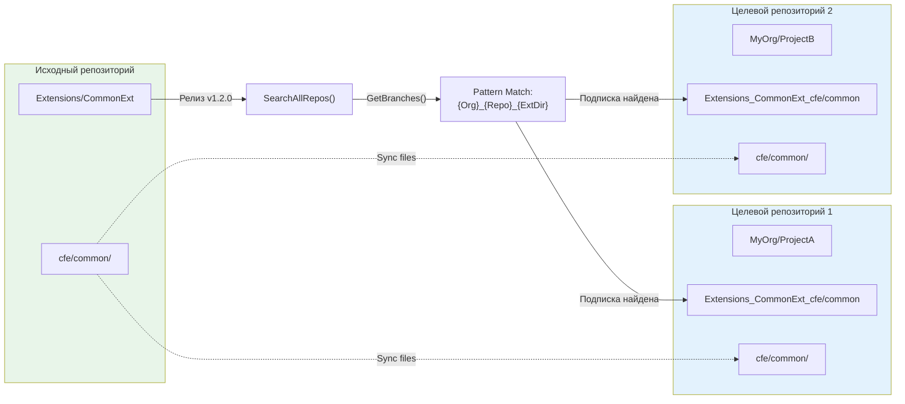
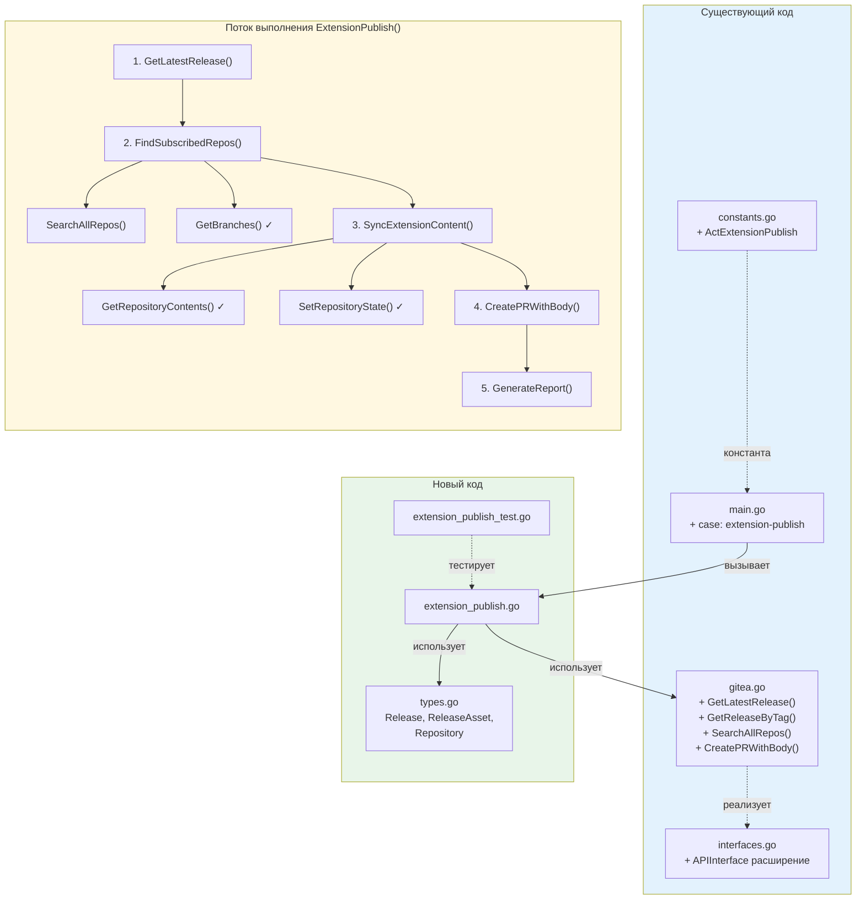
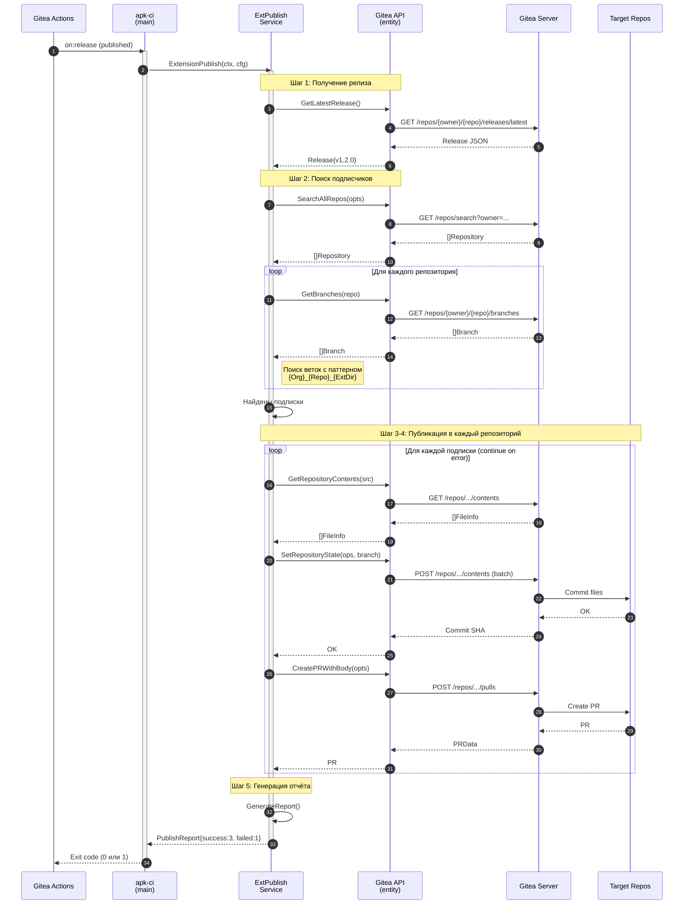
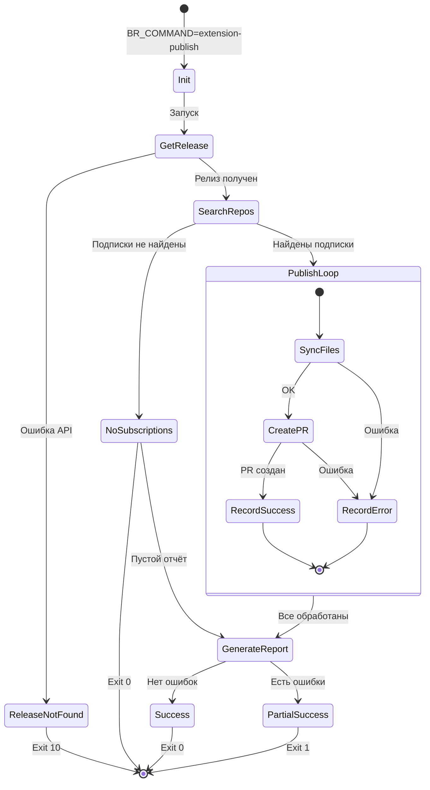

# Архитектура Epic-0: Extension Publish

**Версия:** 1.1
**Дата:** 2025-12-08
**Автор:** Уинстон (Architect Agent)
**Статус:** Draft

---

## 1. Обзор

### 1.1 Цель

Команда `extension-publish` автоматизирует распространение обновлений расширений 1C между репозиториями. При создании релиза в репозитории расширения система находит все "подписанные" репозитории и создаёт PR с обновлённой версией.

### 1.2 Триггер

```yaml
on:
  release:
    types: [published]
```

### 1.3 Принципы проектирования

- **Boring Technology**: Использование существующих паттернов Gitea API
- **Fail-Safe**: Ошибка в одном репозитории не блокирует остальные
- **Transparency**: Детальное логирование и итоговый отчёт
- **Idempotency**: Повторный запуск безопасен

---

## 2. Диаграмма компонентов



### 2.1 C4 Context Diagram



### 2.2 Компоненты

| Компонент | Пакет | Ответственность |
|-----------|-------|-----------------|
| Entry Point | `cmd/apk-ci/main.go` | Маршрутизация команды |
| ExtensionPublish Service | `internal/app/extension_publish.go` | Оркестрация процесса публикации |
| ReleaseReader | `internal/entity/gitea/` | Получение информации о релизах |
| RepoSearcher | `internal/entity/gitea/` | Поиск репозиториев и веток-подписок |
| ContentSyncer | `internal/entity/gitea/` | Синхронизация файлов между репозиториями |
| PRCreator | `internal/entity/gitea/` | Создание Pull Request с информацией |

---

## 3. Схема данных

### 3.0 ER-диаграмма



### 3.1 Структура Release (NEW)

```go
// internal/entity/gitea/types.go

// Release представляет релиз в Gitea
type Release struct {
    ID          int64         `json:"id"`
    TagName     string        `json:"tag_name"`
    Name        string        `json:"name"`
    Body        string        `json:"body"`
    Draft       bool          `json:"draft"`
    Prerelease  bool          `json:"prerelease"`
    CreatedAt   time.Time     `json:"created_at"`
    PublishedAt time.Time     `json:"published_at"`
    Author      *User         `json:"author"`
    Assets      []ReleaseAsset `json:"assets"`
    HTMLURL     string        `json:"html_url"`
    TarballURL  string        `json:"tarball_url"`
    ZipballURL  string        `json:"zipball_url"`
}

// ReleaseAsset представляет файл, прикреплённый к релизу
type ReleaseAsset struct {
    ID            int64     `json:"id"`
    Name          string    `json:"name"`
    Size          int64     `json:"size"`
    DownloadCount int64     `json:"download_count"`
    CreatedAt     time.Time `json:"created_at"`
    UUID          string    `json:"uuid"`
    DownloadURL   string    `json:"browser_download_url"`
}

// User представляет пользователя Gitea
type User struct {
    ID        int64  `json:"id"`
    Login     string `json:"login"`
    FullName  string `json:"full_name"`
    Email     string `json:"email"`
    AvatarURL string `json:"avatar_url"`
}
```

### 3.2 Структура Subscription (подписка)

```go
// internal/app/extension_publish.go

// Subscription представляет подписку репозитория на расширение
type Subscription struct {
    // Целевой репозиторий
    Owner       string
    Repo        string
    // Ветка подписки в целевом репозитории
    BranchName  string
    // Целевая директория для расширения
    TargetDir   string
    // Оригинальное имя расширения
    ExtName     string
}

// PublishResult представляет результат публикации в один репозиторий
type PublishResult struct {
    Subscription Subscription
    Success      bool
    PRNumber     int64
    PRURL        string
    Error        error
}

// PublishReport представляет итоговый отчёт о публикации
type PublishReport struct {
    SourceRepo   string
    Version      string
    TotalTargets int
    Successful   []PublishResult
    Failed       []PublishResult
    Skipped      []PublishResult
}
```

### 3.3 Структура Repository (расширение существующей)

```go
// internal/entity/gitea/types.go (дополнение)

// Repository представляет репозиторий Gitea (расширенная версия)
type Repository struct {
    ID            int64  `json:"id"`
    Owner         *User  `json:"owner"`
    Name          string `json:"name"`
    FullName      string `json:"full_name"`
    Description   string `json:"description"`
    Private       bool   `json:"private"`
    Fork          bool   `json:"fork"`
    DefaultBranch string `json:"default_branch"`
    HTMLURL       string `json:"html_url"`
    CloneURL      string `json:"clone_url"`
    SSHURL        string `json:"ssh_url"`
}

// SearchReposResult представляет результат поиска репозиториев
type SearchReposResult struct {
    OK   bool         `json:"ok"`
    Data []Repository `json:"data"`
}
```

---

## 4. API Контракты

### 4.1 Новые методы Gitea API

#### 4.1.1 GetLatestRelease

```go
// GetLatestRelease получает последний релиз репозитория.
// Gitea API: GET /repos/{owner}/{repo}/releases/latest
//
// Параметры:
//   - (использует g.Owner, g.Repo из конфигурации API)
//
// Возвращает:
//   - *Release: последний опубликованный релиз
//   - error: ошибка если релизы не найдены или API недоступен
func (g *API) GetLatestRelease() (*Release, error)
```

**Пример ответа Gitea API:**
```json
{
    "id": 123,
    "tag_name": "v1.2.0",
    "name": "Release 1.2.0",
    "body": "## Changes\n- Feature X\n- Bug fix Y",
    "draft": false,
    "prerelease": false,
    "created_at": "2025-01-15T10:00:00Z",
    "published_at": "2025-01-15T10:30:00Z",
    "author": {
        "id": 1,
        "login": "developer"
    },
    "html_url": "https://gitea.example.com/org/repo/releases/tag/v1.2.0"
}
```

#### 4.1.2 GetReleaseByTag

```go
// GetReleaseByTag получает релиз по имени тега.
// Gitea API: GET /repos/{owner}/{repo}/releases/tags/{tag}
//
// Параметры:
//   - tag: имя тега релиза (например, "v1.2.0")
//
// Возвращает:
//   - *Release: релиз с указанным тегом
//   - error: ошибка если тег не найден
func (g *API) GetReleaseByTag(tag string) (*Release, error)
```

#### 4.1.3 SearchAllRepos

```go
// SearchAllRepos ищет все репозитории с поддержкой пагинации.
// Gitea API: GET /repos/search
//
// Параметры:
//   - opts: опции поиска (организация, лимит, страница)
//
// Возвращает:
//   - []Repository: найденные репозитории
//   - error: ошибка поиска
func (g *API) SearchAllRepos(opts SearchReposOptions) ([]Repository, error)

// SearchReposOptions определяет опции поиска репозиториев
type SearchReposOptions struct {
    // Владелец (организация или пользователь)
    Owner string
    // Лимит результатов на страницу (по умолчанию 50, макс 50)
    Limit int
    // Номер страницы (начиная с 1)
    Page int
    // Включать приватные репозитории
    IncludePrivate bool
}
```

**Пример ответа Gitea API:**
```json
{
    "ok": true,
    "data": [
        {
            "id": 1,
            "owner": {"login": "MyOrg"},
            "name": "MyProject",
            "full_name": "MyOrg/MyProject",
            "default_branch": "main"
        }
    ]
}
```

#### 4.1.4 FindSubscribedRepos

```go
// FindSubscribedRepos находит все репозитории, подписанные на расширение.
// Паттерн ветки подписки: {SourceOrg}_{SourceRepo}_{ExtDir}
//
// Параметры:
//   - sourceOrg: организация исходного репозитория
//   - sourceRepo: имя исходного репозитория
//   - extDir: директория расширения (например, "cfe/myext")
//
// Возвращает:
//   - []Subscription: список подписок
//   - error: ошибка поиска
func (g *API) FindSubscribedRepos(sourceOrg, sourceRepo, extDir string) ([]Subscription, error)
```

**Логика поиска:**



**Алгоритм:**
1. Получить все репозитории организации через `SearchAllRepos()`
2. Для каждого репозитория получить список веток через `GetBranches()`
3. Найти ветки с паттерном: `{sourceOrg}_{sourceRepo}_{extDir}`
4. Распарсить имя ветки для определения target directory
5. Вернуть список `Subscription`

#### 4.1.5 CreatePRWithBody (расширение существующего CreatePR)

```go
// CreatePRWithBody создаёт Pull Request с полной информацией.
// Gitea API: POST /repos/{owner}/{repo}/pulls
//
// Параметры:
//   - opts: опции создания PR
//
// Возвращает:
//   - *PRData: созданный PR с номером и URL
//   - error: ошибка создания
func (g *API) CreatePRWithBody(opts CreatePROptions) (*PRData, error)

// CreatePROptions определяет опции создания PR
type CreatePROptions struct {
    // Целевая ветка (куда вливаем)
    Base string
    // Исходная ветка (откуда вливаем)
    Head string
    // Заголовок PR
    Title string
    // Тело PR (markdown)
    Body string
    // Assignees (login пользователей)
    Assignees []string
    // Labels
    Labels []int64
}
```

### 4.2 Расширение интерфейса APIInterface

```go
// internal/entity/gitea/interfaces.go (дополнение)

type APIInterface interface {
    // ... существующие методы ...

    // Методы для работы с релизами
    GetLatestRelease() (*Release, error)
    GetReleaseByTag(tag string) (*Release, error)

    // Методы для поиска репозиториев
    SearchAllRepos(opts SearchReposOptions) ([]Repository, error)
    FindSubscribedRepos(sourceOrg, sourceRepo, extDir string) ([]Subscription, error)

    // Расширенное создание PR
    CreatePRWithBody(opts CreatePROptions) (*PRData, error)
}
```

---

## 5. Точки интеграции

### 5.1 Интеграция с существующим кодом

| Точка интеграции | Файл | Метод | Использование |
|------------------|------|-------|---------------|
| Маршрутизация команд | `cmd/apk-ci/main.go` | switch | Добавить case `CmdExtensionPublish` |
| Константы | `internal/constants/constants.go` | — | Добавить `ActExtensionPublish` |
| Config | `internal/config/config.go` | — | Использовать существующую конфигурацию Gitea |
| Gitea API | `internal/entity/gitea/gitea.go` | Новые методы | Release API, Search API |
| Gitea Types | `internal/entity/gitea/types.go` | NEW | Release, ReleaseAsset, Repository |
| Batch Operations | `internal/entity/gitea/gitea.go` | `SetRepositoryState()` | Синхронизация файлов |
| Branch Operations | `internal/entity/gitea/gitea.go` | `GetBranches()` | Поиск веток-подписок |
| PR Creation | `internal/entity/gitea/gitea.go` | `CreatePR()` → `CreatePRWithBody()` | Создание PR с body |

### 5.2 Схема интеграции



**Легенда:** ✓ — существующий метод

### 5.3 Файлы для создания/изменения

| Файл | Действие | Описание |
|------|----------|----------|
| `internal/constants/constants.go` | MODIFY | Добавить `ActExtensionPublish = "extension-publish"` |
| `internal/entity/gitea/types.go` | CREATE | Новые структуры Release, ReleaseAsset, Repository |
| `internal/entity/gitea/gitea.go` | MODIFY | Добавить методы для Release API и Search API |
| `internal/entity/gitea/interfaces.go` | MODIFY | Расширить интерфейс APIInterface |
| `internal/app/extension_publish.go` | CREATE | Основная логика команды |
| `internal/app/extension_publish_test.go` | CREATE | Unit-тесты |
| `cmd/apk-ci/main.go` | MODIFY | Добавить case в switch |

---

## 6. Sequence Diagram



---

## 7. Обработка ошибок

### 7.0 State Diagram: Жизненный цикл публикации



### 7.1 Стратегия Continue-on-Error

```go
type PublishResult struct {
    Subscription Subscription
    Success      bool
    Error        error
}

func (s *ExtensionPublishService) Publish(ctx context.Context) (*PublishReport, error) {
    report := &PublishReport{}

    for _, sub := range subscriptions {
        result := s.publishToRepo(ctx, sub)

        if result.Error != nil {
            report.Failed = append(report.Failed, result)
            s.logger.Error("Ошибка публикации",
                "repo", sub.Repo,
                "error", result.Error)
            continue // Не прерываем цикл
        }

        report.Successful = append(report.Successful, result)
    }

    // Exit code = 1 если есть хотя бы одна ошибка
    if len(report.Failed) > 0 {
        return report, fmt.Errorf("публикация завершена с ошибками: %d из %d",
            len(report.Failed), report.TotalTargets)
    }

    return report, nil
}
```

### 7.2 Коды ошибок

| Код | Описание | Exit Code |
|-----|----------|-----------|
| `ERR_RELEASE_NOT_FOUND` | Релиз не найден | 10 |
| `ERR_NO_SUBSCRIPTIONS` | Нет подписанных репозиториев | 0 (success) |
| `ERR_PARTIAL_PUBLISH` | Часть публикаций не удалась | 1 |
| `ERR_GITEA_API` | Ошибка Gitea API | 11 |
| `ERR_RATE_LIMIT` | Превышен лимит запросов | 12 |

---

## 8. Формат вывода

### 8.1 Итоговый отчёт (JSON)

```json
{
    "status": "partial_success",
    "source": {
        "owner": "Extensions",
        "repo": "CommonExtension",
        "version": "v1.2.0",
        "release_url": "https://gitea.example.com/Extensions/CommonExtension/releases/tag/v1.2.0"
    },
    "summary": {
        "total": 5,
        "successful": 4,
        "failed": 1,
        "skipped": 0
    },
    "results": [
        {
            "repo": "MyOrg/ProjectA",
            "branch": "Extensions_CommonExtension_cfe/common",
            "target_dir": "cfe/common",
            "success": true,
            "pr_number": 123,
            "pr_url": "https://gitea.example.com/MyOrg/ProjectA/pulls/123"
        },
        {
            "repo": "MyOrg/ProjectB",
            "branch": "Extensions_CommonExtension_cfe/common",
            "target_dir": "cfe/common",
            "success": false,
            "error": "branch protection: requires review"
        }
    ]
}
```

### 8.2 Текстовый вывод

```
Extension Publish Report
========================
Source: Extensions/CommonExtension v1.2.0
Release: https://gitea.example.com/Extensions/CommonExtension/releases/tag/v1.2.0

Results: 4/5 successful

✓ MyOrg/ProjectA → PR #123
✓ MyOrg/ProjectC → PR #45
✓ MyOrg/ProjectD → PR #67
✓ OtherOrg/ProjectE → PR #12
✗ MyOrg/ProjectB → Error: branch protection requires review

Exit code: 1
```

---

## 9. Риски и митигация

| Риск | Вероятность | Импакт | Митигация |
|------|-------------|--------|-----------|
| API Rate Limiting | Средняя | Высокий | Добавить задержки между запросами, экспоненциальный backoff |
| Массовые изменения | Низкая | Высокий | Dry-run режим (через env var), детальное логирование |
| Конфликты в целевых репозиториях | Средняя | Средний | Создаём PR, не делаем автомерж |
| Неверный паттерн ветки | Низкая | Низкий | Валидация формата ветки |
| Большие расширения | Низкая | Средний | Пагинация в batch операциях |

---

## 10. Тестирование

### 10.1 Unit-тесты

```go
// internal/app/extension_publish_test.go

func TestParseSubscriptionBranch(t *testing.T) {
    tests := []struct {
        name     string
        branch   string
        expected *Subscription
        wantErr  bool
    }{
        {
            name:   "valid branch",
            branch: "Extensions_CommonExt_cfe/common",
            expected: &Subscription{
                Owner:     "Extensions",
                Repo:      "CommonExt",
                TargetDir: "cfe/common",
            },
        },
        {
            name:    "invalid format",
            branch:  "feature/some-feature",
            wantErr: true,
        },
    }
    // ...
}

func TestFindSubscribedRepos(t *testing.T) {
    // Mock Gitea API
    // Test pagination
    // Test branch matching
}
```

### 10.2 Integration-тесты

```go
// internal/app/extension_publish_integration_test.go
// +build integration

func TestExtensionPublishE2E(t *testing.T) {
    // Требует реального Gitea или моки
    // Создать тестовые репозитории
    // Создать ветки-подписки
    // Запустить публикацию
    // Проверить созданные PR
}
```

---

## 11. Связанные документы

- [Epic-0: Extension Publish](../epics/epic-0-extension-publish.md)
- [Архитектура apk-ci v2.0](../architecture.md)
- [Gitea API Documentation](https://docs.gitea.com/api/1.20/)

---

_Документ создан: 2025-12-08_
_Автор: Уинстон (Architect Agent)_
_Ревизия: 1.0_
