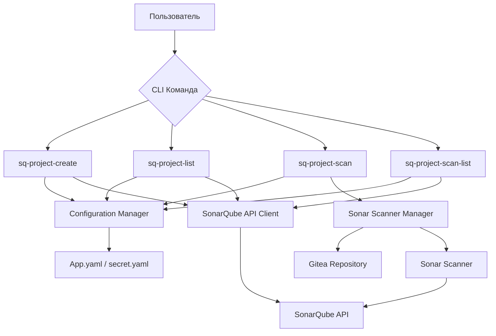

# Software Requirements Specification (SRS) для интеграции с SonarQube

## 1. Введение

### 1.1 Назначение
Этот документ описывает функциональные и нефункциональные требования для интеграции проекта apk-ci с системой SonarQube. Документ предназначен для разработчиков, тестировщиков и заинтересованных сторон, участвующих в реализации интеграции.

### 1.2 Область применения
Интеграция позволяет выполнять анализ качества кода, создание проектов в SonarQube и управление сканированием репозиториев через API SonarQube и локальный sonar-scanner.

### 1.3 Определения, акронимы и сокращения
- **SonarQube**: Платформа для непрерывного анализа и измерения качества кода
- **API**: Application Programming Interface
- **CLI**: Command Line Interface
- **sq-project-create**: Команда создания проекта в SonarQube
- **sq-project-list**: Команда получения списка проектов в SonarQube
- **sq-project-scan**: Команда сканирования репозитория и отправки результатов в SonarQube
- **sq-project-scan-list**: Команда получения списка сканирований проекта в SonarQube

### 1.4 Ссылки
- promts/2-refact-03.md - Исходные требования
- internal/app/app.go - Основной модуль приложения
- internal/config/config.go - Конфигурационный модуль

## 2. User Stories

### 2.1 Как разработчик, я хочу создавать проекты в SonarQube, чтобы отслеживать качество кода
### 2.2 Как разработчик, я хочу получать список проектов в SonarQube, чтобы управлять ими
### 2.3 Как разработчик, я хочу сканировать репозитории и отправлять результаты в SonarQube, чтобы анализировать качество кода
### 2.4 Как разработчик, я хочу получать список сканирований проекта в SonarQube, чтобы отслеживать историю анализа

## 3. Требования по категориям EARS

### Ubiquitous (Повсеместные требования):

THE SYSTEM SHALL authenticate with SonarQube using token-based authentication.
- Идентификатор: REQ-001
- Критерии приемки: Система должна использовать токен аутентификации из secret.yaml для всех запросов к API SonarQube

THE SYSTEM SHALL read configuration parameters from app.yaml and secret.yaml files.
- Идентификатор: REQ-002
- Критерии приемки: Система должна корректно читать URL SonarQube, токен аутентификации и другие параметры из конфигурационных файлов

THE SYSTEM SHALL handle errors gracefully and provide meaningful error messages.
- Идентификатор: REQ-003
- Критерии приемки: Система должна обрабатывать ошибки API, сетевые ошибки и ошибки конфигурации с информативными сообщениями

THE SYSTEM SHALL implement retry mechanism with exponential backoff for API calls.
- Идентификатор: REQ-004
- Критерии приемки: Система должна повторять неудачные запросы к API с экспоненциально увеличивающейся задержкой

### Event-driven (Событийные требования):

WHEN a user executes sq-project-create command, THE SYSTEM SHALL create a new project in SonarQube with specified parameters.
- Идентификатор: REQ-005
- Критерии приемки: Команда должна создавать проект с именем <owner>_<repo>_<branch>, тегами <owner>,<repo>,<branch>, описанием из README.md, администраторами <owner>,<dev> и применяемыми правилами из конфигурационного файла

WHEN a user executes sq-project-list command, THE SYSTEM SHALL retrieve and display a list of projects from SonarQube.
- Идентификатор: REQ-006
- Критерии приемки: Команда должна возвращать список проектов в формате JSON

WHEN a user executes sq-project-scan command, THE SYSTEM SHALL download sonar-scanner from gitea repository and execute it with specified parameters.
- Идентификатор: REQ-007
- Критерии приемки: Команда должна скачивать sonar-scanner из репозитория gitea и запускать его со всеми параметрами которые необходимы для корректной работы сканера. Для формирование нужных параметров изпользуются: URL SonarQube, URL репозитория sonar-scanner, URL репозитория с данными для сканирования, пути к файлу конфигурации SonarQube, хеша коммита и ключа проекта SonarQube

WHEN a user executes sq-project-scan-list command, THE SYSTEM SHALL retrieve and display a list of scans for a specific project from SonarQube.
- Идентификатор: REQ-008
- Критерии приемки: Команда должна возвращать список сканирований проекта в формате JSON

### Unwanted Behavior (Требования к нежелательному поведению):

IF SonarQube API returns an error, THEN THE SYSTEM SHALL log the error and provide user-friendly error message.
- Идентификатор: REQ-009
- Критерии приемки: Система должна логировать ошибки API и выводить пользователю понятные сообщения об ошибках

IF network connection is lost during API call, THEN THE SYSTEM SHALL retry the request according to retry policy.
- Идентификатор: REQ-010
- Критерии приемки: Система должна повторять запросы при сетевых ошибках в соответствии с политикой повторных попыток

IF configuration files are missing or malformed, THEN THE SYSTEM SHALL provide clear error message and exit gracefully.
- Идентификатор: REQ-011
- Критерии приемки: Система должна проверять наличие и корректность конфигурационных файлов и корректно завершаться при ошибках

IF sonar-scanner execution fails, THEN THE SYSTEM SHALL capture the error output and provide detailed diagnostic information.
- Идентификатор: REQ-012
- Критерии приемки: Система должна перехватывать вывод sonar-scanner при ошибках и предоставлять детальную диагностическую информацию

### State-driven (Состоянийные требования):

WHILE executing sq-project-scan command, THE SYSTEM SHALL download and configure sonar-scanner before running the scan.
- Идентификатор: REQ-013
- Критерии приемки: Во время выполнения команды сканирования система должна сначала скачать и настроить sonar-scanner, затем выполнить сканирование

WHILE processing API responses, THE SYSTEM SHALL validate response format and handle unexpected response structures.
- Идентификатор: REQ-014
- Критерии приемки: При обработке ответов API система должна проверять формат ответа и корректно обрабатывать неожиданные структуры ответов

### Optional Features (Опциональные требования):

WHERE debug mode is enabled, THE SYSTEM SHALL provide verbose logging of API requests and responses.
- Идентификатор: REQ-015
- Критерии приемки: В режиме отладки система должна выводить подробные логи запросов и ответов API

WHERE JSON output format is requested, THE SYSTEM SHALL format all command outputs as valid JSON.
- Идентификатор: REQ-016
- Критерии приемки: При запросе формата JSON система должна форматировать все выводы команд как валидный JSON

### Complex (Комплексные требования):

WHILE in normal operation mode, IF a project creation request is made with valid parameters, THEN WHEN the request is processed, THE SYSTEM SHALL create the project in SonarQube and return the project key.
- Идентификатор: REQ-017
- Критерии приемки: В нормальном режиме работы при запросе создания проекта с валидными параметрами система должна создать проект в SonarQube и вернуть ключ проекта

WHILE executing scan command, IF sonar-scanner download fails, THEN WHEN retry attempts are exhausted, THE SYSTEM SHALL report the failure and exit with error code.
- Идентификатор: REQ-018
- Критерии приемки: При выполнении команды сканирования, если загрузка sonar-scanner не удалась и исчерпаны все попытки повтора, система должна сообщить об ошибке и завершиться с кодом ошибки

## 4. Архитектурные аспекты

### 4.1 Компоненты системы

#### 4.1.1 SonarQube API Client
Компонент для взаимодействия с API SonarQube:
- Создание проектов
- Получение списка проектов для получения токена проекта по его имени
- Получение токена проекта по его имени
- Получение списка сканирований проекта по его имени
- Аутентификация по токену

#### 4.1.2 Sonar Scanner Manager
Компонент для управления локальным sonar-scanner:
- Загрузка sonar-scanner из репозитория gitea
- Настройка параметров сканирования
- Выполнение сканирования

#### 4.1.3 Configuration Manager
Компонент для работы с конфигурацией:
- Чтение app.yaml
- Чтение secret.yaml
- Валидация параметров

### 4.2 Интерфейсы

#### 4.2.1 CLI Интерфейс
Команды для взаимодействия с системой:
- sq-project-create
- sq-project-list
- sq-project-scan
- sq-project-scan-list

#### 4.2.2 API Интерфейс
Интерфейс для взаимодействия с SonarQube API:
- RESTful API клиент
- Методы для работы с проектами и сканированиями

### 4.3 Потоки данных

### 4.4 Взаимодействия между частями системы

1. Пользователь вызывает CLI команду
2. CLI интерфейс передает команду и параметры Configuration Manager
3. Configuration Manager читает конфигурационные файлы и валидирует параметры
4. В зависимости от команды, запрос передается либо SonarQube API Client, либо Sonar Scanner Manager
5. SonarQube API Client взаимодействует с SonarQube API
6. Sonar Scanner Manager загружает sonar-scanner из Gitea и выполняет сканирование

## 5. Критерии приемки для каждого требования

### REQ-001
- Система должна использовать токен аутентификации из secret.yaml
- Все запросы к API SonarQube должны содержать заголовок авторизации
- Тест: Проверка наличия заголовка авторизации в запросах к API

### REQ-002
- Система должна читать URL SonarQube из app.yaml
- Система должна читать токен аутентификации из secret.yaml
- Тест: Проверка корректного чтения параметров конфигурации

### REQ-003
- Система должна обрабатывать ошибки API с информативными сообщениями
- Система должна обрабатывать сетевые ошибки
- Тест: Проверка обработки различных типов ошибок

### REQ-004
- Система должна повторять неудачные запросы с экспоненциально увеличивающейся задержкой
- Максимальное количество попыток должно быть настраиваемым
- Тест: Проверка механизма повторных попыток

### REQ-005
- Команда должна создавать проект с указанными параметрами
- Система должна возвращать ключ созданного проекта
- Тест: Проверка создания проекта с корректными параметрами

### REQ-006
- Команда должна возвращать список проектов в формате JSON
- Список должен содержать информацию о проектах
- Тест: Проверка корректности возвращаемого списка проектов

### REQ-007
- Команда должна скачивать sonar-scanner из репозитория gitea
- Команда должна запускать sonar-scanner с указанными параметрами
- Тест: Проверка загрузки и запуска sonar-scanner

### REQ-008
- Команда должна возвращать список сканирований проекта в формате JSON
- Список должен содержать информацию о сканированиях
- Тест: Проверка корректности возвращаемого списка сканирований

### REQ-009
- Система должна логировать ошибки API
- Система должна выводить пользователю понятные сообщения об ошибках
- Тест: Проверка обработки и отображения ошибок API

### REQ-010
- Система должна повторять запросы при сетевых ошибках
- Тест: Проверка повторных попыток при сетевых ошибках

### REQ-011
- Система должна проверять наличие конфигурационных файлов
- Система должна проверять корректность конфигурационных файлов
- Тест: Проверка обработки отсутствующих или некорректных конфигурационных файлов

### REQ-012
- Система должна перехватывать вывод sonar-scanner при ошибках
- Система должна предоставлять детальную диагностическую информацию
- Тест: Проверка обработки ошибок sonar-scanner

### REQ-013
- Во время выполнения команды сканирования система должна сначала скачать и настроить sonar-scanner
- Тест: Проверка последовательности операций при сканировании

### REQ-014
- Система должна проверять формат ответов API
- Система должна корректно обрабатывать неожиданные структуры ответов
- Тест: Проверка обработки различных форматов ответов API

### REQ-015
- В режиме отладки система должна выводить подробные логи запросов и ответов API
- Тест: Проверка логирования в режиме отладки

### REQ-016
- При запросе формата JSON система должна форматировать все выводы команд как валидный JSON
- Тест: Проверка формата вывода в JSON

### REQ-017
- В нормальном режиме работы при запросе создания проекта с валидными параметрами система должна создать проект в SonarQube и вернуть ключ проекта
- Тест: Проверка создания проекта и возврата ключа

### REQ-018
- При выполнении команды сканирования, если загрузка sonar-scanner не удалась и исчерпаны все попытки повтора, система должна сообщить об ошибке и завершиться с кодом ошибки
- Тест: Проверка обработки ошибок загрузки sonar-scanner