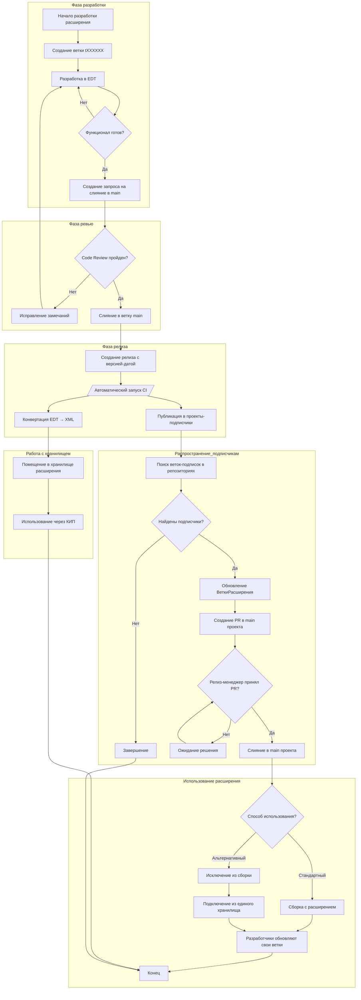
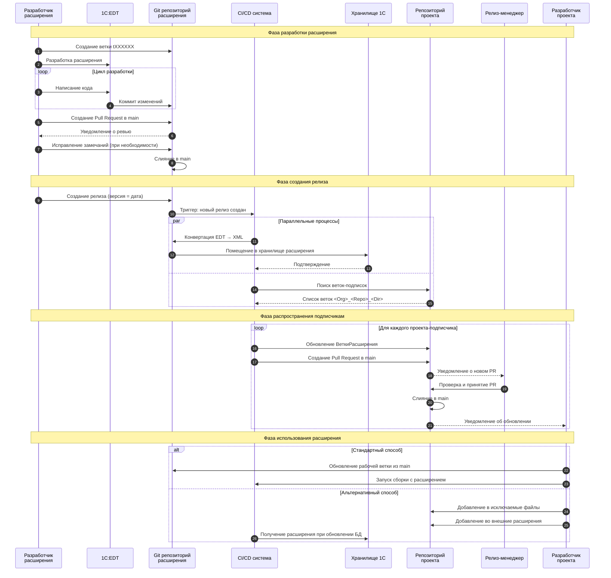

# Процесс разработки внешнего расширения для баз 1С

## Обзор процесса

Данный документ описывает жизненный цикл разработки и распространения внешних расширений для информационных баз 1С:Предприятие. Процесс охватывает:
- Разработку расширения в среде EDT
- Управление версиями через Git
- Автоматическую публикацию через релизы
- Распространение в проекты-подписчики
- Выбор варианта для использования в gitops

---

## Диаграмма активности

Диаграмма активности показывает основные этапы и точки принятия решений в процессе разработки и публикации расширения.



### Описание этапов диаграммы активности

| Этап | Описание |
|------|----------|
| **Создание ветки tXXXXXX** | Ветка разработки именуется по номеру заявки на изменение (ЗнИ) в системе Интрасервис |
| **Разработка в EDT** | Работа ведётся в 1C:EDT с минимально необходимым набором объектов метаданных |
| **Code Review** | Проверка кода перед слиянием в основную ветку |
| **Создание релиза** | Версия релиза соответствует планируемой дате выпуска |
| **Конвертация EDT → XML** | Автоматическое преобразование формата для совместимости с хранилищем |
| **Поиск веток-подписок** | Поиск веток формата `<Org>_<Repo>_<Dir>` в репозиториях проектов |
| **Альтернативный способ** | Расширение исключается из сборки проекта, но добавляется из единого хранилища при обновлении баз |

---

## Диаграмма последовательности

Диаграмма последовательности показывает взаимодействие между участниками и системами в процессе публикации расширения.



### Описание взаимодействий

#### Участники процесса

| Участник | Роль |
|----------|------|
| **Разработчик расширения** | Создаёт и поддерживает код расширения |
| **1C:EDT** | Среда разработки для расширений 1С |
| **Git репозиторий расширения** | Хранение исходного кода расширения |
| **CI/CD система** | Автоматизация сборки и публикации |
| **Хранилище 1С** | Хранилище конфигурации для баз без DevOps |
| **Репозиторий проекта** | Git репозиторий проекта-подписчика |
| **Релиз-менеджер** | Принимает решения о включении расширений в проекты |
| **Разработчик проекта** | Использует расширение в своём проекте |

#### Ключевые взаимодействия

1. **Шаги 1-6**: Стандартный цикл разработки с использованием Git Flow
2. **Шаги 7-9**: Создание релиза запускает автоматические процессы
3. **Шаги 10-12**: Параллельное выполнение конвертации и поиска подписчиков
4. **Шаги 13-18**: Цикл публикации для каждого проекта-подписчика
5. **Шаги 19-23**: Два варианта использования расширения в проекте

---

## Формат ветки-подписки

Ветка-подписка в репозитории проекта имеет следующий формат:

```
<Имя_организации>_<Имя_репозитория>_<Имя_каталога>
```

### Пример

Если расширение находится в:
- Организация: `lib`
- Репозиторий: `apk_ssl`
- Каталог: `АПК_БСП`

То ветка-подписка будет называться: `lib_apk_ssl_АПК_БСП`

---

## Варианты использования расширения

### Стандартный вариант

Расширение включается в сборку проекта и обрабатывается вместе с остальными компонентами:
1. Расширение находится в каталоге расширений проекта
2. При сборке конфигурации расширение компилируется
3. Для расширения создаётся отдельное хранилище

Приемущества стандартного варианта:
- Упрощение управления версиями расширения
- Проверка применимости расширения при сборке проекта
- Удобство включения расширения в проект
- Возможность внесения экстренных изменений в расширение без влияния на остальные проекты

### Альтернативный вариант

Расширение исключается из сборки проекта, но используется из единого хранилища:

1. **Исключение из сборки**: Расширение добавляется в список исключаемых файлов проекта
2. **Подключение внешних расширений**: Расширение добавляется в список внешних расширений
3. **Результат**: При обновлении тестовой и продуктивной базы расширение подключается из единого хранилища

Преимущества альтернативного варианта:
- Не требуется дополнительное хранилище для каждого проекта
- Единая точка управления версией расширения
- Упрощение процесса обновления

Недостатки альтернативного варианта:
- Усложнение управления версиями расширения
- Риск нарушения согласованности конфигурации при обновлении базы
- Усложнение отладки расширения, так как оно находится в отдельном хранилище
- Необходимость доработки CI/CD системы для поддержки альтернативного варианта

## Вывод

Рекомендуется использовать стандартный вариант как унифицированное решение для всех типов расширений.
Желательно не использовать в названиях общих расширений кириллицу, чтобы избежать возможных проблем с кодировкой.