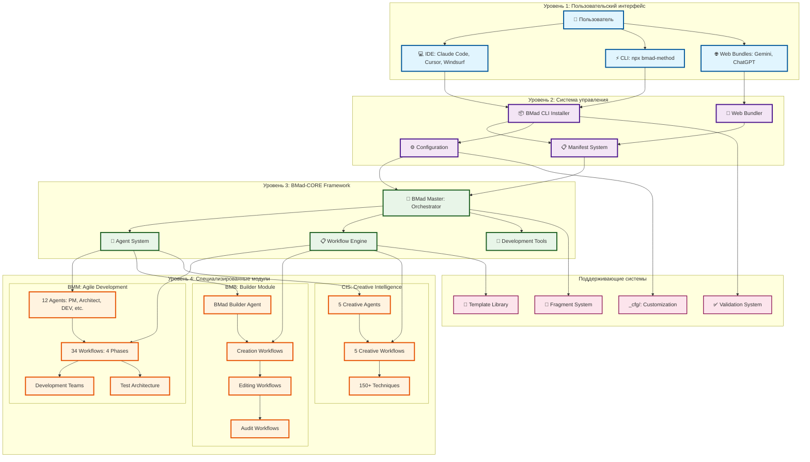

На основе глубокого анализа проекта BMAD-METHOD, я создал комплексную диаграмму Mermaid уровня 4, которая описывает полную архитектуру и workflow работы с проектом:

📊 Описание уровней диаграммы:
Уровень 1: Пользовательский интерфейс
- Пользователь взаимодействует через различные интерфейсы
- IDE интеграция (Claude Code, Cursor, Windsurf) для локальной разработки
- CLI интерфейс для установки и управления
- Web Bundles для использования в Gemini, ChatGPT без установки
Уровень 2: Система управления
- Installer обрабатывает установку модулей и IDE интеграцию
- Bundler создает автономные XML пакеты для web
- Manifest System отслеживает все компоненты и зависимости
- Configuration управляет настройками и кастомизацией
Уровень 3: BMad-CORE Framework
- BMad Master - центральный оркестратор всех операций
- Agent System управляет жизненным циклом агентов
- Workflow Engine исполняет многошаговые процессы
- Development Tools предоставляет утилиты разработки
Уровень 4: Специализированные модули
- BMM (BMad Method): 12 агентов, 34 workflow для agile разработки
- BMB (BMad Builder): инструменты создания кастомных агентов и модулей
- CIS (Creative Intelligence): 5 креативных агентов с 150+ техниками
🔄 Ключевые паттерны взаимодействия:
1. Установка: CLI → Installer → Manifest → Core
2. Разработка: IDE → Core → BMM → Workflows
3. Кастомизация: Config → _cfg/ → Core → Agents
4. Создание: BMB → Builder → Custom Modules
5. Веб-интеграция: Bundler → Web Bundles → External Platforms
Эта диаграмма уровня 4 показывает полную экосистему BMAD-METHOD с детальной проработкой каждого уровня и их взаимосвязей