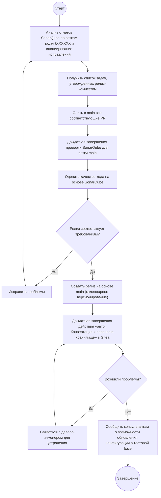

---
tags:
  - gitops
  - docs
Версия: Draft
---

## Решаемые задачи
- Стандартизировать процесс выпуска релизов на 1С через GitOps.
- Обеспечить прозрачность, прослеживаемость и контроль качества релиза.
- Упростить откаты и хотфиксы без ручных операций в проде.
- Согласовать роли и точки принятия решений.

## Область применения и аудитория
- Для релиз-менеджера.
- Охватывает проекты конфигураций 1С.
- Применяется для конфигураций 1С и артефактов `*.epf`.

## Термины и сокращения
- GitOps — управление релизами конфигураций 1С с помощью git используя сервер gitea.
- 1С:Предприятие — платформа бизнес-приложений, далее «1С».
- EDT — среда разработки 1С, CLI для сборки/проверки.
- EPF — внешний обработчик/отчет 1С.
- CI/CD — непрерывная интеграция/доставка.
- PR — pull request.
- Tag — метка версии в gitea.
- Релиз - готовая к тестированию версия конфигурации.

## Предпосылки и окружение
- Доступ к репозиторию Gitea.
- Права на утверждение PR.
- Конфигурация проекта: `project.yaml`.
- Список утвержденных в релиз задач.

## Архитектура GitOps в проекте (обзор)
- Источник правды — ветки и файлы конфигурации в репозитории.
- Автоматизация — запускается runner и CI по событиям в Gitea.
- Артефакты — помещенные в хранилище конфигурации версии конфигурации для тестирования.
- Среды — dev/test/prod; продвижение через merge/PR и теги.

## Ветвление и версионирование
- Ветвление: 
	- `main` - ветка содержащая конфигурацию в формате EDT готовую для тестирования.
	- `xml` - ветка содержащая конфигурацию в формате XML для сборки конфигурации.
  - `tXXXXXX` - ветка содержащая доработки по задаче `XXXXXX` в формате EDT в разработке.
- Версионирование: календарное версионирование вида 20251118.2, где `20251118` - дата выкатки изменений в прод среду, а число после точки - номер по порядки в рамках данного релиза .
- Коммиты: придерживаться Conventional Commits; PR обязателен для merge в `main`.

## Подготовка релиза
- Проанализировать отчеты SonarQube для веток задач (`tXXXXXX`) по которым есть открытые PR и инициировать исправления проблем.
- Получить список утвержденных на релизном комитете задач.
- Слить в `main` все PR с соответствующими задачами.
- Дождаться завершения проверки в SonarQube для ветки `main`.
- Оценить качество кода на основеSonarQube и принять решение о выпуске релиза.
- Если релиз не соответствует требованиям, исправить проблемы и повторить процесс.
- Если релиз соответствует требованиям, создать релиз на основе `main` используя календарное версионирование.
- Дождаться завершения действия `авто. Конвертация и перенос в хранилище` в gitea.
- В случае возникновения проблем связаться с девопс-инженером для устранения.
- В случае успеха сообщить консультантам о возможность обновления конфигурации в тестовой базе.
- При нахождении консультантами ошибок организовать внесение 

### Диаграмма активности

## Проверки качества (минимум)
- Проверка качества релиза проводится с помощью SonarQube, при этом основным критерием является количество добавленных/исправленных ошибок в последнем изменении.

