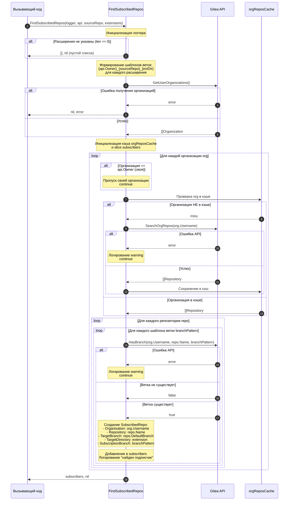

```mermaid
sequenceDiagram
    autonumber
    participant Caller as Вызывающий код
    participant FSR as FindSubscribedRepos
    participant API as Gitea API
    participant Cache as orgReposCache

    Caller->>FSR: FindSubscribedRepos(logger, api, sourceRepo, extensions)

    Note over FSR: Инициализация логгера

    %% Проверка наличия расширений
    alt Расширения не указаны (len == 0)
        FSR-->>Caller: [], nil (пустой список)
    end

    %% Шаг 1: Формирование шаблонов веток-подписок
    Note over FSR: Формирование шаблонов веток:<br/>{api.Owner}_{sourceRepo}_{extDir}<br/>для каждого расширения

    %% Шаг 2: Получение списка организаций
    FSR->>API: GetUserOrganizations()

    alt Ошибка получения организаций
        API-->>FSR: error
        FSR-->>Caller: nil, error
    else Успех
        API-->>FSR: []Organization
    end

    Note over FSR: Инициализация кэша orgReposCache<br/>и slice subscribers

    %% Шаг 3: Итерация по организациям
    loop Для каждой организации org
        alt Организация == api.Owner (своя)
            Note over FSR: Пропуск своей организации<br/>continue
        end

        %% Получение репозиториев организации
        FSR->>Cache: Проверка org в кэше

        alt Организация НЕ в кэше
            Cache-->>FSR: miss
            FSR->>API: SearchOrgRepos(org.Username)

            alt Ошибка API
                API-->>FSR: error
                Note over FSR: Логирование warning<br/>continue
            else Успех
                API-->>FSR: []Repository
                FSR->>Cache: Сохранение в кэш
            end
        else Организация в кэше
            Cache-->>FSR: []Repository
        end

        %% Шаг 4: Проверка веток в репозиториях
        loop Для каждого репозитория repo
            loop Для каждого шаблона ветки branchPattern
                FSR->>API: HasBranch(org.Username, repo.Name, branchPattern)

                alt Ошибка API
                    API-->>FSR: error
                    Note over FSR: Логирование warning<br/>continue
                else Ветка не существует
                    API-->>FSR: false
                else Ветка существует
                    API-->>FSR: true
                    Note over FSR: Создание SubscribedRepo:<br/>- Organization: org.Username<br/>- Repository: repo.Name<br/>- TargetBranch: repo.DefaultBranch<br/>- TargetDirectory: extension<br/>- SubscriptionBranch: branchPattern
                    Note over FSR: Добавление в subscribers<br/>Логирование "найден подписчик"
                end
            end
        end
    end

    FSR-->>Caller: subscribers, nil

```