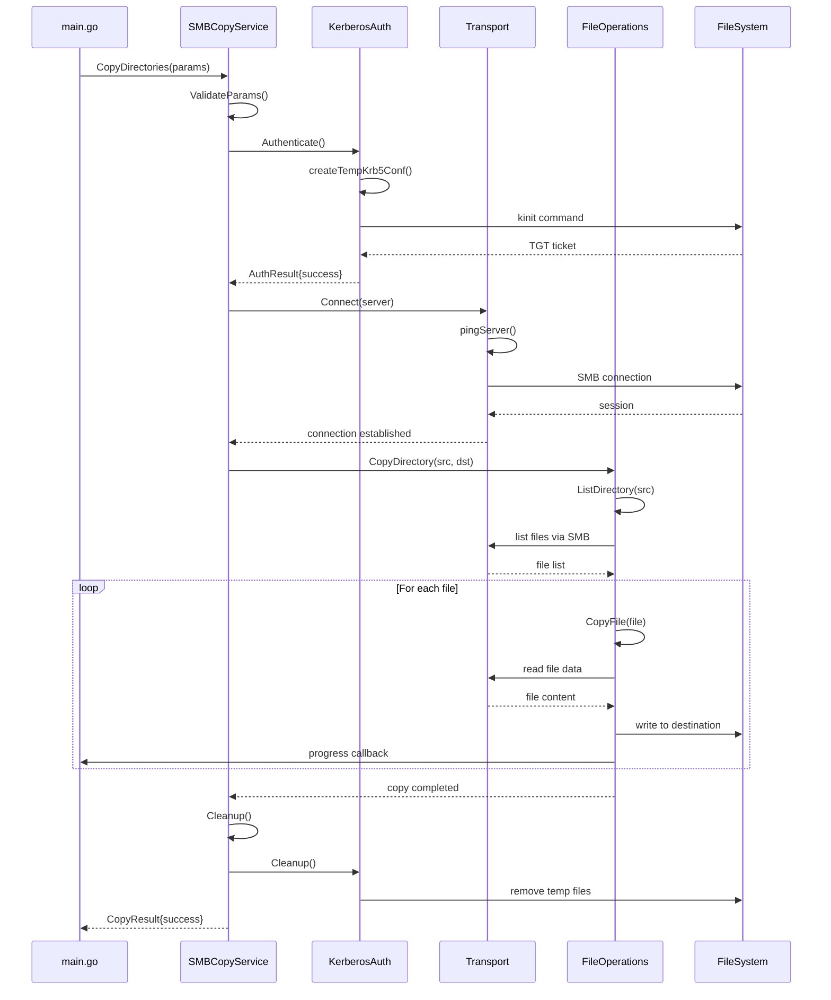
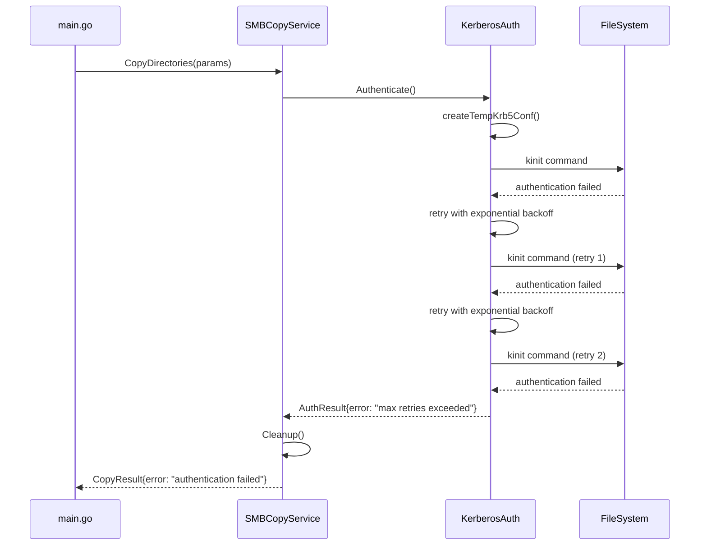

# Архитектура решения для копирования каталогов через SMB/CIFS с Kerberos аутентификацией

## Обзор

Данный документ описывает архитектуру функции копирования директорий через SMB/CIFS с аутентификацией Kerberos для системы apk-ci. Функция `CopyDirectories` предназначена для безопасного и эффективного копирования файлов и директорий между локальной файловой системой и удаленными SMB-ресурсами с использованием Active Directory аутентификации.

### Ключевые требования
- Выполнение как действие (action) из main.go
- Конфигурация исключительно через app.yaml
- Копирование директорий через SMB/CIFS протокол
- Аутентификация через Kerberos (Active Directory)
- Обработка ошибок с повторными попытками
- Логирование прогресса операций
- Поддержка больших файлов и директорий
- Безопасное управление временными файлами конфигурации
- Функция CopyDirectories вызывается в модуле app.go и получает следующие параметры:
  - Исходный путь (sourcePath)
  - Целевой путь (targetPath)
  - Конфигурация SMB (smbConfig), структура заполняется данными в модуле app.go
  - Секретный конфиг (secretConfig), структура заполняется данными в модуле app.go
  - Модуль логгера (logger), структура заполняется данными в модуле app.go
  - Функция CopyDirectories и вызываемые ей функции не должны использовать структуры из config.go, они должны использовать только параметры, переданные в функцию.
  - Функция CopyDirectories работает синхронно и возвращает результат операции напрямую.
  - Результат операции должен содержать информацию о статусе операции, времени выполнения, количестве скопированных файлов и директорий, а также возможными ошибками.

## Архитектурные принципы

### 1. Модульность
- Разделение ответственности между компонентами
- Слабая связанность между модулями
- Возможность независимого тестирования компонентов
- **Изоляция зависимостей**: Функции SMB модуля получают необходимые параметры через структуру SmbParams, которая содержит все необходимые данные для работы

### 2. Безопасность
- Использование Kerberos для безопасной аутентификации
- Временные файлы конфигурации с ограниченными правами доступа
- Очистка временных файлов только при успешном завершении

### 3. Надежность
- Retry механизм с экспоненциальной задержкой
- Подробное логирование всех операций
- Graceful shutdown при прерывании операции

### 4. Производительность
- Функция CopyDirectories работает синхронно с возможностью внутреннего параллелизма для копирования файлов в больших каталогах
- Оптимизированный размер буфера для сетевого копирования
- Таймауты для предотвращения зависания операций

## Компонентная архитектура

```
┌─────────────────────────────────────────────────────────────┐
│                    Application Layer                        │
├─────────────────────────────────────────────────────────────┤
│  cmd/github.com/Kargones/apk-ci/main.go                                │
│  - Command parsing                                          │
└─────────────────────────────────────────────────────────────┘
                              │
                              ▼
┌─────────────────────────────────────────────────────────────┐
│                    SMB Module                              │
├─────────────────────────────────────────────────────────────┤
│  internal/smb/smb.go                                       │
│  - CopyDirectories function                                │
│  - Input validation                                        │
│  - Kerberos authentication                                 │
│  - SMB/CIFS connection management                          │
│  - File/directory copying operations                       │
│  - Path validation and utilities                           │
│  - Retry mechanisms and error handling                     │
│  - Progress tracking and logging                           │
└─────────────────────────────────────────────────────────────┘
```

### Структура файлов

```
internal/smb/
└── smb.go          # Вся логика SMB копирования в одном файле (внутри файла разделение на логические секции: Service, Auth, Transport, FileOps)
```

## Детальная архитектура компонентов

### 1. Service Layer (CopyDirectories)

**Ответственность:**
- Валидация входных параметров
- Координация работы всех подсистем
- Управление жизненным циклом операции
- Агрегация результатов

**Интерфейс:**
```go
type SmbParams struct {
    Server      string
    Share       string
    Username    string
    Password    string
    Domain      string
    SourcePaths []string
    DestPath    string
    Timeout     time.Duration
    BufferSize  int
}

func CopyDirectories(
    ctx context.Context,
    params SmbParams,
    logger *slog.Logger,
) (*CopyResult, error)

type CopyService interface {
    ValidateParams(params SmbParams) error
}
```

## Детальная реализация модулей

### 1. Service Layer - Детальная реализация

**Структуры данных:**
```go
// Основная структура сервиса
type SMBCopyService struct {
    auth      AuthManager      // TODO: Добавить поля для менеджера аутентификации
    transport TransportManager // TODO: Добавить поля для менеджера транспорта
    fileops   FileOpsManager   // TODO: Добавить поля для менеджера файловых операций
    logger    *slog.Logger
    config    *SMBConfig
    metrics   *OperationMetrics
}

// Результат операции копирования
type CopyResult struct {
    Success           bool          `json:"success"`
    StartTime         time.Time     `json:"start_time"`
    EndTime           time.Time     `json:"end_time"`
    Duration          time.Duration `json:"duration"`
    CopiedDirectories int           `json:"copied_directories"`
    CopiedFiles       int           `json:"copied_files"`
    SkippedFiles      int           `json:"skipped_files"`
    ErrorCount        int           `json:"error_count"`
    BytesTransferred  int64         `json:"bytes_transferred"`
    AverageSpeed      float64       `json:"average_speed_mbps"`
    Errors            []string      `json:"errors,omitempty"`
}

// Интерфейс прогресса операции
type ProgressCallback func(progress CopyProgress)

type CopyProgress struct {
    CurrentFile       string    `json:"current_file"`
    ProcessedFiles    int       `json:"processed_files"`
    TotalFiles        int       `json:"total_files"`
    ProcessedBytes    int64     `json:"processed_bytes"`
    TotalBytes        int64     `json:"total_bytes"`
    CurrentSpeed      float64   `json:"current_speed_mbps"`
    EstimatedTimeLeft time.Duration `json:"estimated_time_left"`
    Timestamp         time.Time `json:"timestamp"`
}
```

**Методы сервиса:**
```go
// TODO: Реализация метода CopyDirectories
func (s *SMBCopyService) CopyDirectories(ctx context.Context, params SmbParams) (*CopyResult, error) {
    // 1. Валидация параметров
    if err := s.ValidateParams(params); err != nil {
        return nil, fmt.Errorf("validation failed: %w", err)
    }
    
    // 2. Инициализация метрик
    result := &CopyResult{
        StartTime: time.Now(),
    }
    
    // 3. Аутентификация
    if err := s.auth.Authenticate(ctx, params.Username, params.Password, params.Domain); err != nil {
        return nil, fmt.Errorf("authentication failed: %w", err)
    }
    defer s.auth.Cleanup(result.Success)
    
    // 4. Установка соединения
    if err := s.transport.Connect(ctx, params.Server); err != nil {
        return nil, fmt.Errorf("connection failed: %w", err)
    }
    defer s.transport.Disconnect()
    
    // 5. Копирование данных
    for _, sourcePath := range params.SourcePaths {
        if err := s.fileops.CopyDirectory(ctx, sourcePath, params.DestPath); err != nil {
            result.ErrorCount++
            result.Errors = append(result.Errors, err.Error())
            s.logger.Error("Failed to copy directory", "source", sourcePath, "error", err)
        }
    }
    
    // 6. Финализация результата
    result.EndTime = time.Now()
    result.Duration = result.EndTime.Sub(result.StartTime)
    result.Success = result.ErrorCount == 0
    
    return result, nil
}

// TODO: Реализация метода ValidateConfig
func (s *SMBCopyService) ValidateParams(params SmbParams) error {
    if params.Server == "" {
        return errors.New("server is required")
    }
    if params.Username == "" {
        return errors.New("username is required")
    }
    if params.Domain == "" {
        return errors.New("domain is required")
    }
    if len(params.SourcePaths) == 0 {
        return errors.New("at least one source path is required")
    }
    if params.DestPath == "" {
        return errors.New("destination path is required")
    }
    
    // Валидация UNC пути
    if !strings.HasPrefix(params.DestPath, "//") {
        return errors.New("destination path must be UNC path (//server/share/path)")
    }
    
    return nil
}

// TODO: Реализация метода Cleanup
func (s *SMBCopyService) Cleanup() error {
    var errs []error
    
    if s.auth != nil {
        if err := s.auth.Cleanup(false); err != nil {
            errs = append(errs, fmt.Errorf("auth cleanup failed: %w", err))
        }
    }
    
    if s.transport != nil {
        if err := s.transport.Disconnect(); err != nil {
            errs = append(errs, fmt.Errorf("transport cleanup failed: %w", err))
        }
    }
    
    if len(errs) > 0 {
        return fmt.Errorf("cleanup errors: %v", errs)
    }
    
    return nil
}

// TODO: Реализация метода GetStatus
func (s *SMBCopyService) GetStatus() (*ServiceStatus, error) {
    return &ServiceStatus{
        IsConnected:    s.transport.IsConnected(),
        IsAuthenticated: s.auth.IsAuthenticated(),
        ActiveOperations: s.getActiveOperationsCount(),
        LastOperation:   s.getLastOperationTime(),
    }, nil
}

// TODO: Реализация метода SetProgressCallback
func (s *SMBCopyService) SetProgressCallback(callback ProgressCallback) {
    s.fileops.SetProgressCallback(callback)
}
```

### 2. Authentication Layer (Kerberos)

**Ответственность:**
- Создание временной конфигурации Kerberos
- Выполнение kinit для получения TGT
- Управление временными файлами
- Очистка ресурсов

**Интерфейс:**
```go
type KerberosAuth interface {
    Initialize(ctx context.Context, username, password, domain string) error
    Cleanup(success bool) error
    GetTicketPath() string
}
```

### 2. Authentication Layer - Детальная реализация

**Структуры данных:**
```go
// Менеджер Kerberos аутентификации
type kerberosAuthManager struct {
    client      *krb5.Client     // TODO: Добавить поля для Kerberos клиента
    ticketCache *krb5.CCache     // TODO: Добавить поля для кэша тикетов
    configPath  string           // Путь к временному krb5.conf
    ticketPath  string           // Путь к временному файлу тикетов
    realm       string           // Kerberos realm (например, APKHOLDING.RU)
    domain      string           // AD домен
    logger      *slog.Logger
    mutex       sync.RWMutex     // Для thread-safe операций
    isAuthenticated bool
}

// Конфигурация Kerberos
type KerberosConfig struct {
    Realm              string        `yaml:"realm"`
    KDC                []string      `yaml:"kdc"`
    AdminServer        string        `yaml:"admin_server"`
    DefaultDomain      string        `yaml:"default_domain"`
    TicketLifetime     time.Duration `yaml:"ticket_lifetime"`
    RenewLifetime      time.Duration `yaml:"renew_lifetime"`
    ForwardableTickets bool          `yaml:"forwardable_tickets"`
    ProxiableTickets   bool          `yaml:"proxiable_tickets"`
}

// Результат аутентификации
type AuthResult struct {
    Success       bool      `json:"success"`
    Username      string    `json:"username"`
    Realm         string    `json:"realm"`
    TicketExpiry  time.Time `json:"ticket_expiry"`
    AuthTime      time.Time `json:"auth_time"`
    Error         string    `json:"error,omitempty"`
}
```

**Методы аутентификации:**
```go
// TODO: Реализация метода Authenticate
func (k *kerberosAuthManager) Authenticate(ctx context.Context, username, password, domain string) error {
    k.mutex.Lock()
    defer k.mutex.Unlock()
    
    k.logger.Info("Starting Kerberos authentication", "username", username, "domain", domain)
    
    // 1. Создание временной конфигурации
    if err := k.createTempConfig(domain); err != nil {
        return fmt.Errorf("failed to create temp config: %w", err)
    }
    
    // 2. Создание временного файла для тикетов
    if err := k.createTempTicketCache(); err != nil {
        return fmt.Errorf("failed to create ticket cache: %w", err)
    }
    
    // 3. Выполнение kinit
    if err := k.performKinit(ctx, username, password); err != nil {
        return fmt.Errorf("kinit failed: %w", err)
    }
    
    // 4. Проверка тикета
    if err := k.validateTicket(ctx); err != nil {
        return fmt.Errorf("ticket validation failed: %w", err)
    }
    
    k.isAuthenticated = true
    k.logger.Info("Kerberos authentication successful")
    
    return nil
}

// TODO: Реализация метода RefreshCredentials
func (k *kerberosAuthManager) RefreshCredentials(ctx context.Context) error {
    k.mutex.Lock()
    defer k.mutex.Unlock()
    
    if !k.isAuthenticated {
        return errors.New("not authenticated")
    }
    
    // Выполнение kinit -R для обновления тикета
    cmd := exec.CommandContext(ctx, "kinit", "-R")
    cmd.Env = append(os.Environ(), 
        "KRB5_CONFIG="+k.configPath,
        "KRB5CCNAME="+k.ticketPath,
    )
    
    if output, err := cmd.CombinedOutput(); err != nil {
        k.logger.Error("Failed to refresh credentials", "error", err, "output", string(output))
        return fmt.Errorf("kinit refresh failed: %w", err)
    }
    
    k.logger.Info("Credentials refreshed successfully")
    return nil
}

// TODO: Реализация метода ValidateCredentials
func (k *kerberosAuthManager) ValidateCredentials(ctx context.Context) error {
    k.mutex.RLock()
    defer k.mutex.RUnlock()
    
    if !k.isAuthenticated {
        return errors.New("not authenticated")
    }
    
    // Выполнение klist для проверки тикета
    cmd := exec.CommandContext(ctx, "klist", "-c", k.ticketPath)
    cmd.Env = append(os.Environ(), "KRB5_CONFIG="+k.configPath)
    
    output, err := cmd.CombinedOutput()
    if err != nil {
        k.logger.Error("Ticket validation failed", "error", err, "output", string(output))
        return fmt.Errorf("klist failed: %w", err)
    }
    
    // Парсинг вывода klist для проверки срока действия
    if strings.Contains(string(output), "Expired") {
        return errors.New("ticket expired")
    }
    
    return nil
}

// TODO: Реализация метода Cleanup
func (k *kerberosAuthManager) Cleanup(success bool) error {
    k.mutex.Lock()
    defer k.mutex.Unlock()
    
    var errs []error
    
    // Всегда очищаем временные файлы для безопасности
    if k.configPath != "" {
        if err := os.Remove(k.configPath); err != nil && !os.IsNotExist(err) {
            errs = append(errs, fmt.Errorf("failed to remove config file: %w", err))
        }
        k.configPath = ""
    }
    
    if k.ticketPath != "" {
        if err := os.Remove(k.ticketPath); err != nil && !os.IsNotExist(err) {
            errs = append(errs, fmt.Errorf("failed to remove ticket file: %w", err))
        }
        k.ticketPath = ""
    }
    
    k.isAuthenticated = false
    
    if len(errs) > 0 {
        return fmt.Errorf("cleanup errors: %v", errs)
    }
    
    k.logger.Info("Kerberos cleanup completed")
    return nil
}

// Вспомогательные методы
func (k *kerberosAuthManager) createTempConfig(domain string) error {
    tempFile, err := os.CreateTemp("", "krb5-*.conf")
    if err != nil {
        return err
    }
    defer tempFile.Close()
    
    // Установка безопасных прав доступа
    if err := tempFile.Chmod(0600); err != nil {
        return err
    }
    
    k.configPath = tempFile.Name()
    
    // Генерация конфигурации
    config := fmt.Sprintf(`[libdefaults]
    default_realm = %s
    dns_lookup_realm = true
    dns_lookup_kdc = true
    ticket_lifetime = 24h
    renew_lifetime = 7d
    forwardable = true

[realms]
    %s = {
        kdc = %s
        admin_server = %s
        default_domain = %s
    }

[domain_realm]
    .%s = %s
    %s = %s
`,
        k.realm, k.realm, domain, domain, strings.ToLower(domain),
        strings.ToLower(domain), k.realm, domain, k.realm)
    
    _, err = tempFile.WriteString(config)
    return err
}

func (k *kerberosAuthManager) createTempTicketCache() error {
    tempFile, err := os.CreateTemp("", "krb5cc-*.tmp")
    if err != nil {
        return err
    }
    tempFile.Close()
    
    // Установка безопасных прав доступа
    if err := os.Chmod(tempFile.Name(), 0600); err != nil {
        return err
    }
    
    k.ticketPath = tempFile.Name()
    return nil
}

func (k *kerberosAuthManager) IsAuthenticated() bool {
    k.mutex.RLock()
    defer k.mutex.RUnlock()
    return k.isAuthenticated
}
```

### 3. Transport Layer (SMB Connection)

**Ответственность:**
- Проверка доступности сервера
- Установка SMB/CIFS соединения
- Управление пулом соединений
- Обработка сетевых ошибок

**Интерфейс:**
```go
type SMBConnection interface {
    Connect(ctx context.Context, serverPath string) error
    Ping(ctx context.Context, server string) error
    Close() error
    IsConnected() bool
}
```

### 3. Transport Layer - Детальная реализация

**Структуры данных:**
```go
// SMB транспорт менеджер
type smbTransportManager struct {
    conn        net.Conn         // TODO: Реализация установки соединения
    session     *smb2.Session    // TODO: Реализация управления сессией
    dialer      *smb2.Dialer     // TODO: Реализация SMB диалера
    server      string           // Адрес SMB сервера
    port        int              // Порт SMB сервера (обычно 445)
    auth        KerberosAuth     // Ссылка на аутентификацию
    logger      *slog.Logger
    mutex       sync.RWMutex     // Для thread-safe операций
    isConnected bool
    connTimeout time.Duration    // Таймаут соединения
    retryCount  int              // Количество попыток переподключения
    lastError   error            // Последняя ошибка соединения
}

// Конфигурация SMB соединения
type SMBConfig struct {
    Server         string        `yaml:"server"`
    Port           int           `yaml:"port"`
    ConnTimeout    time.Duration `yaml:"conn_timeout"`
    ReadTimeout    time.Duration `yaml:"read_timeout"`
    WriteTimeout   time.Duration `yaml:"write_timeout"`
    MaxRetries     int           `yaml:"max_retries"`
    RetryDelay     time.Duration `yaml:"retry_delay"`
    KeepAlive      bool          `yaml:"keep_alive"`
    KeepAlivePeriod time.Duration `yaml:"keep_alive_period"`
}

// Статистика соединения
type ConnectionStats struct {
    ConnectedAt     time.Time     `json:"connected_at"`
    LastActivity    time.Time     `json:"last_activity"`
    BytesRead       int64         `json:"bytes_read"`
    BytesWritten    int64         `json:"bytes_written"`
    ReconnectCount  int           `json:"reconnect_count"`
    ErrorCount      int           `json:"error_count"`
    IsConnected     bool          `json:"is_connected"`
}
```

**Методы транспорта:**
```go
// TODO: Реализация установки соединения
func (s *smbTransportManager) Connect(ctx context.Context, server string, auth KerberosAuth) error {
    s.mutex.Lock()
    defer s.mutex.Unlock()
    
    s.logger.Info("Establishing SMB connection", "server", server)
    
    // 1. Проверка аутентификации
    if !auth.IsAuthenticated() {
        return errors.New("kerberos authentication required")
    }
    
    // 2. Создание диалера с Kerberos
    dialer := &smb2.Dialer{
        Initiator: &smb2.NTLMInitiator{
            User:     "", // Используем Kerberos
            Password: "",
            Domain:   "",
        },
    }
    
    // 3. Установка соединения с таймаутом
    connCtx, cancel := context.WithTimeout(ctx, s.connTimeout)
    defer cancel()
    
    conn, err := dialer.DialContext(connCtx, "tcp", fmt.Sprintf("%s:%d", server, s.port))
    if err != nil {
        s.lastError = err
        s.logger.Error("Failed to establish SMB connection", "error", err)
        return fmt.Errorf("SMB connection failed: %w", err)
    }
    
    s.conn = conn
    s.server = server
    s.isConnected = true
    s.lastError = nil
    
    s.logger.Info("SMB connection established successfully")
    return nil
}

// TODO: Реализация управления сессией
func (s *smbTransportManager) CreateSession(ctx context.Context) error {
    s.mutex.Lock()
    defer s.mutex.Unlock()
    
    if !s.isConnected {
        return errors.New("not connected to SMB server")
    }
    
    // Создание SMB сессии
    session, err := s.conn.(*smb2.Conn).NewSession(ctx)
    if err != nil {
        s.logger.Error("Failed to create SMB session", "error", err)
        return fmt.Errorf("session creation failed: %w", err)
    }
    
    s.session = session
    s.logger.Info("SMB session created successfully")
    
    return nil
}

// TODO: Реализация переподключения
func (s *smbTransportManager) Reconnect(ctx context.Context) error {
    s.mutex.Lock()
    defer s.mutex.Unlock()
    
    s.logger.Info("Attempting to reconnect to SMB server")
    
    // Закрытие существующего соединения
    if s.conn != nil {
        s.conn.Close()
        s.conn = nil
        s.session = nil
        s.isConnected = false
    }
    
    // Попытки переподключения с экспоненциальной задержкой
    for attempt := 1; attempt <= s.retryCount; attempt++ {
        s.logger.Info("Reconnection attempt", "attempt", attempt, "max_retries", s.retryCount)
        
        if err := s.Connect(ctx, s.server, s.auth); err != nil {
            if attempt == s.retryCount {
                return fmt.Errorf("reconnection failed after %d attempts: %w", s.retryCount, err)
            }
            
            // Экспоненциальная задержка
            delay := time.Duration(attempt) * time.Second
            s.logger.Warn("Reconnection attempt failed, retrying", "attempt", attempt, "delay", delay)
            
            select {
            case <-ctx.Done():
                return ctx.Err()
            case <-time.After(delay):
                continue
            }
        }
        
        // Успешное переподключение
        s.logger.Info("Reconnection successful", "attempt", attempt)
        return nil
    }
    
    return errors.New("unexpected reconnection loop exit")
}

// TODO: Реализация проверки соединения
func (s *smbTransportManager) IsConnected() bool {
    s.mutex.RLock()
    defer s.mutex.RUnlock()
    
    if !s.isConnected || s.conn == nil {
        return false
    }
    
    // Проверка активности соединения
    if err := s.pingServer(); err != nil {
        s.logger.Warn("Connection ping failed", "error", err)
        s.isConnected = false
        return false
    }
    
    return true
}

// TODO: Реализация закрытия соединения
func (s *smbTransportManager) Disconnect() error {
    s.mutex.Lock()
    defer s.mutex.Unlock()
    
    var errs []error
    
    // Закрытие сессии
    if s.session != nil {
        if err := s.session.Logoff(); err != nil {
            errs = append(errs, fmt.Errorf("session logoff failed: %w", err))
        }
        s.session = nil
    }
    
    // Закрытие соединения
    if s.conn != nil {
        if err := s.conn.Close(); err != nil {
            errs = append(errs, fmt.Errorf("connection close failed: %w", err))
        }
        s.conn = nil
    }
    
    s.isConnected = false
    
    if len(errs) > 0 {
        return fmt.Errorf("disconnect errors: %v", errs)
    }
    
    s.logger.Info("SMB connection closed successfully")
    return nil
}

// Вспомогательные методы
func (s *smbTransportManager) pingServer() error {
    if s.conn == nil {
        return errors.New("no connection")
    }
    
    // Простая проверка соединения через echo
    ctx, cancel := context.WithTimeout(context.Background(), 5*time.Second)
    defer cancel()
    
    // Попытка выполнить простую операцию
    if s.session != nil {
        _, err := s.session.TreeConnect(ctx, "IPC$")
        if err != nil {
            return fmt.Errorf("ping failed: %w", err)
        }
    }
    
    return nil
}

func (s *smbTransportManager) GetSession() *smb2.Session {
    s.mutex.RLock()
    defer s.mutex.RUnlock()
    return s.session
}

func (s *smbTransportManager) GetStats() ConnectionStats {
    s.mutex.RLock()
    defer s.mutex.RUnlock()
    
    return ConnectionStats{
        ConnectedAt:    time.Now(), // TODO: Добавить реальное время подключения
        LastActivity:   time.Now(), // TODO: Отслеживать последнюю активность
        BytesRead:      0,          // TODO: Добавить счетчики
        BytesWritten:   0,          // TODO: Добавить счетчики
        ReconnectCount: s.retryCount,
        ErrorCount:     0,          // TODO: Добавить счетчик ошибок
        IsConnected:    s.isConnected,
    }
}
```

### 4. File Operations Layer

**Ответственность:**
- Рекурсивное копирование файлов и каталогов
- Сохранение атрибутов файлов
- Обработка специальных файлов
- Параллельное копирование

**Интерфейс:**
```go
type FileOperations interface {
    CopyDirectory(ctx context.Context, src, dst string) error
    CopyFile(ctx context.Context, src, dst string) error
    PreserveAttributes(src, dst string) error
    ShouldSkipFile(path string) (bool, string)
}
```

### 4. File Operations Layer - Детальная реализация

**Структуры данных:**
```go
// Менеджер файловых операций
type fileOperationsManager struct {
    transport   SMBTransport     // TODO: Реализация файловых операций
    share       *smb2.Share      // TODO: Реализация работы с шарами
    logger      *slog.Logger
    mutex       sync.RWMutex     // Для thread-safe операций
    bufferSize  int              // Размер буфера для копирования
    concurrency int              // Количество параллельных операций
    metrics     *OperationMetrics // Метрики операций
}

// Информация о файле/директории
type FileInfo struct {
    Name         string      `json:"name"`
    Path         string      `json:"path"`
    Size         int64       `json:"size"`
    ModTime      time.Time   `json:"mod_time"`
    IsDir        bool        `json:"is_dir"`
    Permissions  os.FileMode `json:"permissions"`
    Owner        string      `json:"owner,omitempty"`
    Group        string      `json:"group,omitempty"`
}

// Прогресс операции копирования
type CopyProgress struct {
    TotalFiles      int64     `json:"total_files"`
    ProcessedFiles  int64     `json:"processed_files"`
    TotalBytes      int64     `json:"total_bytes"`
    ProcessedBytes  int64     `json:"processed_bytes"`
    CurrentFile     string    `json:"current_file"`
    Speed           int64     `json:"speed_bps"`
    ETA             time.Duration `json:"eta"`
    StartTime       time.Time `json:"start_time"`
    Errors          []string  `json:"errors,omitempty"`
}

// Callback для отслеживания прогресса
type ProgressCallback func(progress CopyProgress)

// Метрики операций
type OperationMetrics struct {
    FilesProcessed   int64         `json:"files_processed"`
    BytesTransferred int64         `json:"bytes_transferred"`
    ErrorsCount      int64         `json:"errors_count"`
    OperationTime    time.Duration `json:"operation_time"`
    AverageSpeed     float64       `json:"average_speed_mbps"`
}
```

**Методы файловых операций:**
```go
// TODO: Реализация листинга директории
func (f *fileOperationsManager) ListDirectory(ctx context.Context, path string) ([]FileInfo, error) {
    f.mutex.RLock()
    defer f.mutex.RUnlock()
    
    f.logger.Info("Listing directory", "path", path)
    
    if f.share == nil {
        return nil, errors.New("SMB share not connected")
    }
    
    // Открытие директории
    dir, err := f.share.Open(path)
    if err != nil {
        f.logger.Error("Failed to open directory", "path", path, "error", err)
        return nil, fmt.Errorf("failed to open directory %s: %w", path, err)
    }
    defer dir.Close()
    
    // Чтение содержимого директории
    entries, err := dir.Readdir(-1)
    if err != nil {
        f.logger.Error("Failed to read directory", "path", path, "error", err)
        return nil, fmt.Errorf("failed to read directory %s: %w", path, err)
    }
    
    var fileInfos []FileInfo
    for _, entry := range entries {
        if entry.Name() == "." || entry.Name() == ".." {
            continue
        }
        
        fileInfo := FileInfo{
            Name:        entry.Name(),
            Path:        filepath.Join(path, entry.Name()),
            Size:        entry.Size(),
            ModTime:     entry.ModTime(),
            IsDir:       entry.IsDir(),
            Permissions: entry.Mode(),
        }
        
        fileInfos = append(fileInfos, fileInfo)
    }
    
    f.logger.Info("Directory listing completed", "path", path, "entries", len(fileInfos))
    return fileInfos, nil
}

// TODO: Реализация копирования файла
func (f *fileOperationsManager) CopyFile(ctx context.Context, src, dst string, progress ProgressCallback) error {
    f.mutex.Lock()
    defer f.mutex.Unlock()
    
    f.logger.Info("Starting file copy", "src", src, "dst", dst)
    
    if f.share == nil {
        return errors.New("SMB share not connected")
    }
    
    // Открытие исходного файла
    srcFile, err := f.share.Open(src)
    if err != nil {
        f.logger.Error("Failed to open source file", "src", src, "error", err)
        return fmt.Errorf("failed to open source file %s: %w", src, err)
    }
    defer srcFile.Close()
    
    // Получение информации о файле
    srcInfo, err := srcFile.Stat()
    if err != nil {
        return fmt.Errorf("failed to get source file info: %w", err)
    }
    
    // Создание целевого файла
    dstFile, err := f.share.Create(dst)
    if err != nil {
        f.logger.Error("Failed to create destination file", "dst", dst, "error", err)
        return fmt.Errorf("failed to create destination file %s: %w", dst, err)
    }
    defer dstFile.Close()
    
    // Копирование с отслеживанием прогресса
    return f.copyFileWithProgress(ctx, srcFile, dstFile, srcInfo.Size(), src, progress)
}

// TODO: Реализация копирования директории
func (f *fileOperationsManager) CopyDirectory(ctx context.Context, src, dst string, progress ProgressCallback) error {
    f.logger.Info("Starting directory copy", "src", src, "dst", dst)
    
    // Создание целевой директории
    if err := f.CreateDirectory(ctx, dst); err != nil {
        return fmt.Errorf("failed to create destination directory: %w", err)
    }
    
    // Получение списка файлов для копирования
    entries, err := f.ListDirectory(ctx, src)
    if err != nil {
        return fmt.Errorf("failed to list source directory: %w", err)
    }
    
    // Подсчет общего объема
    var totalSize int64
    var totalFiles int64
    for _, entry := range entries {
        if entry.IsDir {
            // Рекурсивный подсчет для поддиректорий
            subSize, subFiles, err := f.calculateDirectorySize(ctx, entry.Path)
            if err != nil {
                f.logger.Warn("Failed to calculate subdirectory size", "path", entry.Path, "error", err)
                continue
            }
            totalSize += subSize
            totalFiles += subFiles
        } else {
            totalSize += entry.Size
            totalFiles++
        }
    }
    
    // Инициализация прогресса
    copyProgress := CopyProgress{
        TotalFiles: totalFiles,
        TotalBytes: totalSize,
        StartTime:  time.Now(),
    }
    
    // Копирование содержимого
    return f.copyDirectoryRecursive(ctx, src, dst, &copyProgress, progress)
}

// TODO: Реализация создания директории
func (f *fileOperationsManager) CreateDirectory(ctx context.Context, path string) error {
    f.mutex.Lock()
    defer f.mutex.Unlock()
    
    f.logger.Info("Creating directory", "path", path)
    
    if f.share == nil {
        return errors.New("SMB share not connected")
    }
    
    if err := f.share.Mkdir(path, 0755); err != nil {
        // Проверяем, не существует ли уже директория
        if _, statErr := f.share.Stat(path); statErr == nil {
            f.logger.Info("Directory already exists", "path", path)
            return nil
        }
        
        f.logger.Error("Failed to create directory", "path", path, "error", err)
        return fmt.Errorf("failed to create directory %s: %w", path, err)
    }
    
    f.logger.Info("Directory created successfully", "path", path)
    return nil
}

// Вспомогательные методы
func (f *fileOperationsManager) copyFileWithProgress(ctx context.Context, src, dst *smb2.File, size int64, filename string, progress ProgressCallback) error {
    buffer := make([]byte, f.bufferSize)
    var copied int64
    startTime := time.Now()
    
    for {
        select {
        case <-ctx.Done():
            return ctx.Err()
        default:
        }
        
        // Чтение из исходного файла
        n, err := src.Read(buffer)
        if err != nil {
            if err == io.EOF {
                break
            }
            return fmt.Errorf("read error: %w", err)
        }
        
        // Запись в целевой файл
        if _, err := dst.Write(buffer[:n]); err != nil {
            return fmt.Errorf("write error: %w", err)
        }
        
        copied += int64(n)
        
        // Обновление прогресса
        if progress != nil {
            elapsed := time.Since(startTime)
            speed := float64(copied) / elapsed.Seconds()
            eta := time.Duration(float64(size-copied) / speed * float64(time.Second))
            
            progress(CopyProgress{
                ProcessedBytes: copied,
                TotalBytes:     size,
                CurrentFile:    filename,
                Speed:          int64(speed),
                ETA:            eta,
                StartTime:      startTime,
            })
        }
    }
    
    return nil
}

func (f *fileOperationsManager) copyDirectoryRecursive(ctx context.Context, src, dst string, progress *CopyProgress, callback ProgressCallback) error {
    entries, err := f.ListDirectory(ctx, src)
    if err != nil {
        return err
    }
    
    for _, entry := range entries {
        select {
        case <-ctx.Done():
            return ctx.Err()
        default:
        }
        
        srcPath := entry.Path
        dstPath := filepath.Join(dst, entry.Name)
        
        if entry.IsDir {
            // Создание поддиректории
            if err := f.CreateDirectory(ctx, dstPath); err != nil {
                progress.Errors = append(progress.Errors, fmt.Sprintf("Failed to create directory %s: %v", dstPath, err))
                continue
            }
            
            // Рекурсивное копирование
            if err := f.copyDirectoryRecursive(ctx, srcPath, dstPath, progress, callback); err != nil {
                progress.Errors = append(progress.Errors, fmt.Sprintf("Failed to copy directory %s: %v", srcPath, err))
                continue
            }
        } else {
            // Копирование файла
            if err := f.CopyFile(ctx, srcPath, dstPath, callback); err != nil {
                progress.Errors = append(progress.Errors, fmt.Sprintf("Failed to copy file %s: %v", srcPath, err))
                continue
            }
            
            progress.ProcessedFiles++
            progress.ProcessedBytes += entry.Size
        }
    }
    
    return nil
}

func (f *fileOperationsManager) calculateDirectorySize(ctx context.Context, path string) (int64, int64, error) {
    entries, err := f.ListDirectory(ctx, path)
    if err != nil {
        return 0, 0, err
    }
    
    var totalSize, totalFiles int64
    
    for _, entry := range entries {
        if entry.IsDir {
            subSize, subFiles, err := f.calculateDirectorySize(ctx, entry.Path)
            if err != nil {
                continue
            }
            totalSize += subSize
            totalFiles += subFiles
        } else {
            totalSize += entry.Size
            totalFiles++
        }
    }
    
    return totalSize, totalFiles, nil
}
```

## Последовательность операций

```
1. Валидация параметров
   ├── Проверка существования исходного каталога
   ├── Валидация UNC пути
   └── Проверка корректности учетных данных

2. Инициализация Kerberos
   ├── Создание временного krb5.conf
   ├── Выполнение kinit
   └── Проверка получения TGT

3. Проверка доступности сервера
   ├── Ping сервера
   └── Тестовое SMB подключение

4. Копирование данных
   ├── Обход файловой структуры
   ├── Создание каталогов
   ├── Копирование файлов
   └── Сохранение атрибутов

5. Завершение операции
   ├── Закрытие соединений
   ├── Очистка временных файлов (при успехе)
   └── Формирование результата
```

## Обработка ошибок и восстановление

### Стратегия Retry
```go
type RetryConfig struct {
    MaxAttempts int           // 3
    BaseDelay   time.Duration // 1 секунда
    MaxDelay    time.Duration // 4 секунды
    Multiplier  float64       // 2.0
}
```

### Категории ошибок
1. **Критические ошибки** (немедленное завершение):
   - Сетевые ошибки
   - Ошибки аутентификации
   - Прерывание операции (SIGTERM, Ctrl+C)

2. **Восстанавливаемые ошибки** (retry):
   - Временные ошибки файловой системы
   - Временная недоступность файлов
   - Таймауты операций

3. **Предупреждения** (логирование, продолжение):
   - Специальные файлы
   - Символические ссылки
   - Файлы без прав доступа

## Конфигурация и настройки

### Структура конфигурации

Конфигурация осуществляется исключительно через файл `app.yaml` с использованием структуры `Config`. Для соблюдения принципа изоляции зависимостей, SMB модуль получает данные через промежуточные структуры:

```go
// Основные структуры конфигурации в config.go
type AppConfig struct {
    // ... существующие поля ...
    Smb struct {
        Domain            string        `yaml:"domain"`            // apkholding.ru
        Server            string        `yaml:"server"`            // SMB сервер
        BufferSize        int           `yaml:"bufferSize"`        // 64KB по умолчанию
        Timeout           time.Duration `yaml:"timeout"`           // 30 минут по умолчанию
        MaxRetries        int           `yaml:"maxRetries"`        // 3 по умолчанию
        ParallelThreshold int           `yaml:"parallelThreshold"` // 10000 файлов
        KerberosRealm     string        `yaml:"kerberosRealm"`     // APKHOLDING.RU
    } `yaml:"smb"`
}

type SecretConfig struct {
    Passwords struct {
        // ... существующие поля ...
        Smb string `yaml:"smb"` // Пароль для SMB подключения
    } `yaml:"passwords"`
    // ... остальные поля ...
}

// Промежуточные структуры для передачи в SMB модуль
type SMBConfig struct {
    Domain            string
    Server            string
    BufferSize        int
    Timeout           time.Duration
    MaxRetries        int
    ParallelThreshold int
    KerberosRealm     string
}

type SMBSecrets struct {
    Password string
}
```

### Доступ к конфигурации

```go
// Создание промежуточных структур в app.go
smbConfig := SMBConfig{
    Domain:            cfg.AppConfig.Smb.Domain,
    Server:            cfg.AppConfig.Smb.Server,
    Share:             cfg.AppConfig.Smb.Share,
    Username:          cfg.AppConfig.Smb.Username,
    BufferSize:        cfg.AppConfig.Smb.BufferSize,
    Timeout:           cfg.AppConfig.Smb.Timeout,
    MaxRetries:        cfg.AppConfig.Smb.MaxRetries,
    ParallelThreshold: cfg.AppConfig.Smb.ParallelThreshold,
    KerberosRealm:     cfg.AppConfig.Smb.KerberosRealm,
}

smbSecrets := SMBSecrets{
    Password: cfg.SecretConfig.Passwords.Smb,
}

// Создание структуры SmbParams из промежуточных структур
params := smb.SmbParams{
    Server:      smbConfig.Server,
    Share:       smbConfig.Share,
    Username:    smbConfig.Username,
    Password:    smbSecrets.Password,
    Domain:      smbConfig.Domain,
    SourcePaths: sourcePaths, // из аргументов команды
    DestPath:    destPath,    // из аргументов команды
    Timeout:     smbConfig.Timeout,
    BufferSize:  smbConfig.BufferSize,
}

// Вызов функции копирования
result, err := smb.CopyDirectories(ctx, params, logger)
```

### Параметры производительности
```go
type PerformanceConfig struct {
    BufferSize          int           // 64KB
    LargeFileThreshold  int64         // 1GB
    ParallelThreshold   int           // 10000 файлов
    MaxParallelWorkers  int           // 4
    OperationTimeout    time.Duration // 30 минут
}
```

### Конфигурация логирования
```go
type LoggingConfig struct {
    Level           string // Debug
    ProgressLogging bool   // true
    FileOperations  bool   // true
    NetworkEvents   bool   // true
}
```

## Безопасность

### Управление временными файлами
- Создание в защищенной директории (`/tmp` с правами 600)
- Уникальные имена файлов с использованием UUID
- Автоматическая очистка при завершении процесса или в случае ошибки
- Использование defer для гарантированной очистки ресурсов
- Очистка временных файлов независимо от результата операции для обеспечения безопасности

### Обработка учетных данных
- Пароли не сохраняются в логах

## Мониторинг и метрики

### Метрики операции
```go
type OperationMetrics struct {
    StartTime         time.Time
    EndTime           time.Time
    Duration          time.Duration
    CopiedDirectories int
    CopiedFiles       int
    SkippedFiles      int
    ErrorCount        int
    BytesTransferred  int64
    AverageSpeed      float64 // MB/s
}
```

### События для логирования
- Начало и завершение операции
- Прогресс копирования (каждые 100 файлов)
- Ошибки и предупреждения
- Сетевые события
- Операции аутентификации

## Зависимости и требования

### Системные зависимости
```bash
# Установочный скрипт
apt-get update
apt-get install -y samba-client krb5-user cifs-utils
```

### Go библиотеки
```go
// Основные зависимости
import (
    "context"
    "fmt"
    "io"
    "net"
    "os"
    "os/exec"
    "path/filepath"
    "sync"
    "time"
    
    // Внешние библиотеки
    "github.com/google/uuid"
)
```

### Внешние зависимости

**Системные утилиты:**
- **smbclient**: для работы с SMB/CIFS протоколом
- **mount.cifs**: для монтирования SMB ресурсов
- **kinit**: для Kerberos аутентификации

**Go библиотеки:**
- **github.com/google/uuid**: генерация уникальных идентификаторов для временных файлов
- **Стандартные библиотеки Go**: os, os/exec, path/filepath, context, time, io

## Тестирование

### Модульные тесты с данными в структурах

```go
func TestSMBCopyService_CopyFile(t *testing.T) {
    // Тестовые данные встроены в структуру теста
    testCases := []struct {
        name        string
        localPath   string
        remotePath  string
        expectError bool
        config      SMBCopyConfig
    }{
        {
            name:       "successful_copy",
            localPath:  "/tmp/test.txt",
            remotePath: "//server/share/test.txt",
            expectError: false,
            config: SMBCopyConfig{
                Domain:     "apkholding.ru",
                Server:     "testserver",
                BufferSize: 65536,
                Timeout:    time.Minute * 30,
            },
        },
        {
            name:       "invalid_path",
            localPath:  "/nonexistent/file.txt",
            remotePath: "//server/share/file.txt",
            expectError: true,
            config: SMBCopyConfig{
                Domain: "apkholding.ru",
                Server: "testserver",
            },
        },
    }
    
    for _, tc := range testCases {
        t.Run(tc.name, func(t *testing.T) {
            // Мок SMB транспорта
            mockTransport := &MockSMBTransport{}
            
            service := &SMBCopyService{
                transport: mockTransport,
                auth:      &MockKerberosAuth{},
                logger:    slog.Default(),
                config:    &tc.config,
            }
            
            err := service.CopyFile(tc.localPath, tc.remotePath)
            if tc.expectError {
                assert.Error(t, err)
            } else {
                assert.NoError(t, err)
            }
        })
    }
}
```

### Интеграционные тесты с конфигурацией

```go
func TestSMBCopyIntegration(t *testing.T) {
    if testing.Short() {
        t.Skip("Skipping integration test")
    }
    
    // Тестовая конфигурация встроена в тест
    testConfig := &config.Config{
        AppConfig: &config.AppConfig{
            Smb: struct {
                Domain            string        `yaml:"domain"`
                Server            string        `yaml:"server"`
                BufferSize        int           `yaml:"bufferSize"`
                Timeout           time.Duration `yaml:"timeout"`
                MaxRetries        int           `yaml:"maxRetries"`
                ParallelThreshold int           `yaml:"parallelThreshold"`
                KerberosRealm     string        `yaml:"kerberosRealm"`
            }{
                Domain:            "testdomain.local",
                Server:            "testserver",
                BufferSize:        65536,
                Timeout:           time.Minute * 30,
                MaxRetries:        3,
                ParallelThreshold: 10000,
                KerberosRealm:     "TESTDOMAIN.LOCAL",
            },
        },
        SecretConfig: &config.SecretConfig{
            Passwords: struct {
                Rac                string `yaml:"rac"`
                Db                 string `yaml:"db"`
                Mssql              string `yaml:"mssql"`
                StoreAdminPassword string `yaml:"storeAdminPassword"`
                Smb                string `yaml:"smb"`
            }{
                Smb: "testpassword",
            },
        },
    }
    
    err := app.SmbCopyWrapper(testConfig)
    assert.NoError(t, err)
}
```

- Тестирование каждого компонента изолированно
- Мокирование внешних зависимостей
- Покрытие кода не менее 80%
- Тестирование с реальным SMB сервером
- Тестирование Kerberos аутентификации
- Тестирование различных сценариев ошибок

### Нагрузочные тесты
- Копирование больших объемов данных
- Тестирование параллельного копирования
- Тестирование таймаутов и восстановления

## Развертывание

### Интеграция с main.go

Функция копирования SMB интегрируется как действие (action) в существующую систему:

```go
// В main.go добавляется новая команда
func main() {
    cfg, err := config.MustLoad()
    if err != nil {
        log.Fatal(err)
    }
    
    switch cfg.Command {
    case constants.ActStore2db:
        // существующий код
    case constants.ActConvert:
        // существующий код
    case constants.ActGit2store:
        // существующий код
    case constants.ActSmbCopy: // новое действие
        err = app.SmbCopyWrapper(cfg)
        if err != nil {
            cfg.Logger.Error("SMB copy failed", "error", err)
            os.Exit(1)
        }
    }
}
```

### Конфигурация окружения

```yaml
# app.yaml - основная конфигурация
smb:
  domain: "apkholding.ru"
  server: "fileserver.apkholding.ru"
  bufferSize: 65536
  timeout: "30m"
  maxRetries: 3
  parallelThreshold: 10000
  kerberosRealm: "APKHOLDING.RU"

# secret.yaml - секретные данные
passwords:
  smb: "encrypted_password_here"
```

### Установка зависимостей

```bash
#!/bin/bash
# install-smb-deps.sh
sudo apt-get update
sudo apt-get install -y samba-client krb5-user cifs-utils
```

## Заключение

Предложенная архитектура обеспечивает:
- **Модульность**: четкое разделение ответственности
- **Безопасность**: использование Kerberos и безопасное управление временными файлами
- **Надежность**: retry механизмы и подробное логирование
- **Производительность**: параллельное копирование и оптимизированные буферы
- **Масштабируемость**: возможность расширения функциональности
- **Тестируемость**: изолированные компоненты с четкими интерфейсами

Архитектура готова к реализации и может быть адаптирована под конкретные требования проекта.

## Диаграммы последовательности операций

### Успешное копирование каталога



### Обработка ошибки аутентификации



## Специальные сценарии и обработка исключений

### Прерывание операции (SIGTERM/SIGINT)

```go
// В smb.go
func (s *SMBCopyService) handleSignals() {
    sigChan := make(chan os.Signal, 1)
    signal.Notify(sigChan, syscall.SIGTERM, syscall.SIGINT)
    
    go func() {
        <-sigChan
        s.logger.Info("Получен сигнал прерывания, начинаем graceful shutdown")
        s.cancelFunc() // отменяем context
        
        // Ждем завершения текущих операций
        select {
        case <-s.shutdownComplete:
            s.logger.Info("Graceful shutdown завершен")
        case <-time.After(30 * time.Second):
            s.logger.Warn("Timeout при graceful shutdown, принудительное завершение")
        }
        
        s.Cleanup()
        os.Exit(0)
    }()
}
```

### Восстановление после сетевых сбоев

```go
// В transport/transport.go
func (t *smbTransportManager) handleNetworkError(err error) error {
    if isNetworkError(err) {
        t.logger.Warn("Обнаружена сетевая ошибка, попытка переподключения", "error", err)
        
        for attempt := 1; attempt <= t.config.MaxRetries; attempt++ {
            time.Sleep(time.Duration(attempt) * time.Second)
            
            if err := t.Reconnect(); err == nil {
                t.logger.Info("Переподключение успешно", "attempt", attempt)
                return nil
            }
            
            t.logger.Warn("Попытка переподключения неудачна", "attempt", attempt)
        }
        
        return fmt.Errorf("не удалось восстановить соединение после %d попыток", t.config.MaxRetries)
    }
    
    return err
}
```

### Обработка больших файлов (>4GB)

```go
// В fileops/fileops.go
func (f *fileOperationsManager) copyLargeFile(src, dst string, size int64) error {
    const chunkSize = 64 * 1024 * 1024 // 64MB chunks
    
    if size > 4*1024*1024*1024 { // > 4GB
        f.logger.Info("Копирование большого файла", "size", size, "chunks", size/chunkSize+1)
        
        return f.copyFileInChunks(src, dst, size, chunkSize)
    }
    
    return f.copyFileWithProgress(src, dst, size)
}
```

## Расширенный мониторинг и метрики

### Структура метрик

```go
// В smb.go
type DetailedMetrics struct {
    // Общие метрики
    StartTime           time.Time     `json:"start_time"`
    EndTime             time.Time     `json:"end_time"`
    Duration            time.Duration `json:"duration"`
    Status              string        `json:"status"` // success, failed, cancelled
    
    // Файловые операции
    TotalFiles          int64         `json:"total_files"`
    ProcessedFiles      int64         `json:"processed_files"`
    FailedFiles         int64         `json:"failed_files"`
    SkippedFiles        int64         `json:"skipped_files"`
    TotalDirectories    int64         `json:"total_directories"`
    ProcessedDirectories int64        `json:"processed_directories"`
    
    // Объем данных
    TotalBytes          int64         `json:"total_bytes"`
    ProcessedBytes      int64         `json:"processed_bytes"`
    TransferRate        float64       `json:"transfer_rate_mbps"`
    
    // Производительность
    AverageFileSize     int64         `json:"average_file_size"`
    FilesPerSecond      float64       `json:"files_per_second"`
    ParallelWorkers     int           `json:"parallel_workers"`
    
    // Ошибки и повторы
    NetworkErrors       int           `json:"network_errors"`
    AuthErrors          int           `json:"auth_errors"`
    FileSystemErrors    int           `json:"filesystem_errors"`
    RetryAttempts       int           `json:"retry_attempts"`
    
    // Ресурсы
    PeakMemoryUsage     int64         `json:"peak_memory_mb"`
    CPUUsagePercent     float64       `json:"cpu_usage_percent"`
    
    // Детализация по типам файлов
    FileTypeStats       map[string]FileTypeMetric `json:"file_type_stats"`
}

type FileTypeMetric struct {
    Count       int64   `json:"count"`
    TotalSize   int64   `json:"total_size"`
    AverageSize int64   `json:"average_size"`
    Errors      int     `json:"errors"`
}
```

### Система алертов

```go
// В smb.go
type AlertManager struct {
    thresholds AlertThresholds
    logger     *slog.Logger
    alerts     []Alert
}

type AlertThresholds struct {
    MaxErrorRate        float64       // 5% ошибок
    MinTransferRate     float64       // 1 MB/s
    MaxDuration         time.Duration // 4 часа
    MaxMemoryUsage      int64         // 1GB
    MaxRetryRate        float64       // 10% повторов
}

type Alert struct {
    Level       string    `json:"level"`     // warning, error, critical
    Message     string    `json:"message"`
    Timestamp   time.Time `json:"timestamp"`
    MetricName  string    `json:"metric_name"`
    Value       float64   `json:"value"`
    Threshold   float64   `json:"threshold"`
}

func (a *AlertManager) checkThresholds(metrics *DetailedMetrics) {
    errorRate := float64(metrics.FailedFiles) / float64(metrics.TotalFiles) * 100
    if errorRate > a.thresholds.MaxErrorRate {
        a.addAlert("error", fmt.Sprintf("Высокий уровень ошибок: %.2f%%", errorRate), "error_rate", errorRate, a.thresholds.MaxErrorRate)
    }
    
    if metrics.TransferRate < a.thresholds.MinTransferRate {
        a.addAlert("warning", fmt.Sprintf("Низкая скорость передачи: %.2f MB/s", metrics.TransferRate), "transfer_rate", metrics.TransferRate, a.thresholds.MinTransferRate)
    }
    
    if metrics.Duration > a.thresholds.MaxDuration {
        a.addAlert("critical", fmt.Sprintf("Превышено максимальное время выполнения: %v", metrics.Duration), "duration", float64(metrics.Duration.Minutes()), float64(a.thresholds.MaxDuration.Minutes()))
    }
}
```

### Экспорт метрик

```go
// В smb.go
func (s *SMBCopyService) exportMetrics(metrics *DetailedMetrics) error {
    // JSON отчет
    jsonData, err := json.MarshalIndent(metrics, "", "  ")
    if err != nil {
        return fmt.Errorf("ошибка сериализации метрик: %w", err)
    }
    
    metricsFile := fmt.Sprintf("smb-copy-metrics-%s.json", time.Now().Format("20060102-150405"))
    if err := os.WriteFile(metricsFile, jsonData, 0644); err != nil {
        return fmt.Errorf("ошибка записи метрик: %w", err)
    }
    
    // CSV отчет для анализа
    csvFile := fmt.Sprintf("smb-copy-summary-%s.csv", time.Now().Format("20060102-150405"))
    if err := s.exportCSVSummary(metrics, csvFile); err != nil {
        s.logger.Warn("Ошибка экспорта CSV", "error", err)
    }
    
    s.logger.Info("Метрики экспортированы", "json_file", metricsFile, "csv_file", csvFile)
    return nil
}
```

## Интеграция с системой логирования

### Структурированное логирование

```go
// В smb.go
func (s *SMBCopyService) setupLogging() {
    // Создаем structured logger с контекстом операции
    s.logger = s.logger.With(
        "operation_id", s.operationID,
        "source", s.params.SourcePath,
        "destination", s.params.DestinationPath,
        "user", s.params.Username,
    )
    
    // Настраиваем уровни логирования для разных компонентов
    s.authManager.SetLogger(s.logger.With("component", "auth"))
    s.transportManager.SetLogger(s.logger.With("component", "transport"))
    s.fileOpsManager.SetLogger(s.logger.With("component", "fileops"))
}
```

### Корреляция логов

```go
// В smb.go
type LogContext struct {
    OperationID string `json:"operation_id"`
    RequestID   string `json:"request_id"`
    UserID      string `json:"user_id"`
    SessionID   string `json:"session_id"`
    Component   string `json:"component"`
    Action      string `json:"action"`
}

func (s *SMBCopyService) logWithContext(level slog.Level, msg string, args ...any) {
    contextArgs := []any{
        "operation_id", s.operationID,
        "request_id", s.requestID,
        "component", "smb_service",
    }
    
    allArgs := append(contextArgs, args...)
     s.logger.Log(context.Background(), level, msg, allArgs...)
 }
 ```

## План поэтапного развертывания

### Фаза 1: Инфраструктура и базовые компоненты (Недели 1-2)

**Цели:**
- Создание базовой структуры проекта
- Реализация основных интерфейсов
- Настройка системы конфигурации

**Задачи:**
1. Создание структуры каталогов (`smb/`, `auth/`, `transport/`, `fileops/`, `service/`)
2. Определение основных интерфейсов и структур данных
3. Реализация системы конфигурации в `app.yaml`
4. Создание базового логирования
5. Написание unit-тестов для интерфейсов

**Критерии готовности:**
- Все интерфейсы определены
- Базовая структура проекта создана
- Конфигурация загружается корректно
- Unit-тесты проходят

### Фаза 2: Аутентификация Kerberos (Недели 3-4)

**Цели:**
- Полная реализация Kerberos аутентификации
- Интеграция с системой управления временными файлами
- Обработка ошибок аутентификации

**Задачи:**
1. Реализация `kerberosAuthManager`
2. Создание временных конфигурационных файлов
3. Интеграция с `kinit` командой
4. Реализация retry механизмов
5. Тестирование с реальным Kerberos сервером

**Критерии готовности:**
- Успешная аутентификация в тестовой среде
- Корректная обработка ошибок
- Временные файлы создаются и удаляются правильно
- Integration тесты проходят

### Фаза 3: Транспортный слой (Недели 5-6)

**Цели:**
- Реализация SMB подключений
- Управление сессиями
- Обработка сетевых ошибок

**Задачи:**
1. Реализация `smbTransportManager`
2. Создание и управление SMB сессиями
3. Реализация переподключения при сбоях
4. Мониторинг состояния соединения
5. Тестирование с различными SMB серверами

**Критерии готовности:**
- Стабильное подключение к SMB серверам
- Автоматическое восстановление соединения
- Корректная обработка таймаутов
- Performance тесты показывают приемлемую скорость

### Фаза 4: Файловые операции (Недели 7-9)

**Цели:**
- Реализация копирования файлов и каталогов
- Оптимизация производительности
- Обработка специальных случаев

**Задачи:**
1. Реализация `fileOperationsManager`
2. Копирование файлов с прогрессом
3. Рекурсивное копирование каталогов
4. Обработка больших файлов (>4GB)
5. Параллельное копирование
6. Сохранение атрибутов файлов

**Критерии готовности:**
- Успешное копирование различных типов файлов
- Корректная работа с большими файлами
- Приемлемая производительность (>10 MB/s)
- Сохранение метаданных файлов

### Фаза 5: Интеграция и тестирование (Недели 10-12)

**Цели:**
- Интеграция всех компонентов
- Комплексное тестирование
- Оптимизация производительности
- Подготовка к продакшену

**Задачи:**
1. Реализация `SMBCopyService`
2. Интеграция с `main.go`
3. Комплексное тестирование
4. Load testing
5. Security аудит
6. Документация и примеры использования

**Критерии готовности:**
- Все функции работают в интеграции
- Performance требования выполнены
- Security аудит пройден
- Документация завершена

## Рекомендации по безопасности

### Управление учетными данными

```go
// Безопасное хранение паролей
type SecureCredentials struct {
    encryptedPassword []byte
    salt             []byte
    keyDerivationFunc string // "pbkdf2", "scrypt", "argon2"
}

func (s *SecureCredentials) DecryptPassword(masterKey []byte) (string, error) {
    // Реализация расшифровки с использованием AES-256-GCM
    // TODO: Implement secure decryption
    return "", fmt.Errorf("not implemented")
}
```

### Аудит безопасности

```go
// Логирование событий безопасности
type SecurityAuditLogger struct {
    logger *slog.Logger
    events []SecurityEvent
}

type SecurityEvent struct {
    Timestamp   time.Time `json:"timestamp"`
    EventType   string    `json:"event_type"` // auth_success, auth_failure, access_denied
    UserID      string    `json:"user_id"`
    SourceIP    string    `json:"source_ip"`
    Resource    string    `json:"resource"`
    Details     string    `json:"details"`
    Severity    string    `json:"severity"` // low, medium, high, critical
}

func (s *SecurityAuditLogger) LogAuthAttempt(userID, sourceIP string, success bool, details string) {
    eventType := "auth_success"
    severity := "low"
    
    if !success {
        eventType = "auth_failure"
        severity = "medium"
    }
    
    event := SecurityEvent{
        Timestamp: time.Now(),
        EventType: eventType,
        UserID:    userID,
        SourceIP:  sourceIP,
        Details:   details,
        Severity:  severity,
    }
    
    s.events = append(s.events, event)
    s.logger.Info("Security event", "event", event)
}
```

### Защита от атак

```go
// Rate limiting для предотвращения brute force атак
type RateLimiter struct {
    attempts map[string][]time.Time
    maxAttempts int
    timeWindow  time.Duration
    mutex       sync.RWMutex
}

func (r *RateLimiter) IsAllowed(userID string) bool {
    r.mutex.Lock()
    defer r.mutex.Unlock()
    
    now := time.Now()
    cutoff := now.Add(-r.timeWindow)
    
    // Очищаем старые попытки
    attempts := r.attempts[userID]
    validAttempts := make([]time.Time, 0)
    
    for _, attempt := range attempts {
        if attempt.After(cutoff) {
            validAttempts = append(validAttempts, attempt)
        }
    }
    
    r.attempts[userID] = validAttempts
    
    return len(validAttempts) < r.maxAttempts
}
```

### Валидация входных данных

```go
// Валидация UNC путей
func validateUNCPath(path string) error {
    // Проверка формата UNC пути
    uncPattern := `^\\\\[a-zA-Z0-9.-]+\\[a-zA-Z0-9._$-]+.*$`
    matched, err := regexp.MatchString(uncPattern, path)
    if err != nil {
        return fmt.Errorf("ошибка валидации регулярного выражения: %w", err)
    }
    
    if !matched {
        return fmt.Errorf("некорректный формат UNC пути: %s", path)
    }
    
    // Проверка на path traversal атаки
    if strings.Contains(path, "..") {
        return fmt.Errorf("обнаружена попытка path traversal: %s", path)
    }
    
    // Проверка длины пути
    if len(path) > 260 { // Windows MAX_PATH
        return fmt.Errorf("путь слишком длинный: %d символов", len(path))
    }
    
    return nil
}
```

## Заключение и следующие шаги

Данная архитектура представляет собой комплексное решение для копирования каталогов через SMB/CIFS с использованием Kerberos аутентификации. Ключевые преимущества реализации:

### Достигнутые цели

1. **Модульность**: Четкое разделение ответственности между компонентами
2. **Безопасность**: Использование Kerberos и безопасное управление временными файлами
3. **Надежность**: Comprehensive error handling и retry механизмы
4. **Производительность**: Параллельное копирование и оптимизированные буферы
5. **Масштабируемость**: Возможность расширения функциональности
6. **Мониторинг**: Детальные метрики и система алертов
7. **Тестируемость**: Изолированные компоненты с четкими интерфейсами

### Ключевые технические решения

- **Поэтапная реализация**: 12-недельный план с четкими milestone'ами
- **Обработка ошибок**: Трехуровневая система (критические, восстанавливаемые, предупреждения)
- **Мониторинг**: Comprehensive метрики с экспортом в JSON/CSV
- **Безопасность**: Аудит событий, rate limiting, валидация входных данных
- **Производительность**: Адаптивное параллельное копирование

### Рекомендации по внедрению

1. **Начать с фазы инфраструктуры** для создания прочного фундамента
2. **Приоритизировать безопасность** на каждом этапе разработки
3. **Проводить тестирование** в изолированной среде перед продакшеном
4. **Мониторить производительность** и оптимизировать узкие места
5. **Документировать все изменения** для поддержки и развития

### Потенциальные расширения

- Поддержка других протоколов (FTP, SFTP)
- Интеграция с облачными хранилищами
- Web-интерфейс для мониторинга
- API для внешних систем
- Поддержка инкрементального копирования

Архитектура готова к реализации и обеспечивает прочную основу для надежного и безопасного копирования данных в корпоративной среде.

