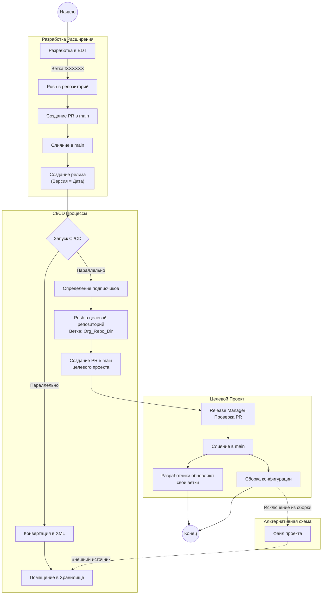
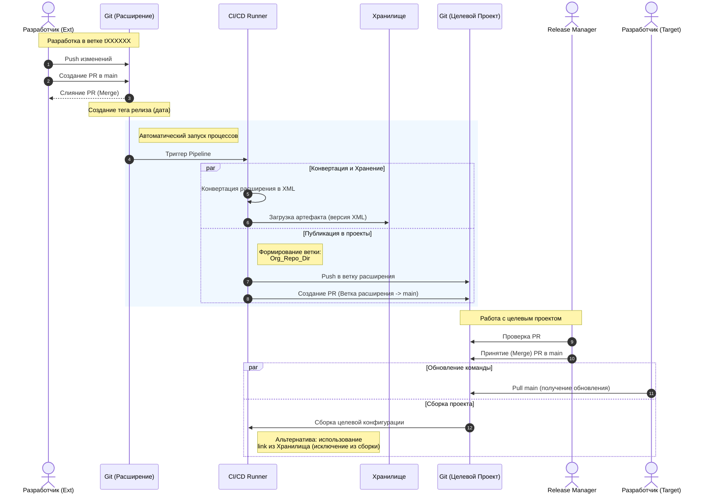

# Процесс разработки и публикации внешнего расширения 1С

Данный документ описывает процесс разработки, версионирования и автоматической дистрибуции внешних расширений для баз данных 1С.

## 1. Диаграмма активности (Activity Diagram)

Диаграмма демонстрирует поток работ от момента разработки функционала расширения до его применения в целевых проектах.

### Подробное описание диаграммы активности

1.  **Разработка**: Разработчик ведет работу в EDT, используя минимальную конфигурацию. Вся работа ведется в ветке `tXXXXXX` (номер задачи).
2.  **Слияние и Релиз**: После завершения разработки создается запрос на слияние (Merge Request) в ветку `main`. После слияния создается релиз, версия которого соответствует дате.
3.  **Автоматизация (CI/CD)**: Создание релиза триггерит два параллельных процесса:
    *   **Архивация**: Расширение конвертируется в XML и помещается в артефактное хранилище.
    *   **Дистрибуция**: Система определяет репозитории, подписанные на это расширение. В каждом целевом репозитории создается (или обновляется) специальная ветка вида `<Организация>_<Репозиторий>_<Каталог>`.
4.  **Интеграция**: В целевом репозитории автоматически создается запрос на слияние ветки расширения в `main`.
5.  **Принятие изменений**: Release Manager принимает запрос. После этого код расширения попадает в основную ветку целевого проекта.
6.  **Обновление**: Разработчики целевого проекта обновляют свои локальные ветки, получая актуальную версию расширения.

---

## 2. Диаграмма последовательности (Sequence Diagram)

Диаграмма отображает взаимодействие между участниками процесса (Разработчик, Git-системы, CI/CD, Release Manager) во времени.

### Подробное описание диаграммы последовательности

1.  **Инициация**: Процесс начинается с действий **Разработчика расширения**, который отправляет код в репозиторий расширения и инициирует слияние в `main`.
2.  **Релиз**: Событие создания релиза в **Git (Расширение)** запускает **CI/CD Runner**.
3.  **Ветвление процессов**: CI/CD выполняет действия параллельно:
    *   Сохраняет сконвертированную версию в **Хранилище**.
    *   Взаимодействует с **Git (Целевой Проект)**, создавая там специальную ветку и Pull Request. Это ключевой момент "подписки" — расширение пушится напрямую в структуру папок целевого проекта.
4.  **Контроль**: **Release Manager** выступает в роли гейткипера для целевого проекта. Он должен явно принять изменения, пришедшие из репозитория расширения.
5.  **Завершение**: После слияния в целевом проекте, **Разработчики проекта** получают обновление через стандартный `git pull`, а система сборки может использовать обновленные файлы или ссылки на хранилище (в зависимости от выбранной стратегии в файле проекта).